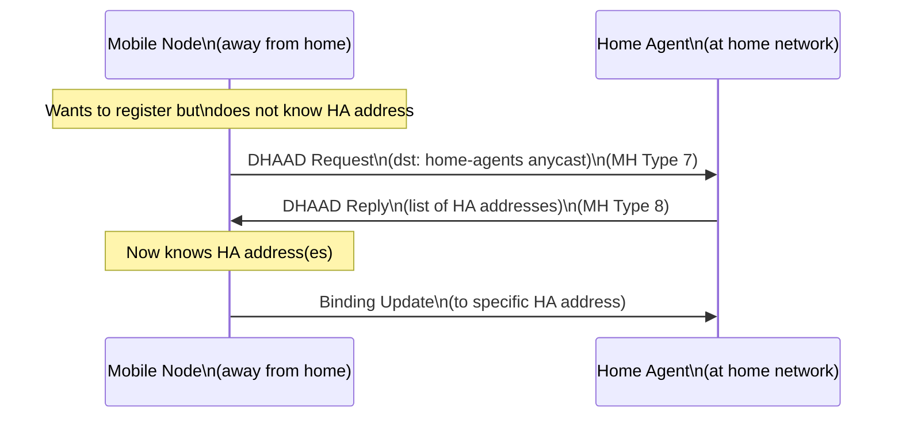

# How to Understand Dynamic Home Agent Address Discovery

Author: [nawazdhandala](https://www.github.com/nawazdhandala)

Tags: Mobile IPv6, DHAAD, Home Agent, Discovery, RFC 3775, Networking

Description: Understand the Dynamic Home Agent Address Discovery (DHAAD) mechanism that allows Mobile Nodes to discover their Home Agent's address when away from the home network.

## Introduction

When a Mobile Node is away from home and needs to register its Care-of Address, it must know the Home Agent's address. Dynamic Home Agent Address Discovery (DHAAD), defined in RFC 3775 and RFC 4067, enables this discovery using anycast addressing.

## The Discovery Problem

```text
Home Network: 2001:db8:home::/64

Mobile Node knows:
  - Its Home Address: 2001:db8:home::100
  - Its home prefix: 2001:db8:home::/64

Mobile Node does NOT know:
  - The HA's specific address (e.g., 2001:db8:home::1)
  - Whether multiple HAs exist
  - Which HA to use
```

## DHAAD Using the Home Agents Anycast Address

RFC 3775 defines a well-known anycast address structure for Home Agents. The Home Agent Anycast Address is formed from the home prefix with the subnet-router anycast suffix.

```text
Home prefix:            2001:db8:home::/64
HA Anycast Address:     2001:db8:home::fdff:ffff:ffff:fffe
                        (subnet-router anycast = all 1s in interface ID
                         per RFC 2526, last 128 addresses)
```

## DHAAD Procedure



## DHAAD Message Format

### DHAAD Request (MH Type 7)

```text
Mobility Header (Type 7):
  Reserved: 0
  Identifier: 0x1234  (random, used to match reply)
  Options:
    Home Address Option: 2001:db8:home::100 (MN's HoA)
```

### DHAAD Reply (MH Type 8)

```text
Mobility Header (Type 8):
  Reserved: 0
  Identifier: 0x1234  (matches request)
  Options:
    Home Address Option: 2001:db8:home::100
  HA Addresses:
    2001:db8:home::1   (primary HA)
    2001:db8:home::2   (secondary HA, if present)
```

## Fallback: Prefix Anycast Discovery

If the MN does not have the HA's address configured, it uses the subnet-router anycast address.

```python
import ipaddress

def compute_ha_anycast_address(home_prefix: str) -> str:
    """
    Compute the Home Agent anycast address for a given home prefix.
    Per RFC 2526: interface identifier = 0xFDFFFFFFFFFFFFFF for /64.
    """
    network = ipaddress.IPv6Network(home_prefix)

    if network.prefixlen > 64:
        raise ValueError("Home prefix must be /64 or shorter")

    # Subnet-router anycast: network prefix + 0xFDFFFFFFFFFFFFFF
    # For /64: last 64 bits = 0xFDFFFFFFFFFFFFFF
    anycast_iid = 0xFDFFFFFFFFFFFFFF

    # Convert network address to integer, add IID
    network_int = int(network.network_address)
    anycast_int = network_int | anycast_iid
    return str(ipaddress.IPv6Address(anycast_int))


# Example usage

prefix = "2001:db8:home::/64"
anycast = compute_ha_anycast_address(prefix)
print(f"HA Anycast Address: {anycast}")
# Output: HA Anycast Address: 2001:db8:home:0:fdff:ffff:ffff:fffe
```

## Configuring HA to Respond to DHAAD

In the UMIP mip6d configuration:

```bash
# /etc/mip6d.conf - HA configuration for DHAAD
NodeConfig HA;

Interface "eth0" {
    # HA must configure the subnet-router anycast address
    HaRestartAfterReboot enabled;
}

# UMIP automatically configures the anycast address
# and responds to DHAAD requests

# Verify anycast address is configured
ip -6 addr show dev eth0 | grep anycast
```

## DNS-Based HA Discovery (Alternative)

```bash
# Store HA addresses in DNS as AAAA records
# Mobile Nodes query _mip6._udp.<home-domain> SRV records

# Example DNS zone:
# _mip6._udp.home.example.com. IN SRV 10 0 0 ha1.home.example.com.
# ha1.home.example.com.       IN AAAA 2001:db8:home::1

# MN queries:
dig SRV _mip6._udp.home.example.com
```

## Conclusion

DHAAD enables Mobile Nodes to discover Home Agents dynamically using anycast addressing, removing the need for static HA configuration on the MN. The anycast address is deterministically derived from the home prefix. Ensure your Home Agent is properly responding to DHAAD requests - monitor this with OneUptime's UDP/ICMP probes.
