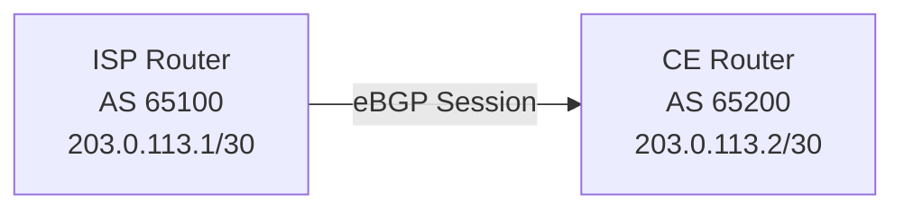

# How to Set Up eBGP Peering Between Two Autonomous Systems

Author: [nawazdhandala](https://www.github.com/nawazdhandala)

Tags: BGP, EBGP, Cisco IOS, Routing, Autonomous Systems, Peering

Description: Learn how to establish an eBGP peering session between two autonomous systems, including neighbor configuration, authentication, and route verification.

## eBGP vs iBGP

External BGP (eBGP) runs between routers in **different** autonomous systems (AS), typically across a direct physical or logical link. Internal BGP (iBGP) runs within a single AS. eBGP peers are almost always directly connected, so the TTL for eBGP packets defaults to 1-meaning multihop requires explicit configuration.

## Topology



## Step 1: Configure the ISP Router (AS 65100)

```nginx
ISP# configure terminal

router bgp 65100
 bgp router-id 100.100.100.100

 ! Point to the customer edge router on the other side of the /30
 neighbor 203.0.113.2 remote-as 65200

 ! Advertise the ISP's upstream block
 network 198.51.100.0 mask 255.255.255.0

ISP(config-router)# end
```

## Step 2: Configure the CE Router (AS 65200)

```text
CE# configure terminal

router bgp 65200
 bgp router-id 200.200.200.200

 ! Point to the ISP peer
 neighbor 203.0.113.1 remote-as 65100

 ! Advertise the customer's public prefix
 network 203.0.114.0 mask 255.255.255.0

CE(config-router)# end
```

## Step 3: Add MD5 Authentication (Recommended)

BGP sessions should always be authenticated to prevent hijacking:

```text
! On ISP router
ISP(config-router)# neighbor 203.0.113.2 password Str0ngP@ssw0rd!

! On CE router
CE(config-router)# neighbor 203.0.113.1 password Str0ngP@ssw0rd!
```

Both sides must use the same password or the TCP session will not establish.

## Step 4: Set a Description for the Neighbor

Documenting neighbors makes troubleshooting much faster:

```text
! On CE router
CE(config-router)# neighbor 203.0.113.1 description ISP-Uplink-AS65100
```

## Step 5: Verify the eBGP Session

```text
CE# show ip bgp summary

Neighbor        V     AS   MsgRcvd MsgSent   TblVer  InQ OutQ Up/Down  State/PfxRcd
203.0.113.1     4  65100        45      45        5    0    0 00:20:10        1
```

The session is established and one prefix has been received from the ISP.

## Step 6: Verify Received Routes

```text
CE# show ip bgp neighbors 203.0.113.1 received-routes

   Network          Next Hop            Metric LocPrf Weight Path
*  198.51.100.0/24  203.0.113.1              0              0 65100 i
```

Activate `soft-reconfiguration inbound` on the neighbor if received-routes shows nothing:

```text
CE(config-router)# neighbor 203.0.113.1 soft-reconfiguration inbound
CE# clear ip bgp 203.0.113.1 soft in
```

## Step 7: Confirm Route Is in the Routing Table

```text
CE# show ip route bgp

B        198.51.100.0/24 [20/0] via 203.0.113.1, 00:20:10
```

Administrative distance 20 confirms this is an eBGP-learned route.

## Key eBGP Behaviors to Remember

| Behavior | Detail |
|---|---|
| TTL | Default TTL=1 (direct connection required) |
| Next-hop | eBGP sets next-hop to the peer's IP |
| AD | Administrative distance is 20 |
| AS-path | Peer's AS is prepended to the path |

## Conclusion

Setting up eBGP peering requires matching AS numbers, reachability between peer IPs, and optionally MD5 authentication. Always verify with `show ip bgp summary` that the session reaches Established state, then confirm prefixes appear in both the BGP table and the routing table.
