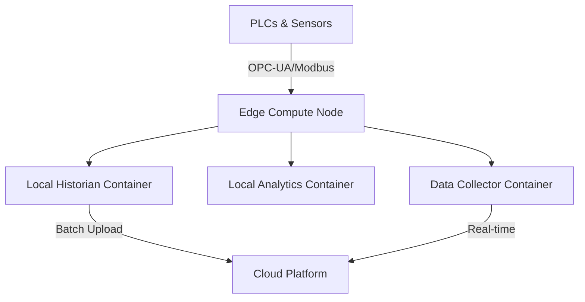

# How to Set Up Edge Computing for Manufacturing with Portainer

Author: [nawazdhandala](https://www.github.com/nawazdhandala)

Tags: Edge Computing, Manufacturing, Portainer, IIoT, Docker, OT, Industry 4.0

Description: Deploy a manufacturing edge computing platform with Portainer to run data collection, local analytics, and protocol conversion containers directly on the factory floor.

---

Manufacturing facilities increasingly run compute workloads at the edge — close to the machines and sensors — to reduce latency, handle network interruptions, and process data locally before forwarding to the cloud. Portainer's Edge Agent is purpose-built for this pattern.

## Manufacturing Edge Architecture



## Step 1: Deploy the Manufacturing Edge Stack

```yaml
# manufacturing-edge-stack.yml
version: "3.8"

services:
  # OPC-UA data collection from PLCs and HMIs
  opcua-collector:
    image: industrial/opcua-collector:3.0
    environment:
      - OPC_SERVER_URL=opc.tcp://plc-server:4840
      - POLL_INTERVAL=500
      - MQTT_BROKER=mosquitto
      - MQTT_TOPIC=factory/plc-data
    restart: unless-stopped
    networks:
      - factory-net

  # Modbus collector for legacy equipment
  modbus-collector:
    image: industrial/modbus-collector:2.1
    environment:
      - MODBUS_HOST=192.168.1.100
      - MODBUS_PORT=502
      - UNIT_ID=1
      - REGISTERS=40001-40020
    restart: unless-stopped
    networks:
      - factory-net

  # Local message bus
  mosquitto:
    image: eclipse-mosquitto:2.0
    volumes:
      - mosquitto-data:/mosquitto/data
    restart: unless-stopped
    networks:
      - factory-net

  # Local time-series store — keeps data during network outages
  influxdb:
    image: influxdb:2.7
    environment:
      - DOCKER_INFLUXDB_INIT_MODE=setup
      - DOCKER_INFLUXDB_INIT_USERNAME=admin
      - DOCKER_INFLUXDB_INIT_PASSWORD=factory_pw
      - DOCKER_INFLUXDB_INIT_ORG=plant
      - DOCKER_INFLUXDB_INIT_BUCKET=production-data
    volumes:
      - influxdb-data:/var/lib/influxdb2
    restart: unless-stopped
    networks:
      - factory-net

  # Edge analytics — detects anomalies locally
  edge-analytics:
    image: myregistry/edge-analytics:1.5
    environment:
      - INFLUXDB_URL=http://influxdb:8086
      - INFLUXDB_TOKEN=your-token
      - ALERT_THRESHOLD_TEMP=85
      - ALERT_THRESHOLD_VIBRATION=12
    restart: unless-stopped
    networks:
      - factory-net

volumes:
  mosquitto-data:
  influxdb-data:

networks:
  factory-net:
    driver: bridge
```

## Step 2: Configure OPC-UA Node Subscriptions

The OPC-UA collector subscribes to specific PLC nodes by node ID:

```json
{
  "subscriptions": [
    {
      "nodeId": "ns=2;i=2001",
      "name": "conveyor_speed",
      "dataType": "float",
      "mqtt_topic": "factory/conveyor/speed"
    },
    {
      "nodeId": "ns=2;i=2002",
      "name": "press_temperature",
      "dataType": "float",
      "mqtt_topic": "factory/press/temperature"
    },
    {
      "nodeId": "ns=2;i=2003",
      "name": "production_count",
      "dataType": "int32",
      "mqtt_topic": "factory/production/count"
    }
  ]
}
```

## Step 3: Implement Store-and-Forward

For sites with intermittent cloud connectivity, configure the edge historian to buffer data and forward when connectivity is restored:

```yaml
  # Store-and-forward agent
  store-forward:
    image: industrial/store-forward-agent:1.0
    environment:
      - LOCAL_INFLUXDB=http://influxdb:8086
      - CLOUD_ENDPOINT=https://cloud-historian.example.com/api/v1/write
      - CLOUD_API_KEY=your-cloud-key
      - MAX_BUFFER_HOURS=72      # Buffer up to 3 days of data
      - RETRY_INTERVAL=60        # Retry every 60 seconds
      - BATCH_SIZE=1000          # Send 1000 points per batch
    restart: unless-stopped
    networks:
      - factory-net
```

## Step 4: Deploy via Portainer Edge Agent

Register the edge compute node with Portainer (see the IoT device management guide), then deploy this stack to the `factory-floor` Edge Group. All factory nodes will receive the same stack, and you can update them centrally from Portainer.

## OT/IT Separation

Keep the OT network isolated from the IT network. The edge compute node sits in a DMZ:

- Port 1883 (MQTT) — internal to factory-net only
- Port 8086 (InfluxDB) — internal to factory-net only
- No external ports exposed from OT-facing containers

## Summary

Portainer Edge Agent gives manufacturing operations teams a practical way to manage containerized workloads on factory floor hardware. Updates are pushed centrally, deployments are consistent across sites, and the edge compute nodes continue operating even when disconnected from the Portainer server.
