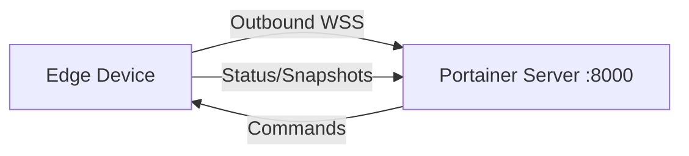

# How to Use the Edge Environment Waiting Room in Portainer

Author: [nawazdhandala](https://www.github.com/nawazdhandala)

Tags: Portainer, Edge, Waiting Room, Onboarding, Management

Description: Use Portainer's Edge waiting room to review and approve new edge agent connections before granting environment access.

---

Portainer Edge Agents enable management of remote environments that are behind NAT, firewalls, or have limited connectivity. The Edge Agent establishes an outbound connection to the Portainer server, eliminating the need for inbound firewall rules.

## How Edge Agent Works



The Edge Agent initiates all connections outbound to the Portainer server on port 8000 (WebSocket Secure), so no inbound ports need to be opened on the edge network.

## Generate Edge Deployment Script

```bash
TOKEN=$(curl -s -X POST \
  https://portainer.example.com:9443/api/auth \
  -H "Content-Type: application/json" \
  -d '{"username":"admin","password":"yourpassword"}' \
  --insecure | python3 -c "import sys,json; print(json.load(sys.stdin)['jwt'])")

# Create an edge environment and get the deployment script

curl -X POST \
  https://portainer.example.com:9443/api/endpoints \
  -H "Authorization: Bearer $TOKEN" \
  -H "Content-Type: application/json" \
  -d '{
    "Name": "edge-site-01",
    "EndpointCreationType": 4,
    "EdgeCheckinInterval": 30
  }' \
  --insecure
```

## Standard Mode Installation

```bash
# Standard mode - agent polls frequently (real-time management)
docker run -d \
  --name portainer_edge_agent \
  --restart=always \
  -v /var/run/docker.sock:/var/run/docker.sock \
  -v /var/lib/docker/volumes:/var/lib/docker/volumes \
  -v /:/host \
  -v portainer_agent_data:/data \
  -e EDGE=1 \
  -e EDGE_ID="${EDGE_ID}" \
  -e EDGE_KEY="${EDGE_KEY}" \
  -e EDGE_INSECURE_POLL=0 \
  portainer/agent:latest
```

## Async Mode Installation

```bash
# Async mode - less frequent polling, suitable for limited bandwidth
docker run -d \
  --name portainer_edge_agent \
  --restart=always \
  -v /var/run/docker.sock:/var/run/docker.sock \
  -v /var/lib/docker/volumes:/var/lib/docker/volumes \
  -v /:/host \
  -v portainer_agent_data:/data \
  -e EDGE=1 \
  -e EDGE_ID="${EDGE_ID}" \
  -e EDGE_KEY="${EDGE_KEY}" \
  -e EDGE_ASYNC=1 \
  -e EDGE_CHECKIN_INTERVAL=30 \
  -e EDGE_SNAPSHOT_INTERVAL=60 \
  portainer/agent:latest
```

## ARM / Windows Variations

```bash
# ARM64 (Raspberry Pi 4, Apple M1)
docker pull portainer/agent:latest  # Multi-arch: automatically uses ARM64

# Windows (Docker Desktop or Docker Engine for Windows)
docker run -d \
  --name portainer_edge_agent \
  --restart=always \
  -e EDGE=1 \
  -e EDGE_ID="${EDGE_ID}" \
  -e EDGE_KEY="${EDGE_KEY}" \
  -v //./pipe/docker_engine://./pipe/docker_engine \
  portainer/agent:latest
```

## Verify Edge Agent Connection

```bash
# Check agent is running
docker logs portainer_edge_agent 2>&1 | tail -20

# On Portainer server, check if environment shows as connected
curl -s https://portainer.example.com:9443/api/endpoints \
  -H "Authorization: Bearer $TOKEN" \
  --insecure | python3 -c "
import sys, json
envs = json.load(sys.stdin)
for e in envs:
    if e.get('EdgeID'):
        print(f'Edge: {e[\"Name\"]}, Status: {\"Online\" if e.get(\"Status\")==1 else \"Offline\"}')
"
```

---

*Monitor edge device health and connectivity with [OneUptime](https://oneuptime.com).*
