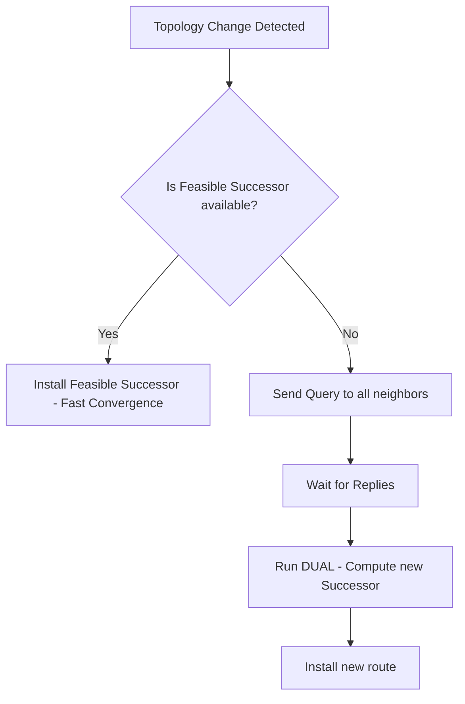

# How to Understand EIGRPv6 for IPv6 Routing

Author: [nawazdhandala](https://www.github.com/nawazdhandala)

Tags: EIGRPv6, IPv6, Cisco, Routing, EIGRP

Description: Understand EIGRPv6 - Cisco's proprietary distance-vector IPv6 routing protocol - including its operation, metric components, and differences from EIGRP for IPv4.

## Overview

EIGRPv6 (Enhanced Interior Gateway Routing Protocol for IPv6) is Cisco's proprietary advanced distance-vector protocol adapted for IPv6. It uses the DUAL (Diffusing Update Algorithm) for loop-free routing and fast convergence.

## EIGRPv6 Key Characteristics

| Feature | Value |
|---------|-------|
| Protocol type | Proprietary (Cisco) |
| Protocol number | 88 (same as EIGRP) |
| Transport | IPv6 |
| Multicast | ff02::a (All EIGRP routers) |
| Adjacency | Link-local addresses |
| Metric | Composite (bandwidth + delay, optionally load + reliability) |
| Administrative distance | 90 (internal), 170 (external) |
| Maximum hops | 255 (default 100) |

## EIGRPv6 vs EIGRP for IPv4

| Feature | EIGRP (IPv4) | EIGRPv6 |
|---------|-------------|---------|
| Network statement | Yes (per subnet) | No - enabled per interface |
| Shutdown by default | No | Yes - must use `no shutdown` |
| Router ID | Optional (uses highest IP) | Required (set manually) |
| Authentication | MD5/SHA | MD5/SHA (same) |
| Adjacency | IPv4 addresses | IPv6 link-local addresses |

## DUAL Algorithm Overview

EIGRPv6 uses DUAL to compute loop-free paths:



- **Successor**: The best path to a destination
- **Feasible Successor**: Backup path that is guaranteed loop-free (kept in topology table)

## EIGRPv6 Metric Components

The composite metric uses:
```text
Metric = [K1 × BW + (K2 × BW)/(256 - Load) + K3 × Delay] × [K5/(Reliability + K4)]
```

Default K values: K1=1, K2=0, K3=1, K4=0, K5=0 → simplifies to:
```text
Metric = BW + Delay
Where:
  BW = 10^7 / min_bandwidth_kbps × 256
  Delay = sum_of_delays / 10 × 256
```

## Summary

EIGRPv6 brings the advanced features of EIGRP - DUAL fast convergence, feasible successors, and composite metric - to IPv6. Key differences from IPv4 EIGRP are that EIGRPv6 is interface-activated (not network-statement based), is shut down by default, requires an explicit Router ID, and uses IPv6 link-local addresses for adjacency. It remains Cisco-proprietary and is mainly found in Cisco-centric networks.
