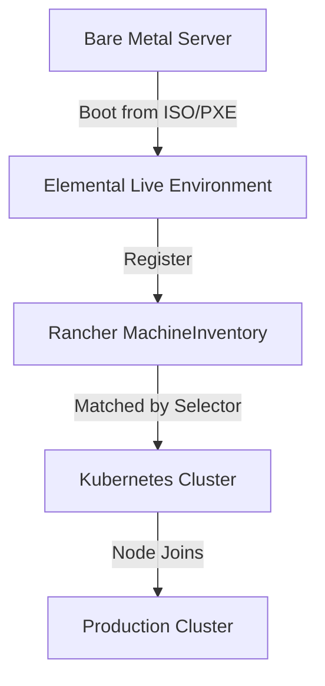

# How to Set Up Elemental for Bare Metal Provisioning

Author: [nawazdhandala](https://www.github.com/nawazdhandala)

Tags: Elemental, Bare Metal, Kubernetes, Provisioning, Edge

Description: Configure Elemental to automatically provision Kubernetes nodes on bare metal hardware using declarative templates.

## Introduction

Elemental transforms bare metal provisioning from a manual, error-prone process into a declarative, Kubernetes-native workflow. This guide covers the complete end-to-end setup for provisioning bare metal servers into Kubernetes clusters using Elemental.

## Architecture Overview



## Hardware Requirements

| Component | Minimum | Recommended |
|-----------|---------|-------------|
| CPU | 2 cores | 4+ cores |
| RAM | 4 GB | 8+ GB |
| Disk | 40 GB | 120+ GB |
| Network | 1 GbE | 10 GbE |

## Step 1: Prepare the Management Infrastructure

```bash
# Verify Elemental Operator is running
kubectl get pods -n elemental-system

# Create a dedicated namespace for bare metal nodes
kubectl create namespace bare-metal-fleet

# Create RBAC for machine management
kubectl create rolebinding elemental-admin \
  --clusterrole=admin \
  --serviceaccount=elemental-system:elemental-operator \
  --namespace=bare-metal-fleet
```

## Step 2: Define Server Tiers with MachineRegistrations

```yaml
# control-plane-registration.yaml
apiVersion: elemental.cattle.io/v1beta1
kind: MachineRegistration
metadata:
  name: control-plane-nodes
  namespace: fleet-default
spec:
  machineLabels:
    role: control-plane
    tier: high-performance
  config:
    elemental:
      install:
        device: /dev/nvme0n1  # NVMe for control plane
        reboot: true
      system-agent:
        url: "https://rancher.example.com"
---
# worker-registration.yaml
apiVersion: elemental.cattle.io/v1beta1
kind: MachineRegistration
metadata:
  name: worker-nodes
  namespace: fleet-default
spec:
  machineLabels:
    role: worker
    tier: standard
  config:
    elemental:
      install:
        device: /dev/sda  # SATA for workers
        reboot: true
```

## Step 3: Create Cluster Template

```yaml
# bare-metal-cluster.yaml
apiVersion: provisioning.cattle.io/v1
kind: Cluster
metadata:
  name: production-bare-metal
  namespace: fleet-default
spec:
  kubernetesVersion: v1.28.0+rke2r1

  rkeConfig:
    machineGlobalConfig:
      cni: cilium
      disable:
        - rke2-ingress-nginx

    machinePools:
      - name: control-plane
        quantity: 3
        etcdRole: true
        controlPlaneRole: true
        workerRole: false
        machineConfigRef:
          kind: MachineInventorySelectorTemplate
          apiVersion: elemental.cattle.io/v1beta1
          name: cp-selector

      - name: workers
        quantity: 10
        etcdRole: false
        controlPlaneRole: false
        workerRole: true
        machineConfigRef:
          kind: MachineInventorySelectorTemplate
          apiVersion: elemental.cattle.io/v1beta1
          name: worker-selector
```

## Step 4: Deploy the Seed Images

```bash
# Build ISOs for each node type
docker run --privileged --rm \
  -v $(pwd):/workspace \
  registry.suse.com/rancher/elemental-toolkit/elemental-cli:latest \
  build-iso \
  --config /workspace/cp-config.yaml \
  --name elemental-cp \
  registry.suse.com/rancher/sle-micro:latest

docker run --privileged --rm \
  -v $(pwd):/workspace \
  registry.suse.com/rancher/elemental-toolkit/elemental-cli:latest \
  build-iso \
  --config /workspace/worker-config.yaml \
  --name elemental-worker \
  registry.suse.com/rancher/sle-micro:latest
```

## Step 5: Boot and Monitor Provisioning

```bash
# Watch machines register
kubectl get machineinventory -n fleet-default --watch

# Monitor cluster creation
kubectl get cluster -n fleet-default production-bare-metal --watch

# Check machine adoption
kubectl get machineinventory -n fleet-default \
  -o custom-columns='NAME:.metadata.name,ROLE:.metadata.labels.role,ADOPTED:.spec.machineRef.name'
```

## Conclusion

Elemental bare metal provisioning turns physical servers into declaratively managed Kubernetes nodes. By defining separate MachineRegistrations for different server tiers and using MachineInventorySelectors to match them to cluster roles, you create a fully automated provisioning pipeline that scales from a handful of servers to thousands of nodes with the same configuration.
