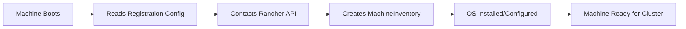

# How to Register Elemental Machines with Rancher

Author: [nawazdhandala](https://www.github.com/nawazdhandala)

Tags: Elemental, Rancher, Kubernetes, Edge, Bare Metal

Description: Learn the complete workflow for registering Elemental-managed machines with Rancher, from booting nodes to verifying their presence in the machine inventory.

## Introduction

Registering Elemental machines with Rancher is the process by which bare metal or edge nodes boot an Elemental OS image, connect to the Rancher management cluster, and add themselves to the machine inventory. Once registered, these machines can be provisioned into Kubernetes clusters through the Rancher UI or via GitOps workflows.

## Prerequisites

- Elemental Operator installed on the Rancher management cluster
- A MachineRegistration resource created
- An Elemental OS image (ISO or network boot) that includes the registration configuration
- Physical or virtual machines to register

## Registration Workflow Overview



## Step 1: Prepare the Registration Configuration

Extract the registration URL and CA cert from your MachineRegistration:

```bash
# Get registration URL
REG_URL=$(kubectl get machineregistration my-nodes \
  -n fleet-default \
  -o jsonpath='{.status.registrationURL}')

echo "Registration URL: $REG_URL"

# Get CA certificate
kubectl get secret -n cattle-system tls-rancher-internal-ca \
  -o jsonpath='{.data.cacerts\.pem}' | base64 -d > rancher-ca.pem
```

## Step 2: Build the Registration ISO

```bash
# Create a registration config file
cat > registration-config.yaml << EOF
elemental:
  registration:
    uri: "${REG_URL}"
    ca-cert: |
$(cat rancher-ca.pem | sed 's/^/      /')
  install:
    device: /dev/sda
    reboot: true
EOF

# Build the ISO with registration config embedded
docker run --privileged --rm \
  -v $(pwd):/workspace \
  registry.suse.com/rancher/elemental-toolkit/elemental-cli:latest \
  build-iso \
  --config /workspace/registration-config.yaml \
  --name elemental-registration \
  registry.suse.com/rancher/sle-micro:latest
```

## Step 3: Boot the Machine

Boot the target machine from the registration ISO. The machine will:

1. Boot into the live Elemental environment
2. Read the embedded registration configuration
3. Contact the Rancher API using the registration URL
4. Install the OS to the target device
5. Reboot into the installed OS
6. Complete registration and appear in MachineInventory

## Step 4: Monitor the Registration

```bash
# Watch for new machines appearing in inventory
kubectl get machineinventory -n fleet-default --watch

# Once a machine appears, describe it for details
kubectl describe machineinventory -n fleet-default <machine-name>

# Check machine labels and annotations
kubectl get machineinventory -n fleet-default \
  <machine-name> -o yaml
```

## Step 5: Verify Registration Success

```bash
# List all registered machines
kubectl get machineinventory -n fleet-default

# Filter machines by label
kubectl get machineinventory -n fleet-default \
  -l location=datacenter-1

# Check that the machine reports as adopted
kubectl get machineinventory -n fleet-default \
  -o custom-columns=NAME:.metadata.name,ADOPTED:.spec.machineRef.name
```

## Troubleshooting Registration Issues

### Machine Not Appearing in Inventory

```bash
# Check operator logs for registration attempts
kubectl logs -n elemental-system \
  -l app=elemental-operator \
  --since=1h

# Verify the MachineRegistration is ready
kubectl get machineregistration -n fleet-default my-nodes \
  -o jsonpath='{.status.conditions}'
```

### Certificate Errors

```bash
# Verify the CA cert is correct
openssl verify -CAfile rancher-ca.pem rancher-ca.pem

# Test connectivity to registration endpoint
curl -v --cacert rancher-ca.pem "${REG_URL}"
```

## Viewing Machines in Rancher UI

After successful registration:

1. Log into Rancher UI
2. Navigate to **Cluster Management** > **Advanced** > **Machines**
3. You should see the registered machines listed with their labels and status

## Conclusion

The Elemental machine registration process automates the onboarding of bare metal and edge nodes into your Rancher-managed infrastructure. Once machines appear in the MachineInventory, they are ready to be provisioned into Kubernetes clusters using MachineInventorySelectors and cluster templates.
