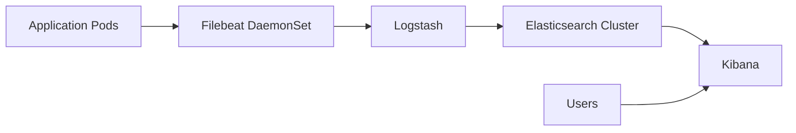

# How to Deploy the ELK Stack with OpenTofu

Author: [nawazdhandala](https://www.github.com/nawazdhandala)

Tags: OpenTofu, ELK Stack, Elasticsearch, Logstash, Kibana, Kubernetes, Helm, Infrastructure as Code

Description: Learn how to deploy the ELK Stack (Elasticsearch, Logstash, Kibana) on Kubernetes using OpenTofu and the Elastic Helm charts for centralized log aggregation and analysis.

---

The ELK Stack provides centralized logging, search, and visualization for distributed systems. Deploying it with OpenTofu via Helm ensures consistent configuration across environments and makes it easy to tune resource limits and storage per environment.

## ELK Architecture



## Elasticsearch Cluster

```hcl
# elasticsearch.tf
resource "helm_release" "elasticsearch" {
  name             = "elasticsearch"
  repository       = "https://helm.elastic.co"
  chart            = "elasticsearch"
  version          = "8.5.1"
  namespace        = "logging"
  create_namespace = true

  values = [
    yamlencode({
      replicas = var.environment == "production" ? 3 : 1

      resources = {
        requests = {
          cpu    = var.environment == "production" ? "1000m" : "250m"
          memory = var.environment == "production" ? "2Gi" : "1Gi"
        }
        limits = {
          cpu    = var.environment == "production" ? "2000m" : "500m"
          memory = var.environment == "production" ? "4Gi" : "2Gi"
        }
      }

      # JVM heap must be half of memory limit
      esJavaOpts = var.environment == "production" ? "-Xmx2g -Xms2g" : "-Xmx1g -Xms1g"

      volumeClaimTemplate = {
        accessModes = ["ReadWriteOnce"]
        resources = {
          requests = {
            storage = var.environment == "production" ? "100Gi" : "10Gi"
          }
        }
        storageClassName = "gp3"
      }

      # Security
      protocol = "https"
      createCert = true
    })
  ]
}
```

## Kibana

```hcl
resource "helm_release" "kibana" {
  name       = "kibana"
  repository = "https://helm.elastic.co"
  chart      = "kibana"
  version    = "8.5.1"
  namespace  = "logging"

  values = [
    yamlencode({
      elasticsearchHosts = "https://elasticsearch-master:9200"

      resources = {
        requests = { cpu = "100m", memory = "512Mi" }
        limits   = { cpu = "500m", memory = "1Gi" }
      }

      ingress = {
        enabled = true
        annotations = {
          "kubernetes.io/ingress.class"              = "nginx"
          "cert-manager.io/cluster-issuer"           = "letsencrypt-prod"
          "nginx.ingress.kubernetes.io/ssl-redirect" = "true"
        }
        hosts = [{ host = "kibana.${var.domain}", paths = [{ path = "/" }] }]
        tls   = [{ secretName = "kibana-tls", hosts = ["kibana.${var.domain}"] }]
      }
    })
  ]

  depends_on = [helm_release.elasticsearch]
}
```

## Logstash Pipeline

```hcl
resource "helm_release" "logstash" {
  name       = "logstash"
  repository = "https://helm.elastic.co"
  chart      = "logstash"
  version    = "8.5.1"
  namespace  = "logging"

  values = [
    yamlencode({
      logstashPipeline = {
        "logstash.conf" = <<-EOT
          input {
            beats {
              port => 5044
            }
          }

          filter {
            if [kubernetes][namespace] == "apps" {
              json {
                source => "message"
                target => "app"
              }
            }
          }

          output {
            elasticsearch {
              hosts    => ["https://elasticsearch-master:9200"]
              index    => "logs-%{[kubernetes][namespace]}-%{+YYYY.MM.dd}"
              user     => "${ELASTICSEARCH_USERNAME}"
              password => "${ELASTICSEARCH_PASSWORD}"
              ssl      => true
              cacert   => "/usr/share/logstash/config/certs/ca.crt"
            }
          }
        EOT
      }

      resources = {
        requests = { cpu = "200m", memory = "1Gi" }
        limits   = { cpu = "1000m", memory = "2Gi" }
      }
    })
  ]
}
```

## Filebeat DaemonSet

```hcl
resource "helm_release" "filebeat" {
  name       = "filebeat"
  repository = "https://helm.elastic.co"
  chart      = "filebeat"
  version    = "8.5.1"
  namespace  = "logging"

  values = [
    yamlencode({
      filebeatConfig = {
        "filebeat.yml" = <<-EOT
          filebeat.inputs:
          - type: container
            paths:
              - /var/log/containers/*.log
            processors:
              - add_kubernetes_metadata:
                  host: ${NODE_NAME}
                  matchers:
                    - logs_path:
                        logs_path: "/var/log/containers/"

          output.logstash:
            hosts: ["logstash-logstash:5044"]
        EOT
      }

      tolerations = [{ operator = "Exists" }]  # Run on all nodes
    })
  ]
}
```

## Best Practices

- Set JVM heap to 50% of the Elasticsearch pod memory limit — `esJavaOpts = "-Xmx2g -Xms2g"` when memory limit is 4Gi.
- Use `gp3` storage class for Elasticsearch — it's faster than `gp2` at the same price.
- Deploy 3 Elasticsearch nodes in production with an odd number to maintain quorum.
- Set index lifecycle management (ILM) policies in Kibana to automatically delete old indices and control storage costs.
- Use separate Logstash nodes for parsing heavy-volume logs rather than having Filebeat write directly to Elasticsearch.
