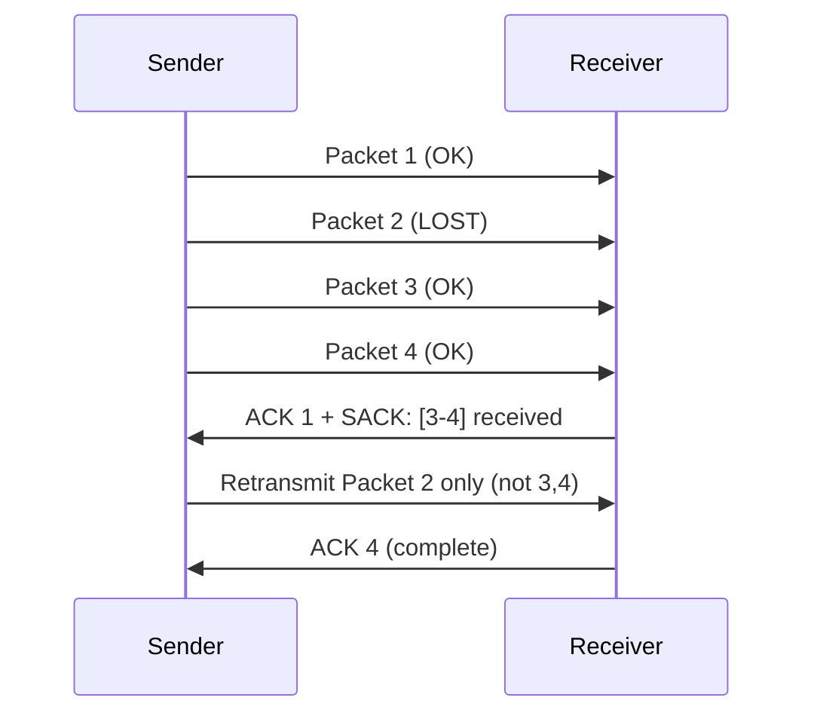

# How to Enable and Verify TCP SACK (Selective Acknowledgment)

Author: [nawazdhandala](https://www.github.com/nawazdhandala)

Tags: TCP, SACK, Selective Acknowledgment, Linux, Performance, Network Tuning

Description: Learn how to enable and verify TCP Selective Acknowledgment (SACK) on Linux, and understand how it improves recovery from packet loss compared to basic TCP retransmission.

## What Is TCP SACK?

Without SACK, if a packet is lost, TCP must retransmit all packets from the lost one onward (go-back-N retransmission). With Selective Acknowledgment (RFC 2018), the receiver tells the sender exactly which packets were received (even out-of-order), so the sender only retransmits what's actually missing.



SACK reduces the number of retransmissions significantly on lossy links.

## Step 1: Check If SACK Is Enabled

```bash
# Check SACK status (should be 1/enabled by default)

sysctl net.ipv4.tcp_sack

# Expected: net.ipv4.tcp_sack = 1

# Also check related SACK options
sysctl net.ipv4.tcp_dsack    # Duplicate SACK (D-SACK)
sysctl net.ipv4.tcp_fack     # Forward Acknowledgment (FACK)
```

## Step 2: Enable SACK If Disabled

```bash
# Enable SACK
sudo sysctl -w net.ipv4.tcp_sack=1

# Enable D-SACK (duplicate SACK - helps detect spurious retransmissions)
sudo sysctl -w net.ipv4.tcp_dsack=1

# Make persistent
cat >> /etc/sysctl.d/99-tcp-tuning.conf << 'EOF'
net.ipv4.tcp_sack = 1
net.ipv4.tcp_dsack = 1
EOF
```

## Step 3: Verify SACK Is Negotiated in TCP Handshake

Capture a TCP connection handshake to verify SACK is negotiated:

```bash
# Capture SYN and SYN-ACK packets
sudo tcpdump -i any -c 6 -w /tmp/tcp-sack.pcap \
  '(tcp[tcpflags] & (tcp-syn|tcp-ack)) != 0'

# Analyze the capture
tshark -r /tmp/tcp-sack.pcap -T fields \
  -e tcp.flags.syn \
  -e tcp.options.sack_perm \
  -Y "tcp.flags.syn == 1"

# Look for tcp.options.sack_perm = 1 in both SYN and SYN-ACK
# This means both sides support SACK
```

Or inspect with tcpdump directly:

```bash
# Show SACK option in TCP handshake
sudo tcpdump -i any -v 'tcp[tcpflags] & tcp-syn != 0 and tcp[tcpflags] & tcp-ack == 0' | \
  grep -A5 "Flags \[S\]" | head -20

# Look for "options [..., sackOK,...]" in the output
```

## Step 4: Verify SACK Is Used During Recovery

To see SACK blocks in action, you need a connection with some packet loss. Simulate with `tc netem`:

```bash
# Simulate 5% packet loss on the loopback
sudo tc qdisc add dev lo root netem loss 5%

# Start iperf3 server
iperf3 -s &

# Run client and capture
sudo tcpdump -i lo -w /tmp/sack-test.pcap port 5201 &
iperf3 -c 127.0.0.1 -t 10 -b 100M

# Stop capture
sudo pkill tcpdump

# Analyze for SACK blocks in the capture
tshark -r /tmp/sack-test.pcap -Y "tcp.options.sack" \
  -T fields -e ip.src -e tcp.seq -e tcp.options.sack_le

# Clean up
sudo tc qdisc del dev lo root netem
```

## Step 5: Monitor SACK Statistics

```bash
# View TCP statistics including SACK-related counters
cat /proc/net/netstat | tr ' ' '\n' | grep -i sack

# Or use netstat -s
netstat -s | grep -i sack

# Output:
#     SACKs sent: 12345
#     SACKs received: 8765
#     SACKReneg: 0
```

## Step 6: Disable SACK for Specific Troubleshooting

Some applications or middleboxes have issues with SACK. Temporarily disable for testing:

```bash
# Disable SACK (for testing only)
sudo sysctl -w net.ipv4.tcp_sack=0

# Test if issue goes away
# Re-enable after testing
sudo sysctl -w net.ipv4.tcp_sack=1
```

## SACK, DSACK, and FACK Comparison

| Feature | Purpose | Enabled by Default |
|---|---|---|
| SACK | Selective retransmission of lost packets | Yes |
| D-SACK | Report duplicate packets received | Yes |
| RACK | Recent ACK algorithm for faster loss detection | Yes (kernel 4.19+) |

## Conclusion

TCP SACK is enabled by default on Linux and should always remain enabled. Verify with `sysctl net.ipv4.tcp_sack`, confirm negotiation in TCP handshake captures by looking for the `sackOK` option in SYN packets, and monitor SACK usage with `/proc/net/netstat`. SACK is particularly valuable on WAN links with >0.1% packet loss where basic TCP retransmission performs poorly.
