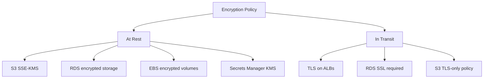

# How to Enforce Encryption Policies with OpenTofu

Author: [nawazdhandala](https://www.github.com/nawazdhandala)

Tags: OpenTofu, Encryption, KMS, Security, Compliance, AWS, Infrastructure as Code

Description: Learn how to enforce encryption at rest and in transit for AWS resources using OpenTofu, including KMS key management, S3 bucket encryption, RDS encryption, and EBS default encryption.

---

Encryption enforcement prevents sensitive data from being stored unencrypted. OpenTofu can enforce encryption requirements through validation blocks, lifecycle preconditions, and by provisioning KMS keys and encryption configurations alongside the resources they protect.

## Encryption Coverage



## KMS Key Management

```hcl
# kms.tf

resource "aws_kms_key" "app" {
  description             = "KMS key for ${var.environment} application data"
  deletion_window_in_days = 30
  enable_key_rotation     = true  # Rotate annually

  policy = jsonencode({
    Version = "2012-10-17"
    Statement = [
      {
        Sid       = "AllowAccount"
        Effect    = "Allow"
        Principal = { AWS = "arn:aws:iam::${data.aws_caller_identity.current.account_id}:root" }
        Action    = "kms:*"
        Resource  = "*"
      },
      {
        Sid    = "AllowServiceUse"
        Effect = "Allow"
        Principal = {
          Service = ["s3.amazonaws.com", "rds.amazonaws.com", "secretsmanager.amazonaws.com"]
        }
        Action = ["kms:GenerateDataKey*", "kms:Decrypt", "kms:Encrypt"]
        Resource = "*"
      }
    ]
  })

  tags = {
    Environment = var.environment
    Purpose     = "app-data-encryption"
  }
}

resource "aws_kms_alias" "app" {
  name          = "alias/${var.environment}/app"
  target_key_id = aws_kms_key.app.key_id
}
```

## S3 Encryption Enforcement

```hcl
# s3_encryption.tf
resource "aws_s3_bucket_server_side_encryption_configuration" "app" {
  bucket = aws_s3_bucket.app.id

  rule {
    apply_server_side_encryption_by_default {
      sse_algorithm     = "aws:kms"
      kms_master_key_id = aws_kms_key.app.arn
    }
    bucket_key_enabled = true  # Reduce KMS API calls and costs
  }
}

# Deny non-encrypted uploads and non-HTTPS requests
resource "aws_s3_bucket_policy" "enforce_tls_and_encryption" {
  bucket = aws_s3_bucket.app.id

  policy = jsonencode({
    Version = "2012-10-17"
    Statement = [
      {
        Sid       = "DenyNonTLS"
        Effect    = "Deny"
        Principal = "*"
        Action    = "s3:*"
        Resource  = ["${aws_s3_bucket.app.arn}", "${aws_s3_bucket.app.arn}/*"]
        Condition = {
          Bool = { "aws:SecureTransport" = "false" }
        }
      },
      {
        Sid       = "DenyUnencryptedObjectUploads"
        Effect    = "Deny"
        Principal = "*"
        Action    = "s3:PutObject"
        Resource  = "${aws_s3_bucket.app.arn}/*"
        Condition = {
          StringNotEquals = {
            "s3:x-amz-server-side-encryption" = "aws:kms"
          }
        }
      }
    ]
  })
}
```

## RDS Encryption

```hcl
resource "aws_db_instance" "main" {
  identifier     = "${var.environment}-database"
  engine         = "postgres"

  # Encryption at rest
  storage_encrypted = true
  kms_key_id        = aws_kms_key.app.arn

  lifecycle {
    precondition {
      condition     = var.storage_encrypted
      error_message = "Database storage encryption is required in all environments"
    }
  }
}

# Enforce SSL for RDS connections
resource "aws_db_parameter_group" "ssl_required" {
  name   = "${var.environment}-postgres-ssl"
  family = "postgres15"

  parameter {
    name  = "rds.force_ssl"
    value = "1"
  }
}
```

## EBS Default Encryption

```hcl
# Enable EBS encryption by default for the region
resource "aws_ebs_encryption_by_default" "enabled" {
  enabled = true
}

resource "aws_ebs_default_kms_key" "app" {
  key_arn = aws_kms_key.app.arn
}
```

## AWS Config Rule for Encryption Compliance

```hcl
resource "aws_config_config_rule" "s3_encryption" {
  name = "s3-bucket-server-side-encryption-enabled"
  source {
    owner             = "AWS"
    source_identifier = "S3_BUCKET_SERVER_SIDE_ENCRYPTION_ENABLED"
  }
}

resource "aws_config_config_rule" "rds_encrypted" {
  name = "rds-storage-encrypted"
  source {
    owner             = "AWS"
    source_identifier = "RDS_STORAGE_ENCRYPTED"
  }
}

resource "aws_config_config_rule" "ebs_encrypted" {
  name = "ec2-ebs-encryption-by-default"
  source {
    owner             = "AWS"
    source_identifier = "EC2_EBS_ENCRYPTION_BY_DEFAULT"
  }
}
```

## Best Practices

- Enable EBS encryption by default at the account level - it protects all new volumes without per-resource configuration.
- Use KMS customer-managed keys (CMKs) for sensitive data so you control the key lifecycle and rotation.
- Enable `bucket_key_enabled = true` on S3 SSE-KMS to reduce KMS API calls by 99% and lower costs.
- Use S3 bucket policies to deny unencrypted uploads and non-TLS requests - defense in depth against misconfiguration.
- Enable key rotation on all KMS keys - annual rotation limits the exposure window if a key is compromised.
