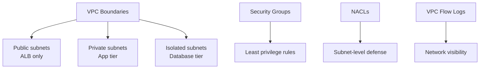

# How to Enforce Network Security Policies with OpenTofu

Author: [nawazdhandala](https://www.github.com/nawazdhandala)

Tags: OpenTofu, Network Security, Security Groups, NACLs, VPC, AWS Config, Infrastructure as Code

Description: Learn how to enforce network security policies using OpenTofu, including security group validation, VPC flow logs, AWS Config network rules, and default VPC remediation.

---

Network misconfigurations - open security groups, unintended public exposure, missing flow logs - are among the most common cloud security issues. OpenTofu enforces network security requirements at plan time and continuously with AWS Config.

## Network Security Architecture



## Security Group with Validation

```hcl
# security_groups.tf

variable "allowed_cidr_blocks" {
  type = list(string)

  validation {
    condition = alltrue([
      for cidr in var.allowed_cidr_blocks :
      !contains(["0.0.0.0/0", "::/0"], cidr) || var.environment == "dev"
    ])
    error_message = "Open CIDRs (0.0.0.0/0) are not allowed in non-dev environments"
  }
}

resource "aws_security_group" "app" {
  name        = "${var.environment}-app"
  description = "Application tier security group"
  vpc_id      = var.vpc_id

  lifecycle {
    precondition {
      condition = var.vpc_id != ""
      error_message = "VPC ID is required - never use the default VPC"
    }
  }
}

# Ingress only from ALB security group (not open internet)
resource "aws_security_group_rule" "app_ingress_alb" {
  type                     = "ingress"
  from_port                = 8080
  to_port                  = 8080
  protocol                 = "tcp"
  source_security_group_id = aws_security_group.alb.id
  security_group_id        = aws_security_group.app.id
  description              = "Allow traffic from ALB only"
}

# No direct SSH - use SSM Session Manager
resource "aws_security_group_rule" "deny_ssh" {
  # Explicitly document that SSH is not allowed
  # Access via SSM: aws ssm start-session --target i-xxxx
  count             = 0
  type              = "ingress"
  from_port         = 22
  to_port           = 22
  protocol          = "tcp"
  cidr_blocks       = ["0.0.0.0/0"]
  security_group_id = aws_security_group.app.id
}
```

## VPC Flow Logs

```hcl
# flow_logs.tf
resource "aws_flow_log" "vpc" {
  vpc_id          = aws_vpc.main.id
  traffic_type    = "ALL"
  iam_role_arn    = aws_iam_role.flow_logs.arn
  log_destination = aws_cloudwatch_log_group.flow_logs.arn

  tags = {
    Environment = var.environment
  }
}

resource "aws_cloudwatch_log_group" "flow_logs" {
  name              = "/vpc/${var.environment}/flow-logs"
  retention_in_days = var.environment == "production" ? 90 : 30
}
```

## AWS Config Network Security Rules

```hcl
# config_network.tf
resource "aws_config_config_rule" "no_unrestricted_ssh" {
  name = "restricted-ssh"
  source {
    owner             = "AWS"
    source_identifier = "INCOMING_SSH_DISABLED"
  }
}

resource "aws_config_config_rule" "no_unrestricted_rdp" {
  name = "restricted-rdp"
  source {
    owner             = "AWS"
    source_identifier = "RESTRICTED_INCOMING_TRAFFIC"
  }
  input_parameters = jsonencode({
    blockedPort1 = "3389"
  })
}

resource "aws_config_config_rule" "no_public_rds" {
  name = "rds-instance-public-access-check"
  source {
    owner             = "AWS"
    source_identifier = "RDS_INSTANCE_PUBLIC_ACCESS_CHECK"
  }
}

resource "aws_config_config_rule" "vpc_flow_logs_enabled" {
  name = "vpc-flow-logs-enabled"
  source {
    owner             = "AWS"
    source_identifier = "VPC_FLOW_LOGS_ENABLED"
  }
}
```

## Remediate Default VPC

```hcl
# Remove default VPCs across all regions (security best practice)
resource "aws_default_vpc" "default" {
  lifecycle {
    prevent_destroy = false
  }

  # Tag as deprecated to indicate it should not be used
  tags = {
    Name       = "DO-NOT-USE-default-vpc"
    Deprecated = "true"
  }
}

# Use a null_resource with CLI to remove the default VPC
resource "null_resource" "remove_default_vpc" {
  provisioner "local-exec" {
    command = <<-EOT
      DEFAULT_VPC=$(aws ec2 describe-vpcs \
        --filters "Name=isDefault,Values=true" \
        --query "Vpcs[0].VpcId" \
        --output text)
      if [ "$DEFAULT_VPC" != "None" ]; then
        aws ec2 delete-vpc --vpc-id $DEFAULT_VPC
      fi
    EOT
  }
}
```

## Best Practices

- Never use the default VPC for any workloads - delete it or prevent its use via SCPs.
- Deny security group rules that allow `0.0.0.0/0` ingress using OpenTofu `validation` blocks and AWS Config rules.
- Enable VPC Flow Logs on all VPCs - network visibility is essential for incident response and anomaly detection.
- Use security group chaining (source_security_group_id) instead of CIDR blocks for internal service communication.
- Disable SSH and RDP to instances - use SSM Session Manager for shell access without open ports.
