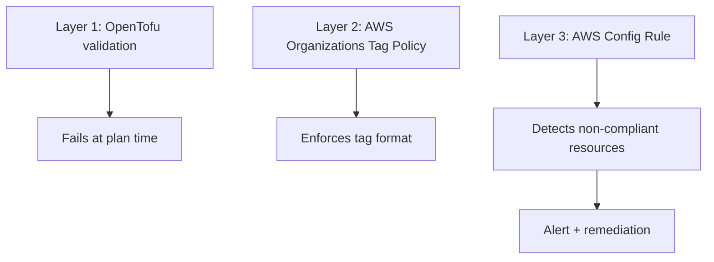

# How to Enforce Resource Tagging Policies with OpenTofu

Author: [nawazdhandala](https://www.github.com/nawazdhandala)

Tags: OpenTofu, Resource Tagging, AWS Config, Tag Policies, Compliance, Infrastructure as Code

Description: Learn how to enforce resource tagging compliance using OpenTofu validation blocks, AWS Organizations tag policies, and AWS Config rules to ensure consistent tags across all infrastructure.

---

Untagged resources make cost attribution, security audits, and compliance reporting impossible. Enforcing tags at multiple layers — OpenTofu plan time, AWS Organizations policy level, and Config rule level — creates defense in depth against untagged resources.

## Tagging Enforcement Layers



## OpenTofu Tagging Validation

```hcl
# modules/tagging/variables.tf
variable "required_tags" {
  type = object({
    Environment = string
    Team        = string
    Project     = string
    CostCenter  = string
  })

  description = "Required tags for all resources"

  validation {
    condition = contains(["dev", "staging", "production"], var.required_tags.Environment)
    error_message = "Environment tag must be dev, staging, or production"
  }

  validation {
    condition = can(regex("^[A-Z]{2}-\\d{4}$", var.required_tags.CostCenter))
    error_message = "CostCenter must follow format: XX-NNNN (e.g., IT-0042)"
  }
}

# Enforce tags at module level
locals {
  enforced_tags = merge(var.required_tags, {
    ManagedBy = "opentofu"
  })
}
```

## AWS Organizations Tag Policy

```hcl
# tag_policy.tf
resource "aws_organizations_policy" "required_tags" {
  name        = "required-resource-tags"
  description = "Enforce required tags on AWS resources"
  type        = "TAG_POLICY"

  content = jsonencode({
    tags = {
      Environment = {
        tag_value = {
          "@@assign" = ["dev", "staging", "production"]
        }
        enforced_for = {
          "@@assign" = [
            "ec2:instance",
            "rds:db",
            "s3:bucket",
          ]
        }
      }
      Team = {
        tag_key = {
          "@@assign" = "Team"
        }
      }
      CostCenter = {
        tag_key = {
          "@@assign" = "CostCenter"
        }
      }
    }
  })
}

resource "aws_organizations_policy_attachment" "tag_policy" {
  policy_id = aws_organizations_policy.required_tags.id
  target_id = var.root_ou_id
}
```

## AWS Config Required Tags Rule

```hcl
resource "aws_config_config_rule" "required_tags" {
  name = "required-tags-enforcement"

  source {
    owner             = "AWS"
    source_identifier = "REQUIRED_TAGS"
  }

  input_parameters = jsonencode({
    tag1Key   = "Environment"
    tag2Key   = "Team"
    tag3Key   = "Project"
    tag4Key   = "CostCenter"
    tag5Key   = "ManagedBy"
  })

  scope {
    compliance_resource_types = [
      "AWS::EC2::Instance",
      "AWS::RDS::DBInstance",
      "AWS::S3::Bucket",
      "AWS::ElasticLoadBalancingV2::LoadBalancer",
      "AWS::ECS::Service",
    ]
  }
}
```

## Automated Tag Remediation

```hcl
# Auto-tag resources that are missing the ManagedBy tag
resource "aws_config_remediation_configuration" "add_managed_by_tag" {
  config_rule_name = aws_config_config_rule.required_tags.name
  target_type      = "SSM_DOCUMENT"
  target_id        = "AWS-AddTagsToResource"
  automatic        = false  # Require manual approval for remediation

  parameter {
    name         = "AutomationAssumeRole"
    static_value = aws_iam_role.config_remediation.arn
  }

  parameter {
    name            = "ResourceId"
    resource_value  = "RESOURCE_ID"
  }

  parameter {
    name         = "Tags"
    static_value = jsonencode({ ManagedBy = "opentofu" })
  }
}
```

## Tag Compliance Dashboard via Lambda

```hcl
# Lambda function to generate weekly tag compliance report
resource "aws_lambda_function" "tag_compliance_report" {
  function_name = "tag-compliance-weekly-report"
  role          = aws_iam_role.reporter.arn
  filename      = data.archive_file.reporter.output_path
  handler       = "index.handler"
  runtime       = "python3.12"
  timeout       = 60

  environment {
    variables = {
      SNS_TOPIC_ARN   = aws_sns_topic.compliance_alerts.arn
      REQUIRED_TAGS   = "Environment,Team,Project,CostCenter"
    }
  }
}

resource "aws_cloudwatch_event_rule" "weekly_tag_report" {
  name                = "weekly-tag-compliance"
  schedule_expression = "cron(0 9 ? * MON *)"  # Monday 9 AM UTC
}
```

## Best Practices

- Enforce tags at three levels: OpenTofu (plan time), Organizations tag policy (API level), and Config (running resources) — each layer catches different gaps.
- Use `validation` blocks with regex patterns to enforce tag formats, not just presence.
- Enable AWS Organizations tag policies in reporting mode first, then switch to enforcement after fixing existing violations.
- Generate a weekly tag compliance report so teams see their non-compliant resources and have time to fix them.
- Use provider `default_tags` to apply mandatory tags automatically — if you rely on individual resource blocks, tags will be missed.
