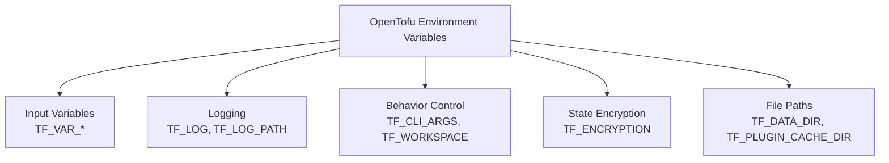

# How to Use Environment Variables with OpenTofu

Author: [nawazdhandala](https://www.github.com/nawazdhandala)

Tags: OpenTofu, Environment Variable, TF_VAR, TF_LOG, TF_WORKSPACE, Configuration, Infrastructure as Code

Description: Learn about all OpenTofu environment variables including TF_VAR_, TF_LOG, TF_WORKSPACE, TF_CLI_ARGS, and TF_DATA_DIR, and how to use them effectively in local development and CI/CD pipelines.

---

OpenTofu reads a set of environment variables to control its behavior without requiring command-line flags. Understanding all available variables helps configure CI/CD pipelines cleanly and enables flexible local development workflows.

## OpenTofu Environment Variables Overview



## Complete Variable Reference

```bash
# Input variables

TF_VAR_<name>=value          # Map to input variable declarations

# Logging control
TF_LOG=TRACE|DEBUG|INFO|WARN|ERROR|OFF
TF_LOG_CORE=DEBUG            # Log level for OpenTofu core only
TF_LOG_PROVIDER=TRACE        # Log level for provider plugins only
TF_LOG_PATH=/path/to/file    # Write logs to file instead of stderr
TF_LOG_PATH_CORE=...         # Core logs to specific file
TF_LOG_PATH_PROVIDER=...     # Provider logs to specific file

# Workspace
TF_WORKSPACE=production      # Select workspace at startup

# CLI argument injection
TF_CLI_ARGS="-compact-warnings"
TF_CLI_ARGS_plan="-parallelism=20"
TF_CLI_ARGS_apply="-auto-approve"

# State encryption (OpenTofu 1.7+)
TF_ENCRYPTION=<hcl_config>

# Directory configuration
TF_DATA_DIR=./.terraform-custom    # Override .terraform directory location
TF_PLUGIN_CACHE_DIR=~/.tofu-cache  # Share provider cache across workspaces

# CI/CD behavior
TF_INPUT=false               # Fail on missing input variables (no prompts)
TF_IN_AUTOMATION=true        # Enables more concise output for CI/CD
```

## TF_IN_AUTOMATION

```bash
# When set, OpenTofu adjusts output for CI/CD:
# - Suppresses suggestions to run follow-up commands
# - Removes interactive prompts
# - More machine-readable output format

export TF_IN_AUTOMATION=true
tofu plan -out=plan.tfplan
# Output: changes only, no "Run `tofu apply` to create these changes" suggestions
```

## TF_CLI_ARGS for Default Flags

```bash
# Add flags to all invocations of a command
export TF_CLI_ARGS="-compact-warnings"

# Add flags to specific commands
export TF_CLI_ARGS_plan="-parallelism=20 -refresh=false"
export TF_CLI_ARGS_apply="-parallelism=20"
export TF_CLI_ARGS_init="-upgrade"

# Multiple args require space separation (not separate exports)
export TF_CLI_ARGS_plan="-var-file=common.tfvars -var-file=prod.tfvars"

# Disable by unsetting
unset TF_CLI_ARGS_plan
```

## TF_WORKSPACE for Environment Selection

```bash
# Select workspace without running tofu workspace select
export TF_WORKSPACE=production
tofu plan  # Runs against "production" workspace state

export TF_WORKSPACE=staging
tofu plan  # Runs against "staging" workspace state

# In CI/CD, map Git branches to workspaces
export TF_WORKSPACE=${GITHUB_REF_NAME:-dev}
tofu plan
```

## TF_PLUGIN_CACHE_DIR for Shared Provider Cache

```bash
# Share downloaded providers across multiple configurations
# Prevents re-downloading the same provider in every tofu init
mkdir -p ~/.opentofu-plugin-cache
export TF_PLUGIN_CACHE_DIR="$HOME/.opentofu-plugin-cache"

# All subsequent tofu init calls share the cache
cd environments/dev && tofu init   # Downloads providers
cd environments/staging && tofu init  # Uses cached providers
```

## Complete CI/CD Environment Setup

```yaml
# .github/workflows/terraform.yml
name: OpenTofu

on: [push, pull_request]

jobs:
  plan:
    runs-on: ubuntu-latest
    environment: ${{ github.ref_name == 'main' && 'production' || 'staging' }}

    env:
      # Behavior
      TF_IN_AUTOMATION: "true"
      TF_INPUT: "false"
      TF_WORKSPACE: ${{ github.ref_name == 'main' && 'production' || 'staging' }}

      # Logging - save to file, upload on failure
      TF_LOG: INFO
      TF_LOG_PATH: /tmp/tofu.log

      # Performance - cache providers
      TF_PLUGIN_CACHE_DIR: ~/.opentofu-plugin-cache

      # Variables from secrets
      TF_VAR_environment: ${{ github.ref_name == 'main' && 'production' || 'staging' }}
      TF_VAR_region: us-east-1
      TF_VAR_database_password: ${{ secrets.DATABASE_PASSWORD }}

      # CLI args
      TF_CLI_ARGS_plan: "-compact-warnings"
      TF_CLI_ARGS_apply: "-compact-warnings"

    steps:
      - uses: actions/checkout@v4

      - name: Setup OpenTofu
        uses: opentofu/setup-opentofu@v1
        with:
          tofu_version: "1.6.x"

      - name: Cache providers
        uses: actions/cache@v4
        with:
          path: ~/.opentofu-plugin-cache
          key: tofu-providers-${{ hashFiles('.terraform.lock.hcl') }}

      - name: Init
        run: tofu init

      - name: Plan
        run: tofu plan -out=plan.tfplan

      - name: Upload debug log on failure
        if: failure()
        uses: actions/upload-artifact@v4
        with:
          name: tofu-logs-${{ github.run_id }}
          path: /tmp/tofu.log
          retention-days: 3
```

## Local Development Profile

```bash
# ~/.zshrc or ~/.bashrc - development defaults

# OpenTofu behavior
export TF_IN_AUTOMATION=false  # Allow interactive prompts locally
export TF_PLUGIN_CACHE_DIR="$HOME/.opentofu-plugin-cache"

# Provider cache directory
mkdir -p "$HOME/.opentofu-plugin-cache"

# Logging - only debug when explicitly needed
# export TF_LOG=DEBUG
# export TF_LOG_PATH=/tmp/tofu-debug.log

# Default workspace for local development
export TF_WORKSPACE=dev

# Common variable defaults for development
export TF_VAR_environment=dev
export TF_VAR_region=us-east-1
```

## Best Practices

- Set `TF_INPUT=false` and `TF_IN_AUTOMATION=true` in all CI/CD pipelines - this prevents hung pipelines waiting for user input and produces cleaner output.
- Use `TF_PLUGIN_CACHE_DIR` to share provider binaries across workspaces - this is especially valuable in CI/CD where each run downloads providers fresh without caching.
- Set `TF_WORKSPACE` in CI/CD to select the target environment rather than running `tofu workspace select` - it's more declarative and easier to review in workflow files.
- Never set `TF_CLI_ARGS_apply=-auto-approve` in CI/CD without also requiring approval gates via GitHub Environments or similar - auto-approve bypasses all human review.
- Document all environment variables your configuration expects in README.md or CONTRIBUTING.md so new team members and CI/CD setup are straightforward.
