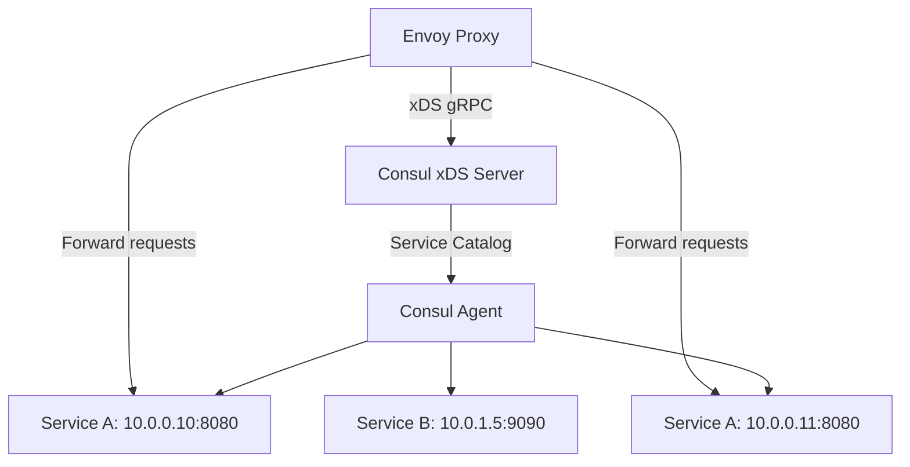

# How to Integrate Envoy with Consul for IPv4 Service Discovery

Author: [nawazdhandala](https://www.github.com/nawazdhandala)

Tags: Envoy, Consul, IPv4, Service Discovery, xDS, EDS, Configuration

Description: Learn how to integrate Envoy with HashiCorp Consul to dynamically discover IPv4 service endpoints using Consul's xDS API support.

---

Consul acts as a control plane for Envoy, pushing service endpoint updates via the xDS API. This enables dynamic load balancing across IPv4 service instances that register and deregister from Consul automatically.

## Architecture



## Registering a Service in Consul

```json
// service-a.json — register with Consul agent
{
  "service": {
    "name": "service-a",
    "id": "service-a-1",
    "address": "10.0.0.10",
    "port": 8080,
    "check": {
      "http": "http://10.0.0.10:8080/health",
      "interval": "10s",
      "timeout": "3s"
    }
  }
}
```

```bash
# Register the service with the local Consul agent
curl --request PUT \
  --data @service-a.json \
  http://127.0.0.1:8500/v1/agent/service/register
```

## Envoy Bootstrap Configuration for Consul xDS

Consul (1.10+) exposes an xDS server that Envoy can consume directly.

```yaml
# envoy-consul-bootstrap.yaml
node:
  id: envoy-proxy-1
  cluster: my-datacenter

dynamic_resources:
  ads_config:
    api_type: GRPC
    transport_api_version: V3
    grpc_services:
      - envoy_grpc:
          cluster_name: consul_xds
  cds_config:
    resource_api_version: V3
    ads: {}
  lds_config:
    resource_api_version: V3
    ads: {}

static_resources:
  clusters:
    - name: consul_xds
      type: STATIC
      connect_timeout: 5s
      http2_protocol_options: {}   # gRPC requires HTTP/2
      load_assignment:
        cluster_name: consul_xds
        endpoints:
          - lb_endpoints:
              - endpoint:
                  address:
                    socket_address:
                      # Consul server IPv4 address and xDS gRPC port
                      address: 192.168.1.100
                      port_value: 8502

admin:
  address:
    socket_address: { address: 127.0.0.1, port_value: 9901 }
```

## Starting Envoy with Consul Bootstrap

```bash
# Start Envoy with the Consul bootstrap config
envoy -c /etc/envoy/envoy-consul-bootstrap.yaml --log-level info

# Verify Envoy received clusters from Consul
curl -s http://localhost:9901/clusters | grep service-a
```

## Static Fallback: Using Consul DNS for IPv4 Resolution

If you prefer static Envoy config with Consul DNS:

```yaml
clusters:
  - name: service_a
    type: STRICT_DNS
    dns_lookup_family: V4_PREFERRED
    connect_timeout: 5s
    load_assignment:
      cluster_name: service_a
      endpoints:
        - lb_endpoints:
            - endpoint:
                address:
                  socket_address:
                    # Consul DNS: <service>.service.<datacenter>.consul
                    address: service-a.service.dc1.consul
                    port_value: 8080
```

## Key Takeaways

- Consul 1.10+ exposes an xDS gRPC server on port 8502 that Envoy can subscribe to for dynamic cluster and listener updates.
- Services registered in Consul with IPv4 addresses are automatically pushed to Envoy via EDS.
- Use `dns_lookup_family: V4_PREFERRED` when using Consul DNS to ensure IPv4 address resolution.
- Check `curl localhost:9901/clusters` to verify Envoy has received and is using Consul-discovered endpoints.
