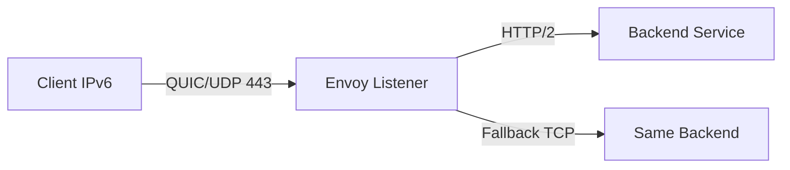

# How to Configure Envoy with QUIC and IPv6

Author: [nawazdhandala](https://www.github.com/nawazdhandala)

Tags: Envoy, QUIC, HTTP/3, IPv6, Service Mesh

Description: Configure Envoy proxy to accept QUIC/HTTP3 connections on IPv6 and proxy them to upstream services.

## Prerequisites

- Envoy 1.20+ (QUIC support improved in 1.20+)
- TLS certificate and key
- IPv6 available on your host

## Envoy QUIC Architecture



## Step 1: Install Envoy

```bash
# Install via official distributions
sudo apt-get install apt-transport-https gnupg2 curl lsb-release
curl -sL 'https://deb.dl.getenvoy.io/public/gpg.8115BA8E629CC074.key' | sudo gpg --dearmor -o /usr/share/keyrings/getenvoy-keyring.gpg
sudo apt-get update && sudo apt-get install getenvoy-envoy

envoy --version
```

## Step 2: QUIC/HTTP3 Listener Configuration

```yaml
# /etc/envoy/envoy.yaml

static_resources:
  listeners:
    # QUIC/HTTP3 listener on IPv6
    - name: quic_listener_ipv6
      address:
        socket_address:
          # :: binds to all IPv6 interfaces
          address: "::"
          port_value: 443
          # QUIC uses UDP
          protocol: UDP
      udp_listener_config:
        quic_options: {}
      filter_chains:
        - transport_socket:
            name: envoy.transport_sockets.quic
            typed_config:
              "@type": type.googleapis.com/envoy.extensions.transport_sockets.quic.v3.QuicDownstreamTransport
              downstream_tls_context:
                common_tls_context:
                  tls_certificates:
                    - certificate_chain:
                        filename: /etc/ssl/certs/example.com.crt
                      private_key:
                        filename: /etc/ssl/private/example.com.key
                  alpn_protocols:
                    - h3
          filters:
            - name: envoy.filters.network.http_connection_manager
              typed_config:
                "@type": type.googleapis.com/envoy.extensions.filters.network.http_connection_manager.v3.HttpConnectionManager
                codec_type: HTTP3
                stat_prefix: ingress_http3
                route_config:
                  name: local_route
                  virtual_hosts:
                    - name: backend
                      domains: ["*"]
                      routes:
                        - match:
                            prefix: "/"
                          route:
                            cluster: backend_service
                http_filters:
                  - name: envoy.filters.http.router
                    typed_config:
                      "@type": type.googleapis.com/envoy.extensions.filters.http.router.v3.Router

    # TCP/HTTP2 fallback listener on IPv6
    - name: tcp_listener_ipv6
      address:
        socket_address:
          address: "::"
          port_value: 443
          protocol: TCP
      filter_chains:
        - transport_socket:
            name: envoy.transport_sockets.tls
            typed_config:
              "@type": type.googleapis.com/envoy.extensions.transport_sockets.tls.v3.DownstreamTlsContext
              common_tls_context:
                tls_certificates:
                  - certificate_chain:
                      filename: /etc/ssl/certs/example.com.crt
                    private_key:
                      filename: /etc/ssl/private/example.com.key
                alpn_protocols: ["h2", "http/1.1"]
          filters:
            - name: envoy.filters.network.http_connection_manager
              typed_config:
                "@type": type.googleapis.com/envoy.extensions.filters.network.http_connection_manager.v3.HttpConnectionManager
                codec_type: AUTO
                stat_prefix: ingress_http
                route_config:
                  name: local_route
                  virtual_hosts:
                    - name: backend
                      domains: ["*"]
                      response_headers_to_add:
                        - header:
                            key: "Alt-Svc"
                            value: "h3=\":443\"; ma=86400"
                      routes:
                        - match:
                            prefix: "/"
                          route:
                            cluster: backend_service
                http_filters:
                  - name: envoy.filters.http.router
                    typed_config:
                      "@type": type.googleapis.com/envoy.extensions.filters.http.router.v3.Router

  clusters:
    - name: backend_service
      connect_timeout: 5s
      type: STATIC
      load_assignment:
        cluster_name: backend_service
        endpoints:
          - lb_endpoints:
              - endpoint:
                  address:
                    socket_address:
                      # IPv6 backend
                      address: "2001:db8:backend::1"
                      port_value: 8080

admin:
  address:
    socket_address:
      address: "::1"  # Admin on IPv6 loopback
      port_value: 9901
```

## Step 3: Start and Verify

```bash
# Validate config
envoy --config-path /etc/envoy/envoy.yaml --mode validate

# Start Envoy
envoy --config-path /etc/envoy/envoy.yaml

# Test HTTP/3 over IPv6
curl -6 --http3 https://[2001:db8::1]/ -v

# Check Envoy admin stats
curl http://[::1]:9901/stats | grep quic

# View QUIC-specific metrics
curl http://[::1]:9901/stats | grep -E "quic|http3"
```

## Monitoring

Use [OneUptime](https://oneuptime.com) to monitor your Envoy QUIC endpoints. Query the Envoy admin API (`/stats`) and create monitors that check both QUIC connection counts and upstream health.

## Conclusion

Envoy QUIC over IPv6 uses separate UDP and TCP listener configurations with different transport sockets. Use the QUIC transport socket for UDP listeners and advertise HTTP/3 via Alt-Svc headers on TCP listeners so clients can upgrade to HTTP/3.
