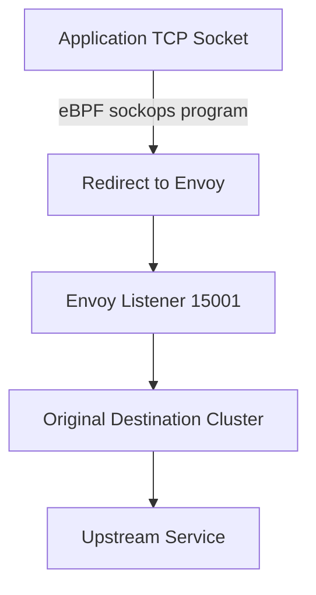

# How to Set Up Envoy as a Transparent Proxy with eBPF and IPv4

Author: [nawazdhandala](https://www.github.com/nawazdhandala)

Tags: Envoy, eBPF, Transparent Proxy, IPv4, Linux, Service Mesh, Networking

Description: Learn how to use eBPF-based traffic redirection instead of iptables to set up Envoy as a transparent IPv4 proxy with lower overhead and better observability.

---

Traditional transparent proxy deployments use iptables to redirect traffic to Envoy. eBPF (Extended Berkeley Packet Filter) provides an alternative: attach BPF programs at the socket or cgroup level to redirect packets without the overhead of iptables traversal, enabling faster interception and better telemetry.

## Why eBPF Over iptables?

| Feature | iptables | eBPF |
|---------|---------|------|
| Performance | NAT table overhead | Near-native; no netfilter |
| Observability | Limited | Rich per-connection metrics |
| Complexity | Rule ordering matters | Program-based, composable |
| Connection tracking | Full conntrack | Can bypass conntrack |

## Architecture Overview



## eBPF Sock Redirect Program

The following BPF C program intercepts `connect()` calls and redirects them to Envoy.

```c
/* transparent_redirect.bpf.c
 * Attach to BPF_PROG_TYPE_SOCK_OPS to intercept IPv4 connections */
#include <linux/bpf.h>
#include <bpf/bpf_helpers.h>
#include <bpf/bpf_endian.h>
#include <sys/socket.h>

/* Envoy listener port for transparent proxying */
#define ENVOY_PORT 15001
/* Mark used by Envoy to avoid re-interception */
#define ENVOY_MARK 100

SEC("sockops")
int transparent_redirect(struct bpf_sock_ops *skops) {
    /* Only act on IPv4 active connections (TCP SYN sent) */
    if (skops->op != BPF_SOCK_OPS_ACTIVE_ESTABLISHED_CB)
        return 0;
    if (skops->family != AF_INET)
        return 0;

    /* Skip if this is Envoy's own traffic (marked) */
    if (skops->sk != NULL) {
        __u32 mark = 0;
        bpf_getsockopt(skops, SOL_SOCKET, SO_MARK, &mark, sizeof(mark));
        if (mark == ENVOY_MARK) return 0;
    }

    /* Redirect non-Envoy IPv4 connections to Envoy's listener */
    bpf_sock_ops_cb_flags_set(skops, BPF_SOCK_OPS_ALL_CB_FLAGS);
    return 0;
}

char _license[] SEC("license") = "GPL";
```

## Loading the eBPF Program

```bash
# Compile the BPF program
clang -O2 -target bpf -c transparent_redirect.bpf.c -o transparent_redirect.bpf.o

# Load and attach to the cgroup (for system-wide redirection)
bpftool prog load transparent_redirect.bpf.o /sys/fs/bpf/transparent_redirect
bpftool cgroup attach /sys/fs/cgroup/ sock_ops pinned /sys/fs/bpf/transparent_redirect

# Verify the program is attached
bpftool cgroup tree /sys/fs/cgroup/
```

## Envoy Configuration for Transparent Proxy

```yaml
# envoy-config.yaml
static_resources:
  listeners:
    - name: transparent_listener
      address:
        socket_address: { address: 0.0.0.0, port_value: 15001 }
      listener_filters:
        - name: envoy.filters.listener.original_dst
          typed_config:
            "@type": type.googleapis.com/envoy.extensions.filters.listener.original_dst.v3.OriginalDst
      filter_chains:
        - filters:
            - name: envoy.filters.network.tcp_proxy
              typed_config:
                "@type": type.googleapis.com/envoy.extensions.filters.network.tcp_proxy.v3.TcpProxy
                stat_prefix: transparent
                cluster: original_dst

  clusters:
    - name: original_dst
      type: ORIGINAL_DST
      connect_timeout: 5s
      upstream_bind_config:
        socket_options:
          - level: 1
            name: 36         # SO_MARK
            int_value: 100   # Envoy's bypass mark
            state: STATE_PREBIND
```

## Key Takeaways

- eBPF `sockops` programs can intercept connections at the socket level before they traverse the network stack.
- Use `SO_MARK` on Envoy's upstream sockets to prevent re-interception by the BPF program.
- The `original_dst` listener filter recovers the original destination IP/port after interception.
- eBPF-based redirection avoids iptables NAT overhead and provides richer observability via BPF maps.
