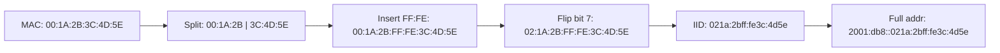

# How to Understand How EUI-64 Enables Cross-Network Tracking

Author: [nawazdhandala](https://www.github.com/nawazdhandala)

Tags: IPv6, EUI-64, Privacy, Tracking, Security, Networking

Description: Understand how IPv6 EUI-64 address generation embeds your device's MAC address into every packet, enabling persistent cross-network device tracking and how to mitigate it.

## Introduction

IPv6 Stateless Address Autoconfiguration (SLAAC) was originally designed to embed a device's MAC address into its IPv6 address using a process called EUI-64 (Extended Unique Identifier - 64 bit). While this made address generation simple and collision-free, it created a serious privacy problem: any observer who sees your IPv6 traffic on any network can derive your hardware MAC address and track you persistently.

## How EUI-64 Address Construction Works

EUI-64 converts a 48-bit MAC address into a 64-bit Interface Identifier by:

1. Splitting the MAC into two 24-bit halves
2. Inserting `ff:fe` in the middle
3. Flipping the 7th bit (the "universal/local" bit)



## The Tracking Problem

Because the IID portion of the address never changes regardless of which network you join, any party that can observe IPv6 traffic can:

1. **Correlate sessions across networks** - the same IID appears at home, at a coffee shop, and at the office
2. **Recover the hardware MAC** - trivially by reversing the EUI-64 transform
3. **Identify device manufacturer** - the first three bytes of a MAC are the OUI (Organizationally Unique Identifier), identifying the hardware vendor

```bash
# Demonstration: reverse EUI-64 to recover MAC address

# Given IPv6 address: 2001:db8::021a:2bff:fe3c:4d5e
# IID: 021a:2bff:fe3c:4d5e

# Step 1: Remove ff:fe from the middle
# 02:1a:2b | 3c:4d:5e

# Step 2: Flip bit 7 of the first byte (02 -> 00)
# Result MAC: 00:1a:2b:3c:4d:5e

echo "Recovered MAC: 00:1a:2b:3c:4d:5e"
```

## Real-World Tracking Scenarios

**Scenario 1: Advertising and Analytics**
Websites that serve both IPv4 and IPv6 content can use the stable EUI-64-based IID to track users even if cookies are cleared or browsers are changed.

**Scenario 2: Network Forensics / Surveillance**
An entity with access to logs from multiple networks (ISP, public Wi-Fi operator) can build a movement history of a specific device.

**Scenario 3: IoT Device Fingerprinting**
Industrial IoT devices that move between test labs, staging, and production networks retain the same address suffix, making them trivially identifiable.

## Checking if Your System Uses EUI-64

```bash
# Display your current IPv6 address
ip -6 addr show | grep "scope global"

# Get your MAC address for comparison
ip link show | grep "link/ether"

# Manually verify EUI-64:
# MAC = AA:BB:CC:DD:EE:FF
# EUI-64 IID = A8BB:CCFF:FEDD:EEFF  (bit 7 flipped: AA->A8)
# If your IID matches this pattern, you are using EUI-64
```

## Verifying via Python

```python
# Script to check if a given IPv6 IID was derived via EUI-64 from a MAC
import re

def mac_to_eui64_iid(mac: str) -> str:
    """Convert a MAC address to its EUI-64 Interface Identifier."""
    parts = mac.split(":")
    # Insert ff:fe between bytes 3 and 4
    parts.insert(3, "ff")
    parts.insert(4, "fe")
    # Flip bit 7 (universal/local bit) of the first byte
    parts[0] = format(int(parts[0], 16) ^ 0x02, "02x")
    # Group into 16-bit chunks
    groups = [parts[i] + parts[i+1] for i in range(0, 8, 2)]
    return ":".join(groups)

mac = "00:1a:2b:3c:4d:5e"
iid = mac_to_eui64_iid(mac)
print(f"MAC {mac} -> EUI-64 IID {iid}")
# Output: MAC 00:1a:2b:3c:4d:5e -> EUI-64 IID 021a:2bff:fe3c:4d5e
```

## Mitigations

| Method | RFC | Stability | Privacy |
|---|---|---|---|
| EUI-64 | Original SLAAC | Permanent | None |
| Temporary Addresses | RFC 4941 | Changes periodically | Good |
| Stable Privacy | RFC 7217 | Stable per-network | Good |
| DHCPv6 assigned | N/A | Server-controlled | Depends |

The modern recommendation is to use **RFC 7217 stable privacy addresses**, which produce opaque IIDs that cannot be correlated across networks.

## Conclusion

EUI-64 was a pragmatic design choice for early IPv6 that has since been recognized as a privacy hazard. Every device using EUI-64 leaks its MAC address and vendor in every packet, enabling persistent cross-network tracking. Understanding how this works is the first step toward deploying RFC 7217 or RFC 4941 privacy extensions to protect your users and devices.
