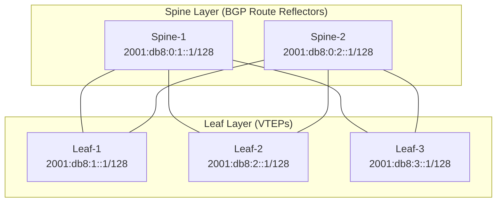

# How to Configure EVPN VXLAN with IPv6 on Cisco Nexus

Author: [nawazdhandala](https://www.github.com/nawazdhandala)

Tags: Cisco, EVPN, VXLAN, IPv6, Nexus, Data Center, BGP

Description: Configure BGP EVPN with VXLAN over an IPv6 underlay on Cisco Nexus switches for scalable overlay fabric.

## Architecture Overview



## IPv6 Underlay Configuration (Leaf)

```
! Leaf-1 — NX-OS configuration
! Enable required features
feature ospfv3
feature bgp
feature vn-segment-vlan-based
feature nv overlay

! IPv6 loopback for VTEP source
interface loopback0
  ipv6 address 2001:db8:1::1/128
  ip router ospf 1 area 0  ! Also run OSPFv2 if needed
  ipv6 router ospfv3 1 area 0

! Spine-facing interface
interface Ethernet1/1
  no switchport
  ipv6 address 2001:db8:f:1::1/64
  ipv6 router ospfv3 1 area 0
  no shutdown

! OSPFv3 for underlay
router ospfv3 1
  router-id 1.1.1.1
```

## EVPN BGP Configuration (Leaf)

```
! BGP with EVPN address family over IPv6
router bgp 65001
  router-id 1.1.1.1
  neighbor 2001:db8:0:1::1 remote-as 65001
    update-source loopback0
    address-family l2vpn evpn
      send-community extended
  neighbor 2001:db8:0:2::1 remote-as 65001
    update-source loopback0
    address-family l2vpn evpn
      send-community extended

! Note: BGP sessions use IPv6 loopbacks
! EVPN NLRIs are L2VPN address family (AF independent of underlay)
```

## VXLAN NVE Interface

```
! Network Virtual Edge (NVE) — VTEP definition
interface nve1
  no shutdown
  source-interface loopback0  ! Uses IPv6 address 2001:db8:1::1
  host-reachability protocol bgp

  ! VNI 10100 → VLAN 100
  member vni 10100
    ingress-replication protocol bgp

  ! L3 VNI for routed EVPN (symmetric IRB)
  member vni 50001 associate-vrf
```

## VLAN and VNI Mapping

```
! Create VLANs and map to VNIs
vlan 100
  vn-segment 10100  ! VNI 10100

vlan 200
  vn-segment 10200

! L3 VLAN for tenant VRF
vlan 3001
  vn-segment 50001

! Tenant VRF
vrf context tenant1
  vni 50001
  rd auto
  address-family ipv4 unicast
    route-target both auto evpn
  address-family ipv6 unicast
    route-target both auto evpn
```

## SVI for Distributed Anycast Gateway

```
! Anycast gateway for hosts on VLAN 100
interface vlan100
  no shutdown
  vrf member tenant1
  ip address 10.100.0.1/24
  fabric forwarding mode anycast-gateway
  ipv6 address 2001:db8:100::1/64

! Anycast gateway MAC (same on all leafs)
fabric forwarding anycast-gateway-mac 0000.dead.beef
```

## Verification Commands

```
! Verify NVE peers (remote VTEPs)
show nve peers
show nve peers detail

! Verify EVPN routes
show bgp l2vpn evpn
show bgp l2vpn evpn summary

! Check VNI to VLAN mapping
show vxlan interface

! Verify MAC/IP table
show mac address-table
show ip arp vrf tenant1

! Ping over VXLAN
ping 10.100.0.2 vrf tenant1
```

## Conclusion

Cisco Nexus EVPN VXLAN supports IPv6 underlay natively when OSPFv3 or IS-IS is used for underlay reachability and BGP sessions are established to loopback IPv6 addresses. The BGP EVPN address family (`l2vpn evpn`) carries MAC/IP routes regardless of underlay IP version. VTEP source interfaces must have the IPv6 loopback address. Symmetric IRB with L3 VNIs enables inter-subnet routing within the overlay without hairpinning traffic to an external router.
