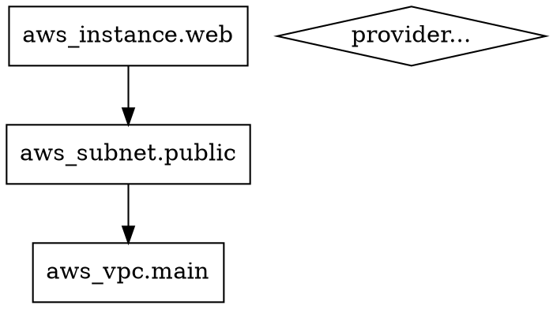

# How to Export Graphs to DOT Format in OpenTofu

Author: [nawazdhandala](https://www.github.com/nawazdhandala)

Tags: OpenTofu, DOT Format, Graphviz, Dependency Graphs, Infrastructure as Code

Description: Learn how to export OpenTofu dependency graphs to DOT format for rendering, sharing, and analysis with graph visualization tools.

DOT is a plain-text graph description language understood by Graphviz and dozens of other tools. OpenTofu natively outputs DOT via the `tofu graph` command, making it easy to export, manipulate, and render your infrastructure dependency graphs.

## Basic Export

Redirect the `tofu graph` output to a `.dot` file:

```bash
# Export the default plan graph
tofu graph > infrastructure.dot

# Export the apply graph
tofu graph -type=apply > apply-graph.dot

# Export the destroy graph
tofu graph -type=destroy-plan > destroy-graph.dot
```

## Understanding the DOT File Structure

A typical exported DOT file looks like this:



Each `->` indicates a dependency: the left node depends on the right node.

## Exporting with Module Context

For configurations with modules, include module subgraphs in the export:

```bash
# Export graph including all module nodes
tofu graph -draw-cycles > full-graph.dot
```

The `-draw-cycles` flag highlights any circular dependency cycles, making them easier to spot visually.

## Customizing DOT Output with Post-Processing

Enhance the raw DOT output before rendering — for example, color nodes by resource type:

```python
#!/usr/bin/env python3
# colorize-graph.py
# Reads a tofu graph DOT file from stdin and adds color coding by resource type

import sys
import re

COLOR_MAP = {
    "aws_vpc":         "lightblue",
    "aws_subnet":      "lightyellow",
    "aws_instance":    "lightgreen",
    "aws_rds":         "lightsalmon",
    "aws_s3":          "plum",
    "aws_iam":         "lightyellow",
    "aws_lambda":      "lightcyan",
}

for line in sys.stdin:
    colored = line
    for resource_prefix, color in COLOR_MAP.items():
        if resource_prefix in line and "label" in line:
            # Add fillcolor and style to matching node declarations
            colored = line.rstrip() + f' fillcolor="{color}" style="filled"\n'
            break
    print(colored, end="")
```

```bash
tofu graph | python3 colorize-graph.py > colored-graph.dot
dot -Tsvg colored-graph.dot -o colored-graph.svg
```

## Exporting from a Specific Module

Target a module subdirectory to get a focused graph:

```bash
cd modules/networking
tofu graph > networking-graph.dot
```

## Stripping Provider Nodes for Clarity

Provider nodes add visual noise in large graphs. Strip them with `grep`:

```bash
# Remove provider node lines from the DOT file
tofu graph | grep -v 'provider\[' > simplified-graph.dot
dot -Tpng simplified-graph.dot -o simplified-graph.png
```

## Automating Export in CI

Add graph export to your CI pipeline for documentation or diff reviews:

```yaml
# .github/workflows/graph.yml
- name: Export Dependency Graph
  run: |
    tofu init -backend=false
    tofu graph > artifacts/graph.dot
    dot -Tsvg artifacts/graph.dot -o artifacts/graph.svg

- name: Upload Graph Artifact
  uses: actions/upload-artifact@v4
  with:
    name: dependency-graph
    path: artifacts/graph.svg
```

## Conclusion

Exporting to DOT format gives you a portable, tool-agnostic representation of your infrastructure's dependency structure. Combine the raw `tofu graph` output with post-processing scripts and CI automation to keep your dependency graphs always up to date and visually informative.
