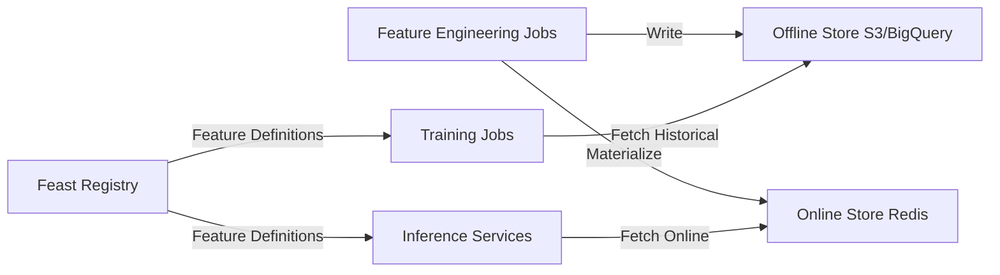

# How to Configure Feature Stores on Rancher

Author: [nawazdhandala](https://www.github.com/nawazdhandala)

Tags: Rancher, Feature Store, Feast, Machine Learning, MLOps, Kubernetes

Description: Deploy Feast feature store on Rancher to centralize feature computation, enable feature sharing across ML models, and reduce training-serving skew.

## Introduction

A feature store centralizes feature computation and storage, enabling reuse of features across multiple ML models and ensuring consistency between training and serving. Feast (Feature Store) is the most popular open-source feature store and integrates with Kubernetes, Redis, and offline stores like BigQuery and Hive.

## Feature Store Architecture



## Step 1: Deploy Redis for Online Store

```bash
helm repo add bitnami https://charts.bitnami.com/bitnami
helm install redis bitnami/redis \
  --namespace ml-platform \
  --create-namespace \
  --set auth.password=featurestore \
  --set replica.replicaCount=2
```

## Step 2: Deploy Feast

```bash
pip install feast[kubernetes,redis]

# Create a Feast project
feast init feature-repo
cd feature-repo
```

Configure `feature_store.yaml`:

```yaml
# feature_store.yaml
project: myproject
provider: local
registry: s3://my-feast-registry/registry.pb
online_store:
  type: redis
  redis_type: redis
  connection_string: "redis.ml-platform.svc.cluster.local:6379,password=featurestore"
offline_store:
  type: file    # Use S3 or BigQuery for production
entity_key_serialization_version: 2
```

## Step 3: Define Features

```python
# features.py - Feature definitions
from datetime import timedelta
from feast import Entity, FeatureView, Field, FileSource
from feast.types import Float32, Int64

# Define entities
user = Entity(name="user_id", description="User identifier")

# Define data source
user_stats_source = FileSource(
    path="s3://my-data/user_stats.parquet",
    timestamp_field="event_timestamp"
)

# Define feature view
user_stats_fv = FeatureView(
    name="user_stats",
    entities=[user],
    ttl=timedelta(days=7),
    schema=[
        Field(name="purchase_count_7d", dtype=Int64),
        Field(name="avg_order_value", dtype=Float32),
        Field(name="last_login_days", dtype=Int64),
    ],
    source=user_stats_source,
    tags={"team": "risk", "owner": "alice"},
)
```

## Step 4: Apply and Materialize Features

```bash
# Register feature definitions
feast apply

# Materialize features to online store
feast materialize 2024-01-01T00:00:00 2026-03-19T00:00:00
```

## Step 5: Retrieve Features in Training

```python
# training.py - Fetch historical features for training
from feast import FeatureStore

store = FeatureStore(repo_path="/feature-repo")

# Fetch historical features for a set of entities
training_df = store.get_historical_features(
    entity_df=entity_dataframe,
    features=["user_stats:purchase_count_7d", "user_stats:avg_order_value"]
).to_df()
```

## Step 6: Retrieve Features in Serving

```python
# inference.py - Fetch online features for real-time inference
feature_vector = store.get_online_features(
    features=["user_stats:purchase_count_7d", "user_stats:avg_order_value"],
    entity_rows=[{"user_id": 12345}]
).to_dict()
```

## Conclusion

Feast on Rancher centralizes feature management across the ML platform. The separation of offline and online stores enables batch feature computation (overnight jobs) with millisecond-latency serving from Redis. This prevents training-serving skew—a major source of model performance degradation in production ML systems.
