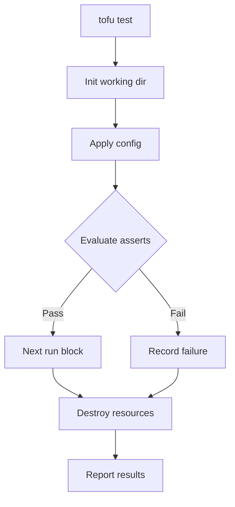

# How to Write Your First Test with tofu test - Opentofu

Author: [nawazdhandala](https://www.github.com/nawazdhandala)

Tags: OpenTofu, Testing, Tofu test, Infrastructure as Code, Unit Testing

Description: A step-by-step guide to writing and running your first infrastructure test using the built-in `tofu test` command in OpenTofu.

## Introduction

OpenTofu ships with a native testing framework that lets you validate your modules and configurations without deploying to a real cloud account. The `tofu test` command reads `.tftest.hcl` (or `.tofutest.hcl`) files and executes `run` blocks that apply configuration, assert conditions, and then clean up resources automatically.

## Prerequisites

- OpenTofu 1.6 or later installed
- Basic familiarity with HCL

## Your First Module

Start with a simple module that creates a local file-no cloud credentials required.

```hcl
# modules/greeter/main.tf

variable "name" {
  type        = string
  description = "Name to greet"
}

output "message" {
  value = "Hello, ${var.name}!"
}
```

## Writing the Test File

Test files live alongside your module (or in a dedicated `tests/` directory) and use the `.tftest.hcl` extension.

```hcl
# modules/greeter/greeter.tftest.hcl

# A run block defines one test scenario
run "greets_with_name" {
  # Pass input variables to the module under test
  variables {
    name = "World"
  }

  # Assert that the output matches what we expect
  assert {
    condition     = output.message == "Hello, World!"
    error_message = "Expected greeting 'Hello, World!' but got: ${output.message}"
  }
}

run "greets_with_different_name" {
  variables {
    name = "OpenTofu"
  }

  assert {
    condition     = output.message == "Hello, OpenTofu!"
    error_message = "Greeting did not include the provided name"
  }
}
```

## Running the Tests

Navigate to the module directory and run:

```bash
# Run all tests in the current directory
tofu test

# Run with verbose output to see each assertion result
tofu test -verbose
```

Expected output:

```text
greeter.tftest.hcl... pass
  run "greets_with_name"... pass
  run "greets_with_different_name"... pass

Success! 2 passed, 0 failed.
```

## Understanding What Happens

When `tofu test` runs a `run` block it:

1. Initialises a temporary working directory.
2. Runs `tofu apply` with the supplied variables.
3. Evaluates every `assert` block; failures are reported but the run continues.
4. After all run blocks execute, performs a `tofu destroy` to remove any real resources created.



## Tips for Your First Test

- **Use `plan` mode for fast feedback.** Add `command = plan` inside the `run` block to skip apply and just check the plan. This is much faster for modules with real cloud resources.
- **One assertion per concern.** Keep each `assert` block focused on a single attribute so failure messages are clear.
- **Test edge cases.** Write a separate `run` block for empty strings, maximum-length values, or other boundary inputs.

## Conclusion

The `tofu test` command makes infrastructure testing approachable. With a test file in place, you can run `tofu test` in CI to catch regressions before every merge-giving you the same safety net that application developers take for granted.
