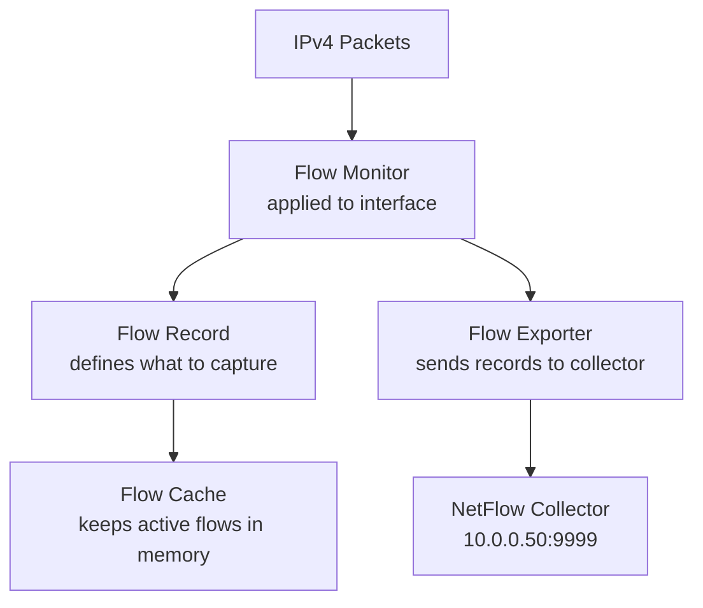

# How to Configure Flexible NetFlow to Monitor Specific IPv4 Traffic Flows

Author: [nawazdhandala](https://www.github.com/nawazdhandala)

Tags: NetFlow, Flexible NetFlow, IPv4, Traffic Monitoring, Cisco, Network Analytics, Flow

Description: Learn how to configure Cisco Flexible NetFlow to capture and export specific IPv4 traffic flow records for network monitoring and capacity planning.

---

Flexible NetFlow (FNF) extends traditional NetFlow with customizable flow records. You can define exactly which IPv4 header fields to capture, enabling targeted traffic analysis without exporting all possible fields.

## Flexible NetFlow Components



## Step 1: Create a Flow Record

Define which IPv4 fields to match (keys) and collect (non-keys).

```
! Cisco IOS/IOS-XE
ip flow record IPV4-FLOW-RECORD

  ! Key fields: used to identify unique flows
  match ipv4 source address
  match ipv4 destination address
  match transport source-port
  match transport destination-port
  match ipv4 protocol
  match interface input

  ! Non-key fields: collected statistics per flow
  collect counter bytes long
  collect counter packets long
  collect timestamp sys-uptime first
  collect timestamp sys-uptime last
  collect transport tcp flags
  collect ipv4 dscp
```

## Step 2: Create a Flow Exporter

Configure where to send flow records.

```
ip flow exporter NETFLOW-COLLECTOR
  destination 10.0.0.50         ! Collector's IPv4 address
  source GigabitEthernet0/0    ! Source interface for flow packets
  transport udp 9999            ! Standard NetFlow UDP port
  export-protocol netflow-v9   ! Use NetFlow v9 (or ipfix for v10)
  template data timeout 30     ! Send templates every 30 seconds
```

## Step 3: Create a Flow Monitor

Tie the record and exporter together.

```
ip flow monitor IPV4-MONITOR
  record IPV4-FLOW-RECORD
  exporter NETFLOW-COLLECTOR
  cache timeout active 60      ! Export active flows every 60 seconds
  cache timeout inactive 15    ! Export idle flows after 15 seconds
```

## Step 4: Apply the Monitor to an Interface

```
interface GigabitEthernet0/1
  ip flow monitor IPV4-MONITOR input   ! Monitor inbound traffic
  ip flow monitor IPV4-MONITOR output  ! Monitor outbound traffic
```

## Monitoring Specific Traffic with Sampled Flow

For high-traffic interfaces, use sampling to reduce CPU overhead:

```
! Define a 1-in-1000 sampler
sampler NETFLOW-SAMPLER
  mode random 1 out-of 1000

interface GigabitEthernet0/1
  ip flow monitor IPV4-MONITOR sampler NETFLOW-SAMPLER input
```

## Verifying Flexible NetFlow

```
! Show active flow caches
show flow monitor IPV4-MONITOR cache

! Show exporter statistics
show flow exporter NETFLOW-COLLECTOR statistics

! Show top talkers by bytes
show flow monitor IPV4-MONITOR cache sort highest counter bytes long top 10

! Show flow monitor on an interface
show flow interface GigabitEthernet0/1
```

## Collecting Flows with a Linux Collector

```bash
# Install nfdump/nfcapd collector
apt install nfdump -y

# Start capturing NetFlow on UDP 9999 (from the Cisco device's IPv4)
mkdir -p /var/netflow
nfcapd -w /var/netflow -p 9999 -b 10.0.0.50 -D

# View captured flows
nfdump -R /var/netflow/ -n 20 -s srcip/bytes

# Filter for a specific source IP
nfdump -R /var/netflow/ 'src ip 10.0.1.5' -n 10
```

## Key Takeaways

- Flexible NetFlow's `match` fields define flow keys (what makes a flow unique); `collect` fields gather statistics.
- Apply the flow monitor to both `input` and `output` on an interface to capture bidirectional traffic.
- Use sampling (`sampler`) on high-traffic interfaces to reduce CPU and memory overhead.
- Open-source collectors like `nfcapd`/`nfdump` or ntopng can receive and analyze FNF records.
