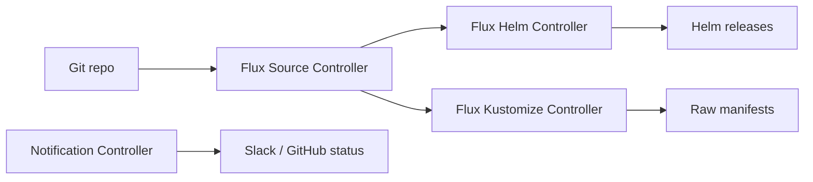

# How to Use Flux CD with OpenTofu for GitOps

Author: [nawazdhandala](https://www.github.com/nawazdhandala)

Tags: OpenTofu, Flux CD, GitOps, Kubernetes, Helm, Infrastructure as Code

Description: Learn how to install Flux CD on Kubernetes using OpenTofu and configure GitRepositories, HelmReleases, and Kustomizations for automated, Git-driven application deployments.

---

Flux CD continuously syncs Kubernetes cluster state with Git repositories. OpenTofu provisions the cluster and bootstraps Flux, then Flux takes over to manage application deployments, Helm releases, and configuration changes from Git.

## Flux GitOps Model



## Install Flux via Helm (OpenTofu)

```hcl
# flux.tf
resource "helm_release" "flux" {
  name             = "flux2"
  repository       = "https://fluxcd-community.github.io/helm-charts"
  chart            = "flux2"
  version          = "2.12.4"
  namespace        = "flux-system"
  create_namespace = true

  values = [
    yamlencode({
      sourceController = {
        resources = {
          requests = { cpu = "50m", memory = "64Mi" }
          limits   = { cpu = "200m", memory = "256Mi" }
        }
      }
      helmController = {
        resources = {
          requests = { cpu = "100m", memory = "64Mi" }
          limits   = { cpu = "500m", memory = "512Mi" }
        }
      }
      kustomizeController = {
        resources = {
          requests = { cpu = "50m", memory = "64Mi" }
          limits   = { cpu = "200m", memory = "256Mi" }
        }
      }
    })
  ]
}
```

## GitRepository Source

```hcl
resource "kubernetes_manifest" "git_repository" {
  manifest = {
    apiVersion = "source.toolkit.fluxcd.io/v1"
    kind       = "GitRepository"
    metadata = {
      name      = "app-configs"
      namespace = "flux-system"
    }
    spec = {
      interval = "1m"
      url      = "https://github.com/myorg/app-configs"
      ref = {
        branch = var.environment == "production" ? "main" : var.environment
      }
      secretRef = { name = "github-credentials" }
    }
  }
  depends_on = [helm_release.flux]
}
```

## HelmRelease via Flux

```hcl
resource "kubernetes_manifest" "app_helm_release" {
  manifest = {
    apiVersion = "helm.toolkit.fluxcd.io/v2"
    kind       = "HelmRelease"
    metadata = {
      name      = var.app_name
      namespace = var.app_namespace
    }
    spec = {
      interval = "10m"
      chart = {
        spec = {
          chart   = var.app_name
          version = ">=1.0.0"
          sourceRef = {
            kind      = "GitRepository"
            name      = "app-configs"
            namespace = "flux-system"
          }
          interval = "1m"
        }
      }
      values = {
        replicaCount = var.environment == "production" ? 3 : 1
        image = { tag = var.app_version }
        environment = var.environment
      }
      # Rollback on failure
      rollback = {
        timeout       = "5m"
        cleanupOnFail = true
      }
    }
  }
}
```

## Kustomization for Manifests

```hcl
resource "kubernetes_manifest" "kustomization" {
  manifest = {
    apiVersion = "kustomize.toolkit.fluxcd.io/v1"
    kind       = "Kustomization"
    metadata = {
      name      = "${var.app_name}-${var.environment}"
      namespace = "flux-system"
    }
    spec = {
      interval    = "5m"
      path        = "./environments/${var.environment}/${var.app_name}"
      prune       = true
      sourceRef = {
        kind = "GitRepository"
        name = "app-configs"
      }
      targetNamespace = var.app_namespace
      healthChecks = [{
        apiVersion = "apps/v1"
        kind       = "Deployment"
        name       = var.app_name
        namespace  = var.app_namespace
      }]
    }
  }
}
```

## Slack Notifications

```hcl
resource "kubernetes_manifest" "flux_provider" {
  manifest = {
    apiVersion = "notification.toolkit.fluxcd.io/v1beta3"
    kind       = "Provider"
    metadata = {
      name      = "slack"
      namespace = "flux-system"
    }
    spec = {
      type      = "slack"
      channel   = "#deployments-${var.environment}"
      secretRef = { name = "slack-webhook" }
    }
  }
}

resource "kubernetes_manifest" "flux_alert" {
  manifest = {
    apiVersion = "notification.toolkit.fluxcd.io/v1beta3"
    kind       = "Alert"
    metadata = {
      name      = "deployment-alerts"
      namespace = "flux-system"
    }
    spec = {
      eventSeverity = "info"
      eventSources = [
        { kind = "HelmRelease", name = "*" }
        { kind = "Kustomization", name = "*" }
      ]
      providerRef = { name = "slack" }
    }
  }
}
```

## Best Practices

- Use `interval: 1m` for GitRepository polling in non-production and `1m` for production to balance responsiveness with API rate limits.
- Enable `prune: true` on Kustomizations to automatically delete resources removed from Git.
- Configure rollback on HelmRelease failures — this prevents broken releases from staying deployed indefinitely.
- Wire Flux notifications to Slack or GitHub commit status — teams need to know when deployments succeed or fail.
- Use GitHub webhook receivers instead of polling for faster deployments in production — webhooks trigger reconciliation immediately on push.
