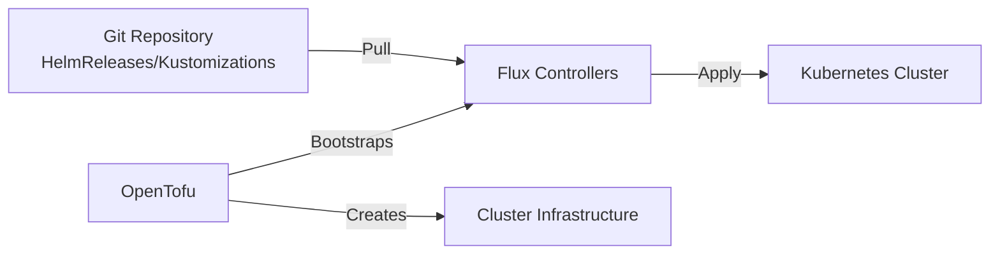

# How to Deploy Flux CD with OpenTofu

Author: [nawazdhandala](https://www.github.com/nawazdhandala)

Tags: OpenTofu, Flux CD, GitOps, Kubernetes, Helm, Infrastructure as Code, CD

Description: Learn how to deploy Flux CD to Kubernetes using OpenTofu to enable GitOps-driven continuous delivery where your Git repository is the single source of truth.

---

Flux CD is a GitOps operator for Kubernetes that automatically synchronizes cluster state with configurations stored in Git. When combined with OpenTofu for infrastructure provisioning, you get end-to-end automation from infrastructure creation to application deployment.

## How Flux Works



## Installing Flux with the Helm Provider

```hcl
# providers.tf
terraform {
  required_providers {
    helm = {
      source  = "hashicorp/helm"
      version = "~> 2.12"
    }
    kubernetes = {
      source  = "hashicorp/kubernetes"
      version = "~> 2.24"
    }
  }
}

provider "helm" {
  kubernetes {
    host                   = var.cluster_endpoint
    cluster_ca_certificate = base64decode(var.cluster_ca_cert)
    token                  = var.cluster_token
  }
}
```

## Deploying the Flux Operator

```hcl
# flux.tf
resource "kubernetes_namespace" "flux_system" {
  metadata {
    name = "flux-system"
    labels = {
      "app.kubernetes.io/managed-by" = "opentofu"
    }
  }
}

resource "helm_release" "flux_operator" {
  name       = "flux-operator"
  repository = "oci://ghcr.io/controlplaneio-fluxcd/charts"
  chart      = "flux-operator"
  version    = "0.8.0"
  namespace  = kubernetes_namespace.flux_system.metadata[0].name

  wait    = true
  timeout = 300
}

# Create a FluxInstance to configure Flux
resource "kubernetes_manifest" "flux_instance" {
  depends_on = [helm_release.flux_operator]

  manifest = {
    apiVersion = "fluxcd.controlplane.io/v1"
    kind       = "FluxInstance"
    metadata = {
      name      = "flux"
      namespace = kubernetes_namespace.flux_system.metadata[0].name
    }
    spec = {
      distribution = {
        version  = "2.x"
        registry = "ghcr.io/fluxcd"
      }
      components = [
        "source-controller",
        "kustomize-controller",
        "helm-controller",
        "notification-controller",
      ]
      cluster = {
        type        = "kubernetes"
        multitenant = false
      }
      # Bootstrap from a Git repository
      sync = {
        kind    = "GitRepository"
        url     = var.flux_git_repository_url
        ref     = "refs/heads/main"
        path    = "clusters/production"
        pullSecret = "flux-git-auth"
      }
    }
  }
}
```

## Creating Git Authentication Secret

```hcl
# git_auth.tf
# Create a Kubernetes secret with the SSH key for Git access
resource "kubernetes_secret" "flux_git_auth" {
  metadata {
    name      = "flux-git-auth"
    namespace = kubernetes_namespace.flux_system.metadata[0].name
  }

  data = {
    # SSH private key for Git access
    "identity"     = var.git_ssh_private_key
    "identity.pub" = var.git_ssh_public_key
    "known_hosts"  = var.git_known_hosts
  }

  type = "Opaque"
}
```

## Configuring Flux Notifications

```hcl
# notifications.tf
# Create a Slack notification provider
resource "kubernetes_manifest" "slack_provider" {
  depends_on = [helm_release.flux_operator]

  manifest = {
    apiVersion = "notification.toolkit.fluxcd.io/v1beta3"
    kind       = "Provider"
    metadata = {
      name      = "slack"
      namespace = kubernetes_namespace.flux_system.metadata[0].name
    }
    spec = {
      type      = "slack"
      channel   = "#deployments"
      secretRef = {
        name = "slack-webhook-url"
      }
    }
  }
}

# Alert on Flux reconciliation failures
resource "kubernetes_manifest" "reconciliation_alert" {
  depends_on = [kubernetes_manifest.slack_provider]

  manifest = {
    apiVersion = "notification.toolkit.fluxcd.io/v1beta3"
    kind       = "Alert"
    metadata = {
      name      = "reconciliation-failures"
      namespace = kubernetes_namespace.flux_system.metadata[0].name
    }
    spec = {
      providerRef = {
        name = "slack"
      }
      eventSeverity = "error"
      eventSources = [
        {
          kind = "GitRepository"
          name = "*"
        },
        {
          kind = "HelmRelease"
          name = "*"
        }
      ]
    }
  }
}
```

## Best Practices

- Store Flux's bootstrap configuration in the same Git repository it manages — this ensures Flux can self-heal if it's accidentally deleted.
- Use SSH key authentication rather than HTTPS tokens for better security and easier rotation.
- Enable Flux notifications so your team knows when reconciliation fails — silent failures are the worst kind.
- Use Kustomize overlays or HelmRelease values to manage environment-specific configuration within the Git repo.
- Set resource limits on Flux controllers to prevent them from consuming excessive cluster resources.
