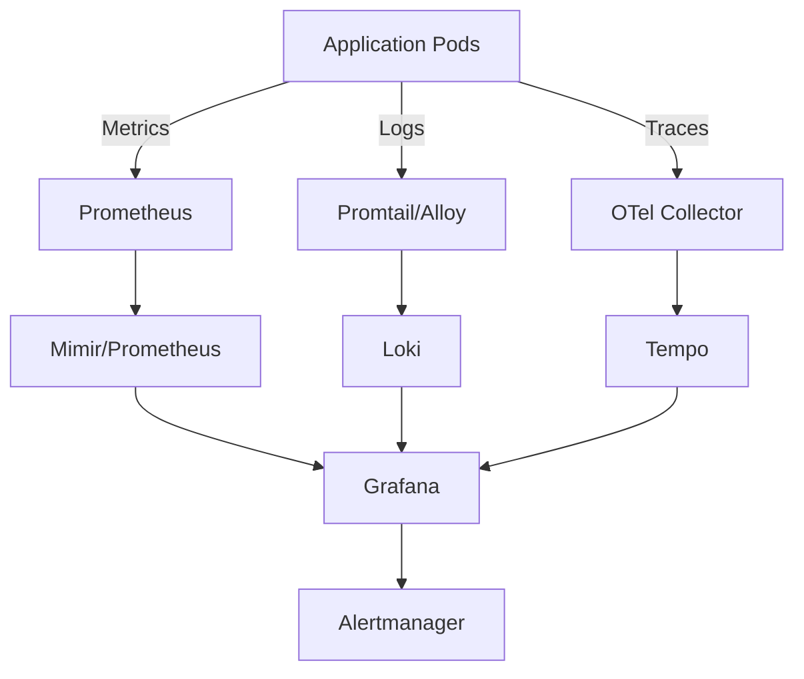

# How to Set Up Full Observability Stack on Rancher

Author: [nawazdhandala](https://www.github.com/nawazdhandala)

Tags: Rancher, Observability, Prometheus, Grafana, Loki, Tempo, OpenTelemetry

Description: Build a complete observability stack on Rancher combining Prometheus metrics, Loki logs, and Tempo traces with Grafana as the unified visualization layer.

## Introduction

Full observability requires three pillars: metrics, logs, and traces. The Grafana LGTM stack (Loki, Grafana, Tempo, Mimir/Prometheus) provides an integrated, cost-effective observability platform. This guide deploys the complete stack on Rancher.

## Stack Overview



## Step 1: Create Observability Namespace

```bash
kubectl create namespace observability
```

## Step 2: Deploy Prometheus Stack

```bash
helm repo add prometheus-community https://prometheus-community.github.io/helm-charts
helm install prometheus prometheus-community/kube-prometheus-stack \
  --namespace observability \
  --set grafana.enabled=true \
  --set prometheus.prometheusSpec.retention=15d \
  --set alertmanager.enabled=true
```

## Step 3: Deploy Loki

```bash
helm repo add grafana https://grafana.github.io/helm-charts
helm install loki grafana/loki \
  --namespace observability \
  --set loki.auth_enabled=false \
  --set loki.storage.type=filesystem    # Use filesystem for dev; S3 for production
```

## Step 4: Deploy Promtail

```bash
helm install promtail grafana/promtail \
  --namespace observability \
  --set config.clients[0].url=http://loki.observability.svc.cluster.local:3100/loki/api/v1/push
```

## Step 5: Deploy Tempo

```bash
helm install tempo grafana/tempo \
  --namespace observability \
  --set tempo.storage.trace.backend=local    # Use S3 for production
```

## Step 6: Deploy OpenTelemetry Collector

```bash
helm repo add open-telemetry https://open-telemetry.github.io/opentelemetry-helm-charts
helm install otel-collector open-telemetry/opentelemetry-collector \
  --namespace observability \
  --set mode=daemonset
```

## Step 7: Configure Grafana Data Sources

Apply all data sources at once via ConfigMap:

```yaml
# grafana-datasources-cm.yaml

apiVersion: v1
kind: ConfigMap
metadata:
  name: grafana-datasources
  namespace: observability
  labels:
    grafana_datasource: "1"
data:
  datasources.yaml: |
    apiVersion: 1
    datasources:
      - name: Prometheus
        type: prometheus
        url: http://prometheus-kube-prometheus-prometheus.observability.svc.cluster.local:9090
        isDefault: true
      - name: Loki
        type: loki
        url: http://loki.observability.svc.cluster.local:3100
      - name: Tempo
        type: tempo
        url: http://tempo.observability.svc.cluster.local:3100
        jsonData:
          tracesToLogsV2:
            datasourceUid: loki
          tracesToMetrics:
            datasourceUid: prometheus
```

## Step 8: Verify Integration

Access Grafana and verify all data sources are connected:

```bash
kubectl port-forward svc/prometheus-grafana \
  -n observability 3000:80

# Open http://localhost:3000
# Default credentials: admin/prom-operator
```

Navigate to **Explore** and verify you can query metrics, logs, and traces.

## Conclusion

The full LGTM observability stack on Rancher provides end-to-end visibility across your applications. The tight integration between Grafana data sources enables powerful workflows like clicking a trace in Tempo and jumping directly to related logs in Loki, or correlating a metrics anomaly with the trace that caused it.
