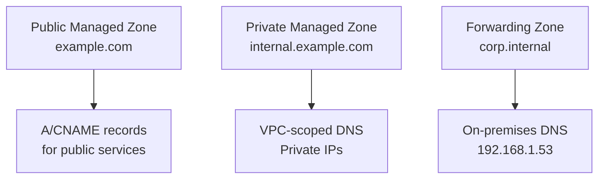

# How to Manage GCP Cloud DNS with OpenTofu

Author: [nawazdhandala](https://www.github.com/nawazdhandala)

Tags: OpenTofu, GCP, Cloud DNS, DNS, Zone, Record, Private DNS, Infrastructure as Code

Description: Learn how to create and manage GCP Cloud DNS managed zones and record sets using OpenTofu, including public zones, private VPC zones, DNS peering, and forwarding for hybrid connectivity.

---

GCP Cloud DNS provides a managed, scalable DNS service. OpenTofu manages public and private DNS zones, record sets of all types, DNS peering for cross-VPC resolution, and forwarding zones for hybrid on-premises connectivity.

## Cloud DNS Architecture



## Public Managed Zone

```hcl
# dns.tf

resource "google_dns_managed_zone" "public" {
  name        = "${replace(var.domain_name, ".", "-")}-public"
  dns_name    = "${var.domain_name}."
  description = "Public DNS zone for ${var.domain_name}"
  project     = var.project_id
  visibility  = "public"

  dnssec_config {
    state = "on"  # Enable DNSSEC for security
  }

  labels = {
    environment = var.environment
    managed-by  = "opentofu"
  }
}

output "name_servers" {
  description = "Configure these at your domain registrar"
  value       = google_dns_managed_zone.public.name_servers
}
```

## DNS Record Sets

```hcl
# records.tf

# A record pointing to load balancer
resource "google_dns_record_set" "apex" {
  name         = "${var.domain_name}."
  type         = "A"
  ttl          = 300
  managed_zone = google_dns_managed_zone.public.name
  project      = var.project_id
  rrdatas      = [google_compute_global_address.lb.address]
}

# CNAME for www
resource "google_dns_record_set" "www" {
  name         = "www.${var.domain_name}."
  type         = "CNAME"
  ttl          = 300
  managed_zone = google_dns_managed_zone.public.name
  project      = var.project_id
  rrdatas      = ["${var.domain_name}."]
}

# MX records
resource "google_dns_record_set" "mx" {
  name         = "${var.domain_name}."
  type         = "MX"
  ttl          = 300
  managed_zone = google_dns_managed_zone.public.name
  project      = var.project_id
  rrdatas      = [
    "10 mail.${var.domain_name}.",
    "20 mail2.${var.domain_name}.",
  ]
}

# TXT for SPF and domain verification
resource "google_dns_record_set" "spf" {
  name         = "${var.domain_name}."
  type         = "TXT"
  ttl          = 300
  managed_zone = google_dns_managed_zone.public.name
  project      = var.project_id
  rrdatas      = ["\"v=spf1 include:_spf.google.com ~all\""]
}
```

## Private DNS Zone

```hcl
# private_zone.tf
resource "google_dns_managed_zone" "private" {
  name        = "${var.prefix}-private"
  dns_name    = "internal.${var.domain_name}."
  description = "Private zone for internal services"
  project     = var.project_id
  visibility  = "private"

  private_visibility_config {
    networks {
      network_url = google_compute_network.main.id
    }
  }
}

# Internal service endpoint
resource "google_dns_record_set" "database" {
  name         = "db.internal.${var.domain_name}."
  type         = "A"
  ttl          = 60
  managed_zone = google_dns_managed_zone.private.name
  project      = var.project_id
  rrdatas      = [google_sql_database_instance.main.private_ip_address]
}
```

## DNS Forwarding Zone

```hcl
# forwarding.tf - forward on-premises domain queries to on-prem DNS
resource "google_dns_managed_zone" "forwarding" {
  name        = "${var.prefix}-onprem-forward"
  dns_name    = "${var.onprem_domain}."
  description = "Forward on-premises domain to corporate DNS"
  project     = var.project_id
  visibility  = "private"

  forwarding_config {
    target_name_servers {
      ipv4_address    = var.onprem_dns_ip
      forwarding_path = "private"  # Route through Cloud Interconnect/VPN
    }
  }

  private_visibility_config {
    networks {
      network_url = google_compute_network.main.id
    }
  }
}
```

## Best Practices

- Always end DNS names with a trailing dot in Cloud DNS (`"example.com."`) - without the trailing dot, Cloud DNS treats the name as relative to the zone, causing resolution failures.
- Enable DNSSEC on public zones to prevent DNS spoofing - after enabling, update your registrar's DS records using the output from `google_dns_managed_zone.dnssec_config`.
- Use private zones with `private_visibility_config` scoped to specific VPCs rather than making internal records public - this prevents internal service endpoints from being publicly resolvable.
- Use forwarding zones for on-premises domains accessible via Cloud Interconnect or VPN - this allows GCP resources to resolve on-premises hostnames using corporate DNS.
- After creating a public zone, update your domain registrar's name servers with the `name_servers` output - Cloud DNS zones don't work until the registrar is updated.
