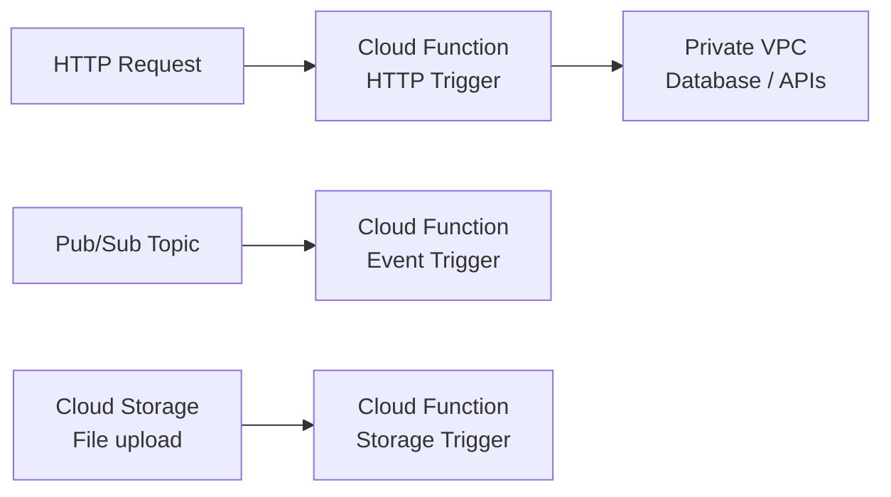

# How to Deploy GCP Cloud Functions with OpenTofu

Author: [nawazdhandala](https://www.github.com/nawazdhandala)

Tags: OpenTofu, GCP, Cloud Function, Serverless, Pub/Sub, Cloud Storage, Infrastructure as Code

Description: Learn how to deploy Google Cloud Functions (Gen 2) using OpenTofu, including HTTP-triggered functions, Pub/Sub event triggers, IAM configuration, and VPC connectivity for private resources.

---

Google Cloud Functions Gen 2 runs on Cloud Run under the hood, offering improved performance, longer timeouts, and higher concurrency. OpenTofu manages the function deployment, IAM bindings, event triggers, and supporting infrastructure like Pub/Sub topics and Cloud Storage buckets.

## Cloud Functions Architecture



## Function Deployment

```hcl
# function.tf

resource "google_storage_bucket" "functions_code" {
  name          = "${var.project_id}-functions-code"
  location      = var.region
  storage_class = "STANDARD"

  uniform_bucket_level_access = true
}

# Upload function source code
resource "google_storage_bucket_object" "function_zip" {
  name   = "${var.function_name}-${var.function_version}.zip"
  bucket = google_storage_bucket.functions_code.name
  source = "${path.module}/functions/${var.function_name}.zip"
}

resource "google_cloudfunctions2_function" "main" {
  name     = var.function_name
  location = var.region
  project  = var.project_id

  build_config {
    runtime     = "python311"
    entry_point = var.entry_point

    source {
      storage_source {
        bucket = google_storage_bucket.functions_code.name
        object = google_storage_bucket_object.function_zip.name
      }
    }
  }

  service_config {
    min_instance_count             = 0
    max_instance_count             = var.max_instances
    available_memory               = var.memory  # e.g., "256M"
    timeout_seconds                = var.timeout
    service_account_email          = google_service_account.function.email
    ingress_settings               = "ALLOW_INTERNAL_AND_GCLB"

    environment_variables = {
      PROJECT_ID = var.project_id
      ENVIRONMENT = var.environment
    }

    secret_environment_variables {
      key        = "DATABASE_PASSWORD"
      project_id = var.project_id
      secret     = google_secret_manager_secret.db_password.secret_id
      version    = "latest"
    }
  }

  labels = {
    environment = var.environment
    managed-by  = "opentofu"
  }
}
```

## Pub/Sub Event Trigger

```hcl
resource "google_pubsub_topic" "events" {
  name    = "${var.function_name}-events"
  project = var.project_id
}

resource "google_cloudfunctions2_function" "pubsub" {
  name     = "${var.function_name}-pubsub"
  location = var.region
  project  = var.project_id

  build_config {
    runtime     = "python311"
    entry_point = "process_event"
    source {
      storage_source {
        bucket = google_storage_bucket.functions_code.name
        object = google_storage_bucket_object.function_zip.name
      }
    }
  }

  event_trigger {
    trigger_region        = var.region
    event_type            = "google.cloud.pubsub.topic.v1.messagePublished"
    pubsub_topic          = google_pubsub_topic.events.id
    retry_policy          = "RETRY_POLICY_RETRY"
    service_account_email = google_service_account.function.email
  }

  service_config {
    max_instance_count    = 10
    available_memory      = "512M"
    timeout_seconds       = 300
    service_account_email = google_service_account.function.email
  }
}
```

## IAM for HTTP-Triggered Function

```hcl
# Allow unauthenticated access for public HTTP functions
resource "google_cloud_run_service_iam_member" "public" {
  count = var.allow_unauthenticated ? 1 : 0

  location = google_cloudfunctions2_function.main.location
  project  = var.project_id
  service  = google_cloudfunctions2_function.main.name
  role     = "roles/run.invoker"
  member   = "allUsers"
}

# IAM for service-to-service invocation
resource "google_cloud_run_service_iam_member" "invoker" {
  for_each = toset(var.invoker_service_accounts)

  location = google_cloudfunctions2_function.main.location
  project  = var.project_id
  service  = google_cloudfunctions2_function.main.name
  role     = "roles/run.invoker"
  member   = "serviceAccount:${each.value}"
}
```

## VPC Connector for Private Access

```hcl
resource "google_vpc_access_connector" "function" {
  name          = "${var.prefix}-connector"
  region        = var.region
  project       = var.project_id
  network       = var.vpc_network
  ip_cidr_range = var.connector_cidr  # e.g., "10.8.0.0/28"
  min_instances = 2
  max_instances = 10
}

# Use the connector in function service_config
resource "google_cloudfunctions2_function" "private" {
  # ...
  service_config {
    # ...
    vpc_connector                  = google_vpc_access_connector.function.id
    vpc_connector_egress_settings  = "PRIVATE_RANGES_ONLY"
  }
}
```

## Best Practices

- Use Gen 2 (`google_cloudfunctions2_function`) for all new deployments - Gen 2 offers longer timeouts (up to 60 minutes), higher concurrency, and runs on Cloud Run for better observability.
- Store function code in GCS and upload new zips for each deployment - this provides a version history and makes rollbacks possible.
- Use `ingress_settings = "ALLOW_INTERNAL_AND_GCLB"` for functions accessed via load balancers - this prevents direct public internet access while allowing Cloud Load Balancing traffic.
- Attach a dedicated service account to each function with minimal permissions - avoid using the default compute service account, which has broad project-level access.
- Use VPC Access Connector for functions that need to access private VPC resources (databases, internal APIs) - without it, functions can only reach public internet endpoints.
