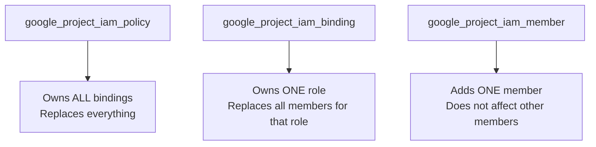

# How to Set Up GCP IAM Bindings with OpenTofu

Author: [nawazdhandala](https://www.github.com/nawazdhandala)

Tags: OpenTofu, GCP, IAM, IAM Bindings, Google Cloud, Infrastructure as Code, Security

Description: Learn the difference between google_project_iam_policy, google_project_iam_binding, and google_project_iam_member in OpenTofu and when to use each for managing GCP IAM permissions.

---

GCP IAM in OpenTofu offers three resource types for managing permissions, and choosing the wrong one can inadvertently remove existing access. Understanding the difference between `iam_policy`, `iam_binding`, and `iam_member` is critical before making changes to production projects.

## The Three IAM Resource Types



## iam_member - Additive (Recommended)

```hcl
# Adds a single member to a role - does NOT remove existing members

resource "google_project_iam_member" "ci_storage_viewer" {
  project = var.project_id
  role    = "roles/storage.objectViewer"
  member  = "serviceAccount:${google_service_account.ci.email}"
}

resource "google_project_iam_member" "dev_team_viewer" {
  project = var.project_id
  role    = "roles/viewer"
  member  = "group:dev-team@example.com"
}

# Conditional binding - only during business hours
resource "google_project_iam_member" "conditional_access" {
  project = var.project_id
  role    = "roles/editor"
  member  = "user:oncall@example.com"

  condition {
    title       = "business-hours"
    description = "Only allow access during business hours"
    expression  = "request.time.getHours(\"America/New_York\") >= 9 && request.time.getHours(\"America/New_York\") <= 17"
  }
}
```

## iam_binding - Authoritative for One Role

```hcl
# Owns ALL members for this specific role
# Removes any members not listed here when applied
resource "google_project_iam_binding" "storage_admins" {
  project = var.project_id
  role    = "roles/storage.admin"

  members = [
    "user:alice@example.com",
    "serviceAccount:${google_service_account.backup.email}",
  ]
}
```

## iam_policy - Authoritative for Entire Project

```hcl
# DANGEROUS: Replaces ALL IAM bindings on the project
# Only use if you want complete control over all project IAM
data "google_iam_policy" "project" {
  binding {
    role = "roles/owner"
    members = ["user:owner@example.com"]
  }

  binding {
    role = "roles/editor"
    members = [
      "serviceAccount:${google_service_account.app.email}",
    ]
  }
}

resource "google_project_iam_policy" "project" {
  project     = var.project_id
  policy_data = data.google_iam_policy.project.policy_data
}
```

Resource-Level Bindings

```hcl
# GCS bucket
resource "google_storage_bucket_iam_member" "bucket_reader" {
  bucket = google_storage_bucket.data.name
  role   = "roles/storage.objectViewer"
  member = "serviceAccount:${google_service_account.reader.email}"
}

# BigQuery dataset
resource "google_bigquery_dataset_iam_member" "dataset_viewer" {
  dataset_id = google_bigquery_dataset.analytics.dataset_id
  project    = var.project_id
  role       = "roles/bigquery.dataViewer"
  member     = "group:analysts@example.com"
}

# GKE Workload Identity binding
resource "google_service_account_iam_member" "workload_identity" {
  service_account_id = google_service_account.app.name
  role               = "roles/iam.workloadIdentityUser"
  member             = "serviceAccount:${var.project_id}.svc.id.goog[${var.k8s_namespace}/${var.k8s_sa}]"
}
```

## Using for_each for Multiple Bindings

```hcl
locals {
  service_account_roles = toset([
    "roles/storage.objectAdmin",
    "roles/secretmanager.accessor",
    "roles/cloudtrace.agent",
  ])
}

resource "google_project_iam_member" "app_roles" {
  for_each = local.service_account_roles

  project = var.project_id
  role    = each.value
  member  = "serviceAccount:${google_service_account.app.email}"
}
```

## Best Practices

- Prefer `iam_member` for additive grants - it's the safest option and won't accidentally remove access granted outside OpenTofu.
- Use `iam_binding` only when you need to own all members of a specific role.
- Never use `iam_policy` on a project unless you want OpenTofu to manage 100% of the project's IAM - it removes any manually added bindings on the next apply.
- Apply IAM at the narrowest scope (resource > folder > project > organization) to minimize blast radius.
- Use conditional bindings for temporary access grants - they expire automatically without manual cleanup.
