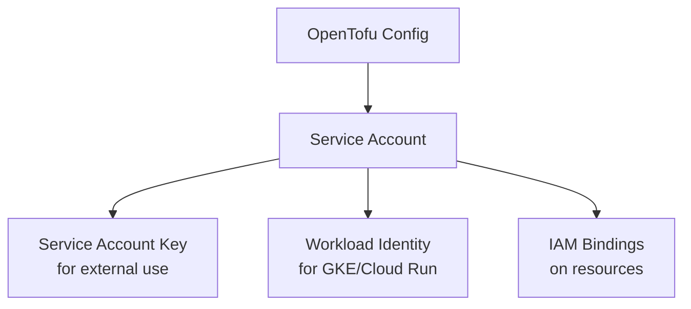

# How to Create GCP IAM Service Accounts with OpenTofu

Author: [nawazdhandala](https://www.github.com/nawazdhandala)

Tags: OpenTofu, GCP, IAM, Service Accounts, Google Cloud, Infrastructure as Code, Security

Description: Learn how to create and manage GCP IAM service accounts using OpenTofu to enable secure authentication for applications, VMs, and CI/CD pipelines running on Google Cloud.

---

GCP Service Accounts are special accounts used by applications and VMs to authenticate to Google APIs and services. Unlike user accounts, service accounts are owned by projects and designed for non-human identities. OpenTofu's Google provider makes managing service accounts declarative and auditable.

## Service Account Types in GCP

GCP has two types of service accounts: user-managed (which you create and manage) and Google-managed (created automatically for GCP services). This guide focuses on user-managed service accounts.



## Creating a Basic Service Account

```hcl
# main.tf

terraform {
  required_providers {
    google = {
      source  = "hashicorp/google"
      version = "~> 5.10"
    }
  }
}

provider "google" {
  project = var.project_id
  region  = var.region
}

# Create a service account for the application backend
resource "google_service_account" "app_backend" {
  account_id   = "app-backend-sa"
  display_name = "App Backend Service Account"
  description  = "Service account used by the app backend to access GCP services"
  project      = var.project_id
}
```

## Granting Project-Level IAM Roles

```hcl
# iam_bindings.tf
# Grant the service account the Storage Object Viewer role at project level
resource "google_project_iam_member" "storage_viewer" {
  project = var.project_id
  role    = "roles/storage.objectViewer"
  member  = "serviceAccount:${google_service_account.app_backend.email}"
}

# Grant Pub/Sub Publisher access
resource "google_project_iam_member" "pubsub_publisher" {
  project = var.project_id
  role    = "roles/pubsub.publisher"
  member  = "serviceAccount:${google_service_account.app_backend.email}"
}
```

## Granting Resource-Level IAM Roles

For least-privilege, prefer granting roles on specific resources rather than at the project level.

```hcl
# resource_iam.tf
# Create a Cloud Storage bucket
resource "google_storage_bucket" "app_data" {
  name     = "${var.project_id}-app-data"
  location = var.region
}

# Grant access only to this specific bucket (not all buckets in the project)
resource "google_storage_bucket_iam_member" "app_bucket_access" {
  bucket = google_storage_bucket.app_data.name
  role   = "roles/storage.objectAdmin"
  member = "serviceAccount:${google_service_account.app_backend.email}"
}

# Grant access to a specific Pub/Sub topic
resource "google_pubsub_topic" "events" {
  name = "app-events"
}

resource "google_pubsub_topic_iam_member" "events_publisher" {
  topic  = google_pubsub_topic.events.name
  role   = "roles/pubsub.publisher"
  member = "serviceAccount:${google_service_account.app_backend.email}"
}
```

## Creating Service Account Keys for External Access

Keys should only be used when Workload Identity or Application Default Credentials are not available.

```hcl
# keys.tf
# Create a key for the service account (use sparingly - prefer Workload Identity)
resource "google_service_account_key" "app_backend_key" {
  service_account_id = google_service_account.app_backend.name
  public_key_type    = "TYPE_X509_PEM_FILE"
}

# Store the key in Secret Manager rather than in state or files
resource "google_secret_manager_secret" "sa_key" {
  secret_id = "app-backend-sa-key"

  replication {
    auto {}
  }
}

resource "google_secret_manager_secret_version" "sa_key_version" {
  secret      = google_secret_manager_secret.sa_key.id
  # Key is base64-encoded - store as-is
  secret_data = google_service_account_key.app_backend_key.private_key
}
```

## Setting Up Workload Identity for GKE

Workload Identity is the preferred way to grant GKE workloads access to GCP APIs without keys.

```hcl
# workload_identity.tf
# Allow the Kubernetes service account to impersonate the GCP service account
resource "google_service_account_iam_member" "workload_identity_binding" {
  service_account_id = google_service_account.app_backend.name
  role               = "roles/iam.workloadIdentityUser"
  member             = "serviceAccount:${var.project_id}.svc.id.goog[${var.k8s_namespace}/${var.k8s_service_account}]"
}
```

## Best Practices

- Avoid creating service account keys unless absolutely necessary - use Workload Identity or Application Default Credentials instead.
- Use descriptive `account_id` values that make the purpose obvious in audit logs.
- Grant roles at the resource level, not project level, wherever possible.
- Audit service accounts regularly with `gcloud iam service-accounts list` to find unused accounts.
- Disable and then delete service accounts rather than deleting them immediately, in case dependent services need time to migrate.
