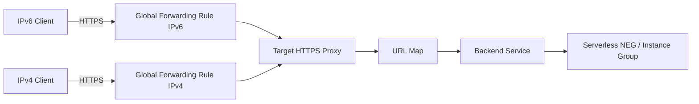

# How to Configure GCP Load Balancer with IPv6 Using Terraform

Author: [nawazdhandala](https://www.github.com/nawazdhandala)

Tags: GCP, Terraform, IPv6, Load Balancer, Global LB, Networking

Description: A guide to creating a GCP Global External Application Load Balancer with IPv6 frontend using Terraform.

GCP's Global External Application Load Balancer automatically supports both IPv4 and IPv6 through its anycast frontend IPs. When you create a global forwarding rule with `ip_version = "IPV6"`, GCP provisions a globally anycast IPv6 address routed to the nearest Google edge PoP.

## Architecture



## Step 1: Create the Backend Service

```hcl
# backend.tf - Backend service pointing to a managed instance group

resource "google_compute_backend_service" "app" {
  name        = "app-backend"
  protocol    = "HTTP"
  port_name   = "http"
  timeout_sec = 30

  backend {
    group = google_compute_instance_group_manager.app.instance_group
  }

  health_checks = [google_compute_health_check.http.id]
}

resource "google_compute_health_check" "http" {
  name = "http-health-check"
  http_health_check {
    port         = 80
    request_path = "/health"
  }
}
```

## Step 2: Create the URL Map and Target Proxy

```hcl
# proxy.tf - URL map and HTTPS proxy for the load balancer
resource "google_compute_url_map" "main" {
  name            = "app-url-map"
  default_service = google_compute_backend_service.app.id
}

resource "google_compute_target_https_proxy" "main" {
  name             = "app-https-proxy"
  url_map          = google_compute_url_map.main.id
  ssl_certificates = [google_compute_managed_ssl_certificate.main.id]
}

resource "google_compute_managed_ssl_certificate" "main" {
  name = "app-cert"
  managed {
    domains = [var.domain_name]
  }
}
```

## Step 3: Create IPv4 and IPv6 Global Forwarding Rules

```hcl
# forwarding-rules.tf - Separate forwarding rules for IPv4 and IPv6

# IPv4 global anycast frontend
resource "google_compute_global_forwarding_rule" "ipv4" {
  name        = "app-fwd-ipv4"
  target      = google_compute_target_https_proxy.main.id
  port_range  = "443"
  ip_version  = "IPV4"
  ip_protocol = "TCP"
}

# IPv6 global anycast frontend
resource "google_compute_global_forwarding_rule" "ipv6" {
  name        = "app-fwd-ipv6"
  target      = google_compute_target_https_proxy.main.id
  port_range  = "443"
  ip_version  = "IPV6"   # GCP allocates a global anycast IPv6 address
  ip_protocol = "TCP"
}

output "lb_ipv4_address" {
  value = google_compute_global_forwarding_rule.ipv4.ip_address
}

output "lb_ipv6_address" {
  value = google_compute_global_forwarding_rule.ipv6.ip_address
}
```

## Step 4: Create DNS Records for Both Address Families

```hcl
# dns.tf - Add A and AAAA records to point to the load balancer
resource "google_dns_record_set" "a" {
  name         = "${var.domain_name}."
  type         = "A"
  ttl          = 300
  managed_zone = google_dns_managed_zone.main.name
  rrdatas      = [google_compute_global_forwarding_rule.ipv4.ip_address]
}

resource "google_dns_record_set" "aaaa" {
  name         = "${var.domain_name}."
  type         = "AAAA"
  ttl          = 300
  managed_zone = google_dns_managed_zone.main.name
  rrdatas      = [google_compute_global_forwarding_rule.ipv6.ip_address]
}
```

## Step 5: Apply and Test

```bash
terraform apply

# Get the IPv6 frontend address
IPV6_IP=$(terraform output -raw lb_ipv6_address)

# Test connectivity
curl -6 "https://[$IPV6_IP]/" -k
# Or via DNS
curl -6 "https://${DOMAIN_NAME}/"
```

GCP's Global External Load Balancer with IPv6 forwarding rules leverages Google's global anycast network to serve IPv6 traffic from the nearest edge point of presence, minimizing latency for IPv6 clients worldwide.
