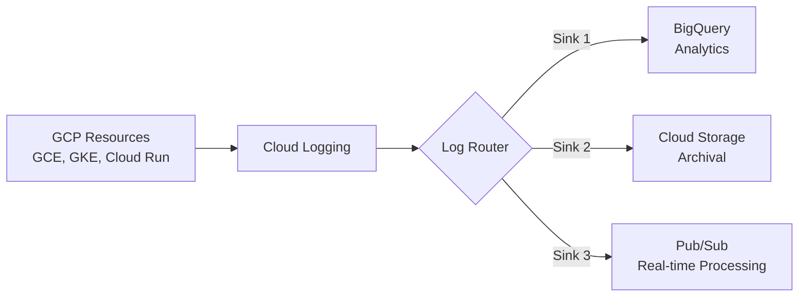

# How to Create GCP Log Sinks with OpenTofu

Author: [nawazdhandala](https://www.github.com/nawazdhandala)

Tags: OpenTofu, GCP, Cloud Logging, Log Sinks, Observability, Infrastructure as Code, Google Cloud

Description: Learn how to create GCP Cloud Logging log sinks with OpenTofu to route logs to BigQuery, Cloud Storage, or Pub/Sub for long-term retention and analysis.

---

GCP Cloud Logging collects logs from all GCP services automatically, but by default they have limited retention. Log sinks allow you to route logs to destinations like BigQuery for analytics, Cloud Storage for long-term archival, or Pub/Sub for real-time stream processing. OpenTofu manages sinks, destinations, and IAM permissions in a single configuration.

## Log Sink Architecture



## Creating a Log Sink to BigQuery

```hcl
# main.tf
terraform {
  required_providers {
    google = {
      source  = "hashicorp/google"
      version = "~> 5.10"
    }
  }
}

provider "google" {
  project = var.project_id
  region  = var.region
}

# Create the BigQuery dataset to receive logs
resource "google_bigquery_dataset" "audit_logs" {
  dataset_id  = "audit_logs"
  description = "Dataset for GCP audit log analysis"
  location    = var.region

  # Keep tables for 365 days by default
  default_table_expiration_ms = 31536000000

  labels = {
    managed_by = "opentofu"
  }
}

# Create the log sink
resource "google_logging_project_sink" "audit_to_bigquery" {
  name        = "audit-logs-to-bigquery"
  destination = "bigquery.googleapis.com/projects/${var.project_id}/datasets/${google_bigquery_dataset.audit_logs.dataset_id}"

  # Filter: only route Admin Activity audit logs
  filter = "logName:\"cloudaudit.googleapis.com%2Factivity\""

  # Create a dedicated service account for this sink
  unique_writer_identity = true
}

# Grant the sink's service account permission to write to BigQuery
resource "google_bigquery_dataset_iam_member" "sink_writer" {
  dataset_id = google_bigquery_dataset.audit_logs.dataset_id
  role       = "roles/bigquery.dataEditor"
  member     = google_logging_project_sink.audit_to_bigquery.writer_identity
}
```

## Creating a Log Sink to Cloud Storage

```hcl
# storage_sink.tf
resource "google_storage_bucket" "log_archive" {
  name     = "${var.project_id}-log-archive"
  location = var.region

  lifecycle_rule {
    condition {
      age = 365  # Move to Nearline after 1 year
    }
    action {
      type          = "SetStorageClass"
      storage_class = "NEARLINE"
    }
  }

  lifecycle_rule {
    condition {
      age = 730  # Delete after 2 years
    }
    action {
      type = "Delete"
    }
  }
}

resource "google_logging_project_sink" "all_logs_to_storage" {
  name        = "all-logs-to-storage"
  destination = "storage.googleapis.com/${google_storage_bucket.log_archive.name}"

  # Route all logs to storage (no filter = catch-all)
  filter = ""

  unique_writer_identity = true
}

resource "google_storage_bucket_iam_member" "log_sink_writer" {
  bucket = google_storage_bucket.log_archive.name
  role   = "roles/storage.objectCreator"
  member = google_logging_project_sink.all_logs_to_storage.writer_identity
}
```

## Creating a Log Sink to Pub/Sub

```hcl
# pubsub_sink.tf
resource "google_pubsub_topic" "security_alerts" {
  name = "security-alert-logs"
}

resource "google_logging_project_sink" "security_to_pubsub" {
  name        = "security-logs-to-pubsub"
  destination = "pubsub.googleapis.com/projects/${var.project_id}/topics/${google_pubsub_topic.security_alerts.name}"

  # Filter: route only security-related logs
  filter = "severity >= ERROR AND resource.type != \"gcs_bucket\""

  unique_writer_identity = true
}

resource "google_pubsub_topic_iam_member" "log_sink_publisher" {
  topic  = google_pubsub_topic.security_alerts.name
  role   = "roles/pubsub.publisher"
  member = google_logging_project_sink.security_to_pubsub.writer_identity
}
```

## Organization-Level Sink

```hcl
# org_sink.tf
# Route logs from all projects in the org to a central archive
resource "google_logging_organization_sink" "central_archive" {
  name        = "org-central-log-archive"
  org_id      = var.org_id
  destination = "storage.googleapis.com/${google_storage_bucket.central_archive.name}"

  # Include logs from all child projects
  include_children = true

  # Filter: only high-severity events
  filter = "severity >= WARNING"
}
```

## Best Practices

- Use `unique_writer_identity = true` on all sinks to get a dedicated service account per sink rather than sharing the default logging service account.
- Always grant the minimum required permission to the sink's writer identity (e.g., `storage.objectCreator` rather than `storage.objectAdmin`).
- Use specific log filters to avoid routing unnecessary logs and incurring egress costs.
- Test your filter with the Log Explorer in the GCP Console before deploying.
- For compliance use cases (PCI, HIPAA), use organization-level sinks to centralize all project logs.
