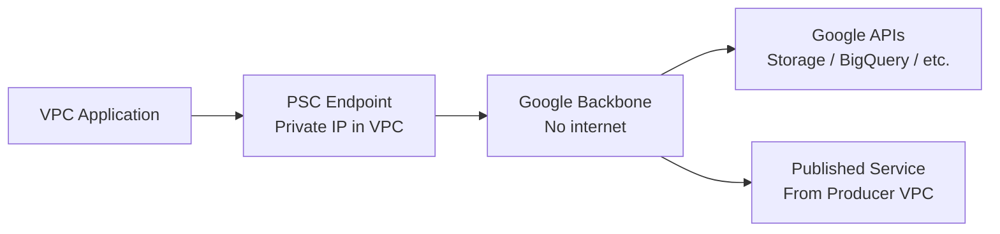

# How to Set Up GCP Private Service Connect with OpenTofu

Author: [nawazdhandala](https://www.github.com/nawazdhandala)

Tags: OpenTofu, GCP, Private Service Connect, VPC, Private Connectivity, Infrastructure as Code

Description: Learn how to configure GCP Private Service Connect (PSC) endpoints using OpenTofu to access Google APIs and published services privately without internet exposure.

---

GCP Private Service Connect provides private connectivity to Google APIs and third-party services from your VPC using private IP addresses. OpenTofu manages PSC endpoints, DNS configurations, and the forwarding rules that route traffic through the private network.

## PSC Architecture



## PSC Endpoint for Google APIs

```hcl
# psc.tf
resource "google_compute_global_address" "psc_google_apis" {
  name          = "${var.prefix}-psc-google-apis"
  purpose       = "PRIVATE_SERVICE_CONNECT"
  address_type  = "INTERNAL"
  network       = google_compute_network.main.id
  address       = "10.100.0.2"  # Fixed IP for DNS forwarding
  project       = var.project_id
}

resource "google_compute_global_forwarding_rule" "psc_google_apis" {
  name                  = "${var.prefix}-psc-all-apis"
  target                = "all-apis"  # Bundle of all Google APIs
  network               = google_compute_network.main.id
  ip_address            = google_compute_global_address.psc_google_apis.id
  load_balancing_scheme = ""  # Empty for PSC
  project               = var.project_id
}
```

## DNS Configuration for PSC

```hcl
# dns.tf — route Google API calls through PSC endpoint
resource "google_dns_managed_zone" "googleapis" {
  name        = "${var.prefix}-googleapis"
  dns_name    = "googleapis.com."
  visibility  = "private"
  project     = var.project_id

  private_visibility_config {
    networks {
      network_url = google_compute_network.main.id
    }
  }
}

# Route all googleapis.com traffic to PSC IP
resource "google_dns_record_set" "googleapis_a" {
  name         = "*.googleapis.com."
  type         = "A"
  ttl          = 300
  managed_zone = google_dns_managed_zone.googleapis.name
  rrdatas      = [google_compute_global_address.psc_google_apis.address]
  project      = var.project_id
}

resource "google_dns_record_set" "googleapis_cname" {
  name         = "*.googleapis.com."
  type         = "CNAME"
  ttl          = 300
  managed_zone = google_dns_managed_zone.googleapis.name
  rrdatas      = ["private.googleapis.com."]
  project      = var.project_id
}

# Also configure for gcr.io and pkg.dev
resource "google_dns_managed_zone" "gcr" {
  name        = "${var.prefix}-gcr"
  dns_name    = "gcr.io."
  visibility  = "private"
  project     = var.project_id

  private_visibility_config {
    networks {
      network_url = google_compute_network.main.id
    }
  }
}

resource "google_dns_record_set" "gcr_a" {
  name         = "*.gcr.io."
  type         = "A"
  ttl          = 300
  managed_zone = google_dns_managed_zone.gcr.name
  rrdatas      = [google_compute_global_address.psc_google_apis.address]
  project      = var.project_id
}
```

## PSC Endpoint for a Published Service (Consumer)

```hcl
# consumer_psc.tf — connect to a service published by another VPC

# Reserve IP for the PSC endpoint
resource "google_compute_address" "psc_endpoint" {
  name         = "${var.prefix}-psc-endpoint"
  subnetwork   = google_compute_subnetwork.main.id
  address_type = "INTERNAL"
  region       = var.region
  project      = var.project_id
}

# Create the PSC forwarding rule to connect to the published service
resource "google_compute_forwarding_rule" "psc_consumer" {
  name                  = "${var.prefix}-psc-consumer"
  region                = var.region
  project               = var.project_id
  target                = var.service_attachment_uri  # From the service producer
  load_balancing_scheme = ""
  ip_address            = google_compute_address.psc_endpoint.id
  network               = google_compute_network.main.id
  subnetwork            = google_compute_subnetwork.main.id
}
```

## Publisher: Exposing a Service via PSC

```hcl
# publisher_psc.tf — expose your service for other VPCs to connect

# NLB is required as the frontend for PSC published services
resource "google_compute_forwarding_rule" "psc_producer_nlb" {
  name                  = "${var.prefix}-psc-nlb"
  region                = var.region
  project               = var.project_id
  load_balancing_scheme = "INTERNAL"
  backend_service       = google_compute_region_backend_service.main.id
  ip_address            = google_compute_address.nlb_ip.id
  network               = google_compute_network.main.id
  subnetwork            = google_compute_subnetwork.main.id
  all_ports             = true
}

# PSC service attachment
resource "google_compute_service_attachment" "main" {
  name                  = "${var.prefix}-service-attachment"
  region                = var.region
  project               = var.project_id
  description           = "PSC service attachment for ${var.service_name}"
  forwarding_rule       = google_compute_forwarding_rule.psc_producer_nlb.id
  connection_preference = "ACCEPT_AUTOMATIC"  # or ACCEPT_MANUAL for explicit approval

  nat_subnets = [google_compute_subnetwork.psc_nat.id]

  # Allowlist specific consumer projects
  consumer_accept_lists {
    project_id_or_num = var.consumer_project_id
    connection_limit  = 10
  }
}

output "service_attachment_uri" {
  description = "Share with consumers to create PSC endpoints"
  value       = google_compute_service_attachment.main.id
}
```

## Best Practices

- Use the `all-apis` PSC target rather than `vpc-sc` unless you need VPC Service Controls — `all-apis` covers all Google APIs with a single endpoint.
- Create private DNS zones for `googleapis.com` and `gcr.io` to route API calls through the PSC endpoint — without DNS, applications will still resolve to public IP addresses.
- Use `ACCEPT_AUTOMATIC` for trusted internal consumers and `ACCEPT_MANUAL` for external organizations that need approval before connecting.
- Create a dedicated NAT subnet (`/29` minimum) for PSC service attachments — this subnet provides IP addresses for PSC connection translations.
- Test PSC connectivity by resolving `storage.googleapis.com` from inside the VPC — it should resolve to the PSC endpoint IP rather than a public Google IP.
