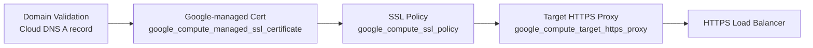

# How to Manage GCP SSL Certificates with OpenTofu

Author: [nawazdhandala](https://www.github.com/nawazdhandala)

Tags: OpenTofu, GCP, SSL, TLS, Certificates, Google-managed, Cloud DNS, Infrastructure as Code

Description: Learn how to provision Google-managed SSL certificates and self-managed certificates for GCP Load Balancers using OpenTofu, with automatic domain validation and certificate lifecycle management.

---

GCP offers Google-managed SSL certificates that are automatically provisioned and renewed, and self-managed certificates for custom PKI requirements. OpenTofu manages both certificate types and their attachment to HTTPS load balancer target proxies.

## GCP Certificate Architecture



## Google-Managed SSL Certificate

```hcl
# ssl.tf
resource "google_compute_managed_ssl_certificate" "main" {
  name = "${var.app_name}-cert-${var.environment}"

  managed {
    domains = [
      var.domain_name,
      "www.${var.domain_name}",
      "api.${var.domain_name}",
    ]
  }

  lifecycle {
    create_before_destroy = true
  }
}
```

## DNS Record for Certificate Validation

```hcl
# Cloud DNS record pointing to load balancer IP
resource "google_compute_global_address" "lb" {
  name = "${var.app_name}-lb-ip"
}

resource "google_dns_record_set" "apex" {
  name         = "${var.domain_name}."
  type         = "A"
  ttl          = 300
  managed_zone = google_dns_managed_zone.main.name
  rrdatas      = [google_compute_global_address.lb.address]
}

resource "google_dns_record_set" "api" {
  name         = "api.${var.domain_name}."
  type         = "A"
  ttl          = 300
  managed_zone = google_dns_managed_zone.main.name
  rrdatas      = [google_compute_global_address.lb.address]
}
```

## HTTPS Load Balancer with SSL Certificate

```hcl
# backend.tf
resource "google_compute_backend_service" "app" {
  name                  = "${var.app_name}-backend"
  protocol              = "HTTP"
  load_balancing_scheme = "EXTERNAL_MANAGED"
  timeout_sec           = 30

  backend {
    group           = google_compute_instance_group_manager.app.instance_group
    balancing_mode  = "UTILIZATION"
    max_utilization = 0.8
  }

  health_checks = [google_compute_health_check.app.id]
}

resource "google_compute_url_map" "main" {
  name            = "${var.app_name}-urlmap"
  default_service = google_compute_backend_service.app.id
}

# SSL policy — enforce minimum TLS version
resource "google_compute_ssl_policy" "main" {
  name            = "${var.app_name}-ssl-policy"
  profile         = "MODERN"
  min_tls_version = "TLS_1_2"
}

# HTTPS target proxy — ties certificate to load balancer
resource "google_compute_target_https_proxy" "main" {
  name             = "${var.app_name}-https-proxy"
  url_map          = google_compute_url_map.main.id
  ssl_certificates = [google_compute_managed_ssl_certificate.main.id]
  ssl_policy       = google_compute_ssl_policy.main.id
}

# Forwarding rule — binds external IP to proxy
resource "google_compute_global_forwarding_rule" "https" {
  name                  = "${var.app_name}-https"
  target                = google_compute_target_https_proxy.main.id
  ip_address            = google_compute_global_address.lb.id
  port_range            = "443"
  load_balancing_scheme = "EXTERNAL_MANAGED"
}

# HTTP to HTTPS redirect
resource "google_compute_url_map" "redirect" {
  name = "${var.app_name}-redirect"

  default_url_redirect {
    https_redirect         = true
    redirect_response_code = "MOVED_PERMANENTLY_DEFAULT"
    strip_query            = false
  }
}

resource "google_compute_target_http_proxy" "redirect" {
  name    = "${var.app_name}-http-redirect"
  url_map = google_compute_url_map.redirect.id
}

resource "google_compute_global_forwarding_rule" "http" {
  name        = "${var.app_name}-http"
  target      = google_compute_target_http_proxy.redirect.id
  ip_address  = google_compute_global_address.lb.id
  port_range  = "80"
}
```

## Self-Managed Certificate

```hcl
# For custom certificates (e.g., from Let's Encrypt)
resource "google_compute_ssl_certificate" "custom" {
  name        = "${var.app_name}-custom-cert"
  private_key = file("${path.module}/certs/privkey.pem")
  certificate = file("${path.module}/certs/fullchain.pem")

  lifecycle {
    create_before_destroy = true
  }
}
```

## GKE Ingress Certificate

```hcl
# For GKE workloads using GKE Ingress
resource "kubernetes_manifest" "managed_cert" {
  manifest = {
    apiVersion = "networking.gke.io/v1"
    kind       = "ManagedCertificate"
    metadata = {
      name      = var.app_name
      namespace = var.namespace
    }
    spec = {
      domains = [var.domain_name, "www.${var.domain_name}"]
    }
  }
}
```

## Best Practices

- Use Google-managed certificates for all public-facing services — they're free, automatically renewed, and require no operational overhead.
- The DNS A record must exist and point to the correct load balancer IP before requesting a managed certificate — Google validates domain ownership by resolving the DNS name.
- Google-managed certificates can take up to 60 minutes to provision after DNS propagates — plan for this delay in initial deployments.
- Use `create_before_destroy = true` on certificate resources so replacement certificates are issued before the old one is detached.
- Set `min_tls_version = "TLS_1_2"` on the SSL policy — TLS 1.0 and 1.1 are deprecated and should never be enabled in production.
