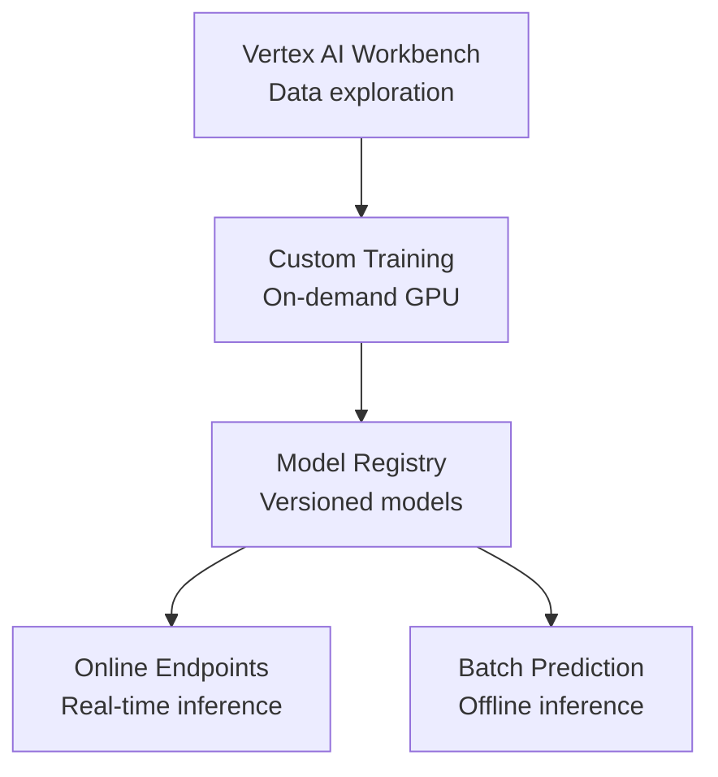

# How to Deploy GCP Vertex AI Infrastructure with OpenTofu

Author: [nawazdhandala](https://www.github.com/nawazdhandala)

Tags: OpenTofu, GCP, Vertex AI, Machine Learning, MLOps, Workbench, Infrastructure as Code

Description: Learn how to provision GCP Vertex AI Workbench notebooks, training jobs, model endpoints, and feature stores using OpenTofu for reproducible ML infrastructure on Google Cloud.

---

Vertex AI is GCP's unified ML platform for training, serving, and managing ML models. OpenTofu provisions Vertex AI Workbench notebooks, custom training infrastructure, model endpoints, and the supporting IAM and networking configuration.

## Vertex AI Architecture



## Service Account for ML Workloads

```hcl
# iam.tf

resource "google_service_account" "vertex_ai" {
  account_id   = "${var.prefix}-vertex-ai"
  display_name = "Vertex AI Service Account"
  project      = var.project_id
}

# Vertex AI roles
resource "google_project_iam_member" "vertex_user" {
  project = var.project_id
  role    = "roles/aiplatform.user"
  member  = "serviceAccount:${google_service_account.vertex_ai.email}"
}

resource "google_project_iam_member" "storage_admin" {
  project = var.project_id
  role    = "roles/storage.admin"
  member  = "serviceAccount:${google_service_account.vertex_ai.email}"
}

resource "google_project_iam_member" "artifact_registry" {
  project = var.project_id
  role    = "roles/artifactregistry.reader"
  member  = "serviceAccount:${google_service_account.vertex_ai.email}"
}
```

## GCS Bucket for ML Artifacts

```hcl
# storage.tf
resource "google_storage_bucket" "ml_artifacts" {
  name          = "${var.project_id}-ml-artifacts"
  location      = var.region
  storage_class = "STANDARD"

  versioning {
    enabled = true
  }

  lifecycle_rule {
    action {
      type          = "SetStorageClass"
      storage_class = "NEARLINE"
    }
    condition {
      age = 30  # Move to cheaper storage after 30 days
    }
  }

  labels = {
    environment = var.environment
    managed-by  = "opentofu"
  }
}

resource "google_storage_bucket" "training_data" {
  name          = "${var.project_id}-training-data"
  location      = var.region
  storage_class = "STANDARD"

  uniform_bucket_level_access = true
}
```

## Vertex AI Workbench

```hcl
# workbench.tf
resource "google_notebooks_instance" "workbench" {
  name     = "${var.prefix}-workbench"
  location = "${var.region}-a"
  project  = var.project_id

  machine_type = var.environment == "production" ? "n1-standard-8" : "n1-standard-4"

  # Use Deep Learning VM image with pre-installed ML frameworks
  vm_image {
    project      = "deeplearning-platform-release"
    image_family = "tf-latest-gpu"
  }

  # Attach GPU for training experiments
  accelerator_config {
    type       = "NVIDIA_TESLA_T4"
    core_count = 1
  }

  install_gpu_driver = true

  service_account = google_service_account.vertex_ai.email

  network = google_compute_network.ml.id
  subnet  = google_compute_subnetwork.ml.id

  # No public IP - access via IAP
  no_public_ip        = true
  no_proxy_access     = false

  # Auto-shutdown after 1 hour of inactivity
  instance_owners = var.notebook_owners

  labels = {
    environment = var.environment
    managed-by  = "opentofu"
  }
}
```

## Vertex AI Endpoint

```hcl
# endpoint.tf
resource "google_vertex_ai_endpoint" "main" {
  name         = "${var.model_name}-endpoint"
  display_name = "${var.model_name} Endpoint"
  location     = var.region
  project      = var.project_id

  network = "projects/${data.google_project.main.number}/global/networks/${google_compute_network.ml.name}"

  labels = {
    model       = var.model_name
    environment = var.environment
    managed-by  = "opentofu"
  }
}
```

## Artifact Registry for Training Images

```hcl
# registry.tf
resource "google_artifact_registry_repository" "ml" {
  repository_id = "${var.prefix}-ml-images"
  location      = var.region
  format        = "DOCKER"
  project       = var.project_id

  description = "ML training and serving container images"

  cleanup_policies {
    id     = "keep-minimum-versions"
    action = "KEEP"
    most_recent_versions {
      keep_count = 5
    }
  }
}

# Grant CI/CD SA push access
resource "google_artifact_registry_repository_iam_member" "ci_push" {
  repository = google_artifact_registry_repository.ml.name
  location   = google_artifact_registry_repository.ml.location
  project    = var.project_id
  role       = "roles/artifactregistry.writer"
  member     = "serviceAccount:${var.ci_service_account_email}"
}
```

## Enable Required APIs

```hcl
# apis.tf
resource "google_project_service" "vertex_ai" {
  project = var.project_id
  service = "aiplatform.googleapis.com"
  disable_on_destroy = false
}

resource "google_project_service" "notebooks" {
  project = var.project_id
  service = "notebooks.googleapis.com"
  disable_on_destroy = false
}

resource "google_project_service" "artifact_registry" {
  project = var.project_id
  service = "artifactregistry.googleapis.com"
  disable_on_destroy = false
}
```

## Best Practices

- Set `no_public_ip = true` on Workbench instances and use Identity-Aware Proxy (IAP) for access - this avoids exposing notebook instances to the internet.
- Use Vertex AI managed notebooks rather than individual Workbench instances for teams - managed notebooks auto-shutdown and provide better multi-user isolation.
- Store training data and model artifacts in GCS with versioning enabled - this provides a history of datasets and enables reproducible training runs.
- Use Artifact Registry rather than Container Registry for training images - Artifact Registry supports cleanup policies to prevent storage costs from accumulating with old images.
- Enable required GCP APIs via `google_project_service` resources - Vertex AI operations fail silently if APIs are not enabled, causing confusing error messages.
