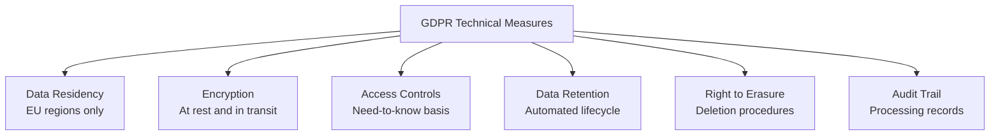

# How to Implement GDPR-Compliant Infrastructure with OpenTofu

Author: [nawazdhandala](https://www.github.com/nawazdhandala)

Tags: OpenTofu, GDPR, Compliance, Privacy, Data Residency, Personal Data, Infrastructure as Code

Description: Learn how to provision GDPR-compliant AWS infrastructure using OpenTofu, covering data residency, encryption, data retention policies, and the right to erasure.

---

GDPR requires that personal data of EU residents is processed lawfully, stored securely, and deleted on request. OpenTofu provisions the technical infrastructure for GDPR compliance: EU region enforcement, encryption, access logging, and automated data lifecycle policies.

## GDPR Technical Requirements



## Data Residency Enforcement

```hcl
# providers.tf — enforce EU region for personal data
provider "aws" {
  alias  = "eu"
  region = "eu-west-1"  # Ireland — EU region
}

provider "aws" {
  alias  = "eu_backup"
  region = "eu-central-1"  # Frankfurt — EU region for backups
}

# Prevent accidental deployment to non-EU regions
variable "aws_region" {
  type = string

  validation {
    condition = contains([
      "eu-west-1",       # Ireland
      "eu-west-2",       # London
      "eu-west-3",       # Paris
      "eu-central-1",    # Frankfurt
      "eu-north-1",      # Stockholm
      "eu-south-1",      # Milan
    ], var.aws_region)
    error_message = "Personal data must be stored in EU AWS regions only (GDPR Art. 44-49)"
  }
}
```

## Personal Data Encryption

```hcl
# gdpr_encryption.tf
resource "aws_kms_key" "personal_data" {
  provider                = aws.eu
  description             = "KMS key for personal data — GDPR Art. 32"
  deletion_window_in_days = 30
  enable_key_rotation     = true

  tags = {
    DataCategory   = "PersonalData"
    GDPR           = "true"
    DataController = var.company_name
  }
}

resource "aws_s3_bucket" "personal_data" {
  provider = aws.eu
  bucket   = "${var.company}-personal-data-${var.environment}"

  tags = {
    GDPR             = "true"
    DataCategory     = "PersonalData"
    LegalBasis       = "Consent"
    RetentionYears   = "3"
  }
}

resource "aws_s3_bucket_server_side_encryption_configuration" "personal_data" {
  bucket = aws_s3_bucket.personal_data.id
  rule {
    apply_server_side_encryption_by_default {
      sse_algorithm     = "aws:kms"
      kms_master_key_id = aws_kms_key.personal_data.arn
    }
  }
}
```

## Data Retention Lifecycle

```hcl
# gdpr_lifecycle.tf — automated data deletion (Art. 5, 17)
resource "aws_s3_bucket_lifecycle_configuration" "personal_data" {
  bucket = aws_s3_bucket.personal_data.id

  rule {
    id     = "gdpr-data-retention"
    status = "Enabled"

    # Personal data expires after 3 years from creation
    expiration {
      days = 1095  # 3 years
    }

    noncurrent_version_expiration {
      noncurrent_days = 90
    }
  }
}

# DynamoDB TTL for session data
resource "aws_dynamodb_table" "sessions" {
  provider     = aws.eu
  name         = "${var.environment}-sessions"
  billing_mode = "PAY_PER_REQUEST"
  hash_key     = "user_id"
  range_key    = "session_id"

  attribute {
    name = "user_id"
    type = "S"
  }

  attribute {
    name = "session_id"
    type = "S"
  }

  # TTL for automatic expiry of session data
  ttl {
    attribute_name = "expires_at"
    enabled        = true
  }

  tags = {
    GDPR         = "true"
    DataCategory = "SessionData"
  }
}
```

## Access Audit Logging

```hcl
# gdpr_audit.tf — maintain records of processing (Art. 30)
resource "aws_s3_bucket" "gdpr_audit_logs" {
  provider = aws.eu
  bucket   = "${var.company}-gdpr-audit-logs"
}

resource "aws_cloudtrail" "personal_data_access" {
  provider   = aws.eu
  name       = "personal-data-access"
  s3_bucket_name = aws_s3_bucket.gdpr_audit_logs.id

  event_selector {
    read_write_type = "All"
    data_resource {
      type   = "AWS::S3::Object"
      values = ["${aws_s3_bucket.personal_data.arn}/"]
    }
  }
}
```

## Right to Erasure Support

```hcl
# Lambda for handling erasure requests (Art. 17)
resource "aws_lambda_function" "erasure_handler" {
  provider      = aws.eu
  function_name = "gdpr-erasure-handler"
  role          = aws_iam_role.erasure_handler.arn
  runtime       = "python3.12"
  handler       = "erasure.handler"
  filename      = data.archive_file.erasure.output_path
  timeout       = 300

  environment {
    variables = {
      PERSONAL_DATA_BUCKET = aws_s3_bucket.personal_data.id
      SESSIONS_TABLE       = aws_dynamodb_table.sessions.id
      AUDIT_LOG_BUCKET     = aws_s3_bucket.gdpr_audit_logs.id
    }
  }
}
```

## Best Practices

- Enforce EU regions through variable validation — GDPR data transfers outside the EU require additional legal basis (Standard Contractual Clauses or adequacy decisions).
- Use S3 lifecycle policies and DynamoDB TTL for automated personal data expiry — manual deletion is error-prone.
- Tag all resources containing personal data with `GDPR = "true"` and `DataCategory` — this enables targeted audits.
- Log all access to personal data via CloudTrail data events — Article 30 requires records of processing activities.
- Build erasure APIs that delete personal data from all storage systems: databases, S3, caches, backups — right to erasure applies to all copies.
