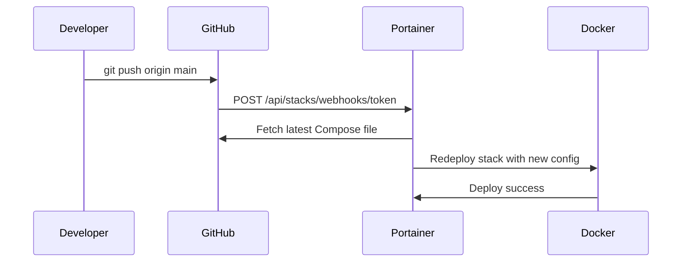

# How to Configure Git Webhooks for Auto-Updates in Portainer

Author: [nawazdhandala](https://www.github.com/nawazdhandala)

Tags: Portainer, GitOps, Webhooks, GitHub, Auto-Updates

Description: Learn how to configure Portainer and your Git repository to automatically redeploy stacks via webhooks on every push.

## What Is a Git Webhook Update?

Instead of Portainer polling Git for changes, webhooks let your Git provider (GitHub, GitLab, etc.) push a notification to Portainer the moment a push happens. This gives near-instant deployments with no unnecessary polling overhead.

## Prerequisites

- Portainer is accessible from the internet (or from your Git provider's servers).
- You have admin access to the Git repository.

## Step 1: Enable Webhook Updates in Portainer

1. Create or edit a Git-backed stack in Portainer.
2. Under **GitOps updates**, select **Webhook**.
3. Portainer generates a unique webhook URL.
4. Copy the webhook URL: `https://portainer.mycompany.com/api/stacks/webhooks/abc123...`

## Step 2: Configure the Webhook in GitHub

1. Go to your GitHub repository.
2. Navigate to **Settings > Webhooks**.
3. Click **Add webhook**.
4. Set:
   - **Payload URL**: The Portainer webhook URL.
   - **Content type**: `application/json`.
   - **Secret**: Optional but recommended.
   - **Events**: Select **Just the push event**.
5. Click **Add webhook**.

## Step 3: Configure the Webhook in GitLab

1. Go to your GitLab project.
2. Navigate to **Settings > Webhooks**.
3. Set:
   - **URL**: The Portainer webhook URL.
   - **Secret token**: Optional.
   - **Trigger**: Check **Push events**.
4. Click **Add webhook**.

## Testing the Webhook

```bash
# Test the Portainer stack webhook manually
curl -X POST "https://portainer.mycompany.com/api/stacks/webhooks/abc123token"
# Expect: 204 No Content

# Or trigger from GitHub webhook test
# In GitHub: Settings > Webhooks > Recent Deliveries > Redeliver
```

## Securing Webhooks with a Secret

Portainer currently validates the webhook URL token rather than a shared secret. For additional security:

1. Use HTTPS for Portainer.
2. Add IP allowlisting at the reverse proxy for known GitHub/GitLab IP ranges.

```nginx
# Nginx: Restrict webhook endpoint to GitHub IP ranges
location /api/stacks/webhooks/ {
    # Allow GitHub's webhook IP ranges
    allow 140.82.112.0/20;
    allow 185.199.108.0/22;
    allow 192.30.252.0/22;
    deny all;
    proxy_pass http://portainer:9000;
}
```

## Webhook Event Flow



## Verifying Webhook Deployments

In Portainer:
1. Go to the stack.
2. Check **Stack events** or the activity log.
3. Verify the deploy timestamp matches your recent push.

## Conclusion

Git webhooks provide the fastest Portainer auto-update mechanism — deployments trigger within seconds of a push. Combine them with your CI/CD pipeline (build image, update tag in docker-compose.yml, commit, push) for a complete automated delivery chain.
