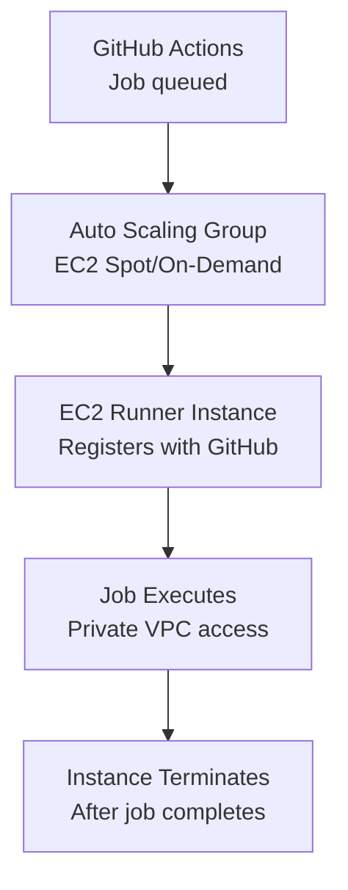

# How to Deploy GitHub Actions Runners on AWS with OpenTofu

Author: [nawazdhandala](https://www.github.com/nawazdhandala)

Tags: OpenTofu, GitHub Actions, CI/CD, AWS, EC2, Auto Scaling, Runners, Infrastructure as Code

Description: Learn how to deploy self-hosted GitHub Actions runners on AWS EC2 with auto-scaling using OpenTofu, providing cost-effective and secure CI/CD compute that scales with your workload.

---

Self-hosted GitHub Actions runners on AWS give you control over compute size, network access, and cost. Auto Scaling Groups paired with the GitHub Actions Runner Controller or instance lifecycle hooks provide elastic scaling that matches your CI/CD throughput.

## Architecture



## IAM Role for Runners

```hcl
# iam.tf
resource "aws_iam_role" "runner" {
  name = "${var.prefix}-github-runner"

  assume_role_policy = jsonencode({
    Version = "2012-10-17"
    Statement = [{
      Effect    = "Allow"
      Principal = { Service = "ec2.amazonaws.com" }
      Action    = "sts:AssumeRole"
    }]
  })
}

resource "aws_iam_role_policy_attachment" "runner_ssm" {
  role       = aws_iam_role.runner.name
  policy_arn = "arn:aws:iam::aws:policy/AmazonSSMManagedInstanceCore"
}

# Additional permissions for what your CI/CD pipeline needs
resource "aws_iam_policy" "runner_ci" {
  name = "${var.prefix}-runner-ci"
  policy = jsonencode({
    Version = "2012-10-17"
    Statement = [
      {
        Effect   = "Allow"
        Action   = ["ecr:GetAuthorizationToken", "ecr:BatchGetImage", "ecr:PutImage"]
        Resource = "*"
      },
      {
        Effect   = "Allow"
        Action   = ["s3:PutObject", "s3:GetObject"]
        Resource = "${aws_s3_bucket.artifacts.arn}/*"
      }
    ]
  })
}

resource "aws_iam_role_policy_attachment" "runner_ci" {
  role       = aws_iam_role.runner.name
  policy_arn = aws_iam_policy.runner_ci.arn
}

resource "aws_iam_instance_profile" "runner" {
  name = "${var.prefix}-github-runner"
  role = aws_iam_role.runner.name
}
```

## Launch Template

```hcl
# launch_template.tf
data "aws_ami" "ubuntu" {
  most_recent = true
  owners      = ["099720109477"]  # Canonical

  filter {
    name   = "name"
    values = ["ubuntu/images/hvm-ssd/ubuntu-jammy-22.04-amd64-server-*"]
  }
}

resource "aws_launch_template" "runner" {
  name_prefix   = "${var.prefix}-runner-"
  image_id      = data.aws_ami.ubuntu.id
  instance_type = var.instance_type  # e.g., "c6i.2xlarge" for compute-intensive jobs

  iam_instance_profile {
    arn = aws_iam_instance_profile.runner.arn
  }

  network_interfaces {
    associate_public_ip_address = false
    security_groups             = [aws_security_group.runner.id]
  }

  # EBS volume for Docker layer cache
  block_device_mappings {
    device_name = "/dev/sda1"
    ebs {
      volume_size           = 100
      volume_type           = "gp3"
      delete_on_termination = true
      encrypted             = true
    }
  }

  user_data = base64encode(templatefile("${path.module}/userdata.sh", {
    github_token        = var.github_runner_token
    github_org          = var.github_org
    runner_labels       = join(",", var.runner_labels)
    runner_group        = var.runner_group
  }))

  lifecycle {
    create_before_destroy = true
  }

  tag_specifications {
    resource_type = "instance"
    tags = {
      Name        = "${var.prefix}-github-runner"
      Environment = var.environment
      ManagedBy   = "opentofu"
    }
  }
}
```

## Runner User Data Script

```bash
#!/bin/bash
# userdata.sh
set -e

# Install dependencies
apt-get update && apt-get install -y curl jq docker.io
systemctl start docker && systemctl enable docker
usermod -aG docker ubuntu

# Install GitHub Actions runner
cd /home/ubuntu
curl -o actions-runner.tar.gz -L https://github.com/actions/runner/releases/download/v2.313.0/actions-runner-linux-x64-2.313.0.tar.gz
tar xzf actions-runner.tar.gz

# Configure and register runner
./config.sh \
  --url https://github.com/${github_org} \
  --token ${github_token} \
  --labels ${runner_labels} \
  --runnergroup ${runner_group} \
  --ephemeral \  # Runner terminates after one job
  --unattended

# Install and start as service
./svc.sh install ubuntu
./svc.sh start
```

## Auto Scaling Group

```hcl
# asg.tf
resource "aws_autoscaling_group" "runners" {
  name                = "${var.prefix}-github-runners"
  vpc_zone_identifier = var.private_subnet_ids
  min_size            = 0
  max_size            = var.max_runners
  desired_capacity    = 0

  launch_template {
    id      = aws_launch_template.runner.id
    version = "$Latest"
  }

  # Use spot instances for cost savings
  mixed_instances_policy {
    instances_distribution {
      on_demand_base_capacity                  = 0
      on_demand_percentage_above_base_capacity = 0
      spot_allocation_strategy                 = "capacity-optimized"
    }

    launch_template {
      launch_template_specification {
        launch_template_id = aws_launch_template.runner.id
        version            = "$Latest"
      }

      override {
        instance_type = "c6i.2xlarge"
      }
      override {
        instance_type = "c6a.2xlarge"
      }
      override {
        instance_type = "c5.2xlarge"
      }
    }
  }

  tag {
    key                 = "Name"
    value               = "${var.prefix}-github-runner"
    propagate_at_launch = true
  }
}
```

## Security Group

```hcl
resource "aws_security_group" "runner" {
  name        = "${var.prefix}-github-runner"
  description = "GitHub Actions runner — outbound only"
  vpc_id      = var.vpc_id

  # No inbound rules — runners connect outbound to GitHub
  egress {
    from_port   = 0
    to_port     = 0
    protocol    = "-1"
    cidr_blocks = ["0.0.0.0/0"]
  }
}
```

## Best Practices

- Use `--ephemeral` flag in the runner configuration — ephemeral runners terminate after one job, preventing state leakage between jobs and ensuring clean environments.
- Use Spot instances with multiple instance types for non-critical CI jobs — this reduces costs by 60-80% compared to On-Demand pricing.
- Restrict the security group to outbound-only — runners don't need inbound access. GitHub uses long-polling over HTTPS for job dispatch.
- Store the GitHub runner token in AWS Secrets Manager and fetch it in user data rather than embedding it in the launch template.
- Scale the ASG to zero when no jobs are queued — use GitHub's runner scale sets or a Lambda function that watches queue depth to trigger scaling events.
