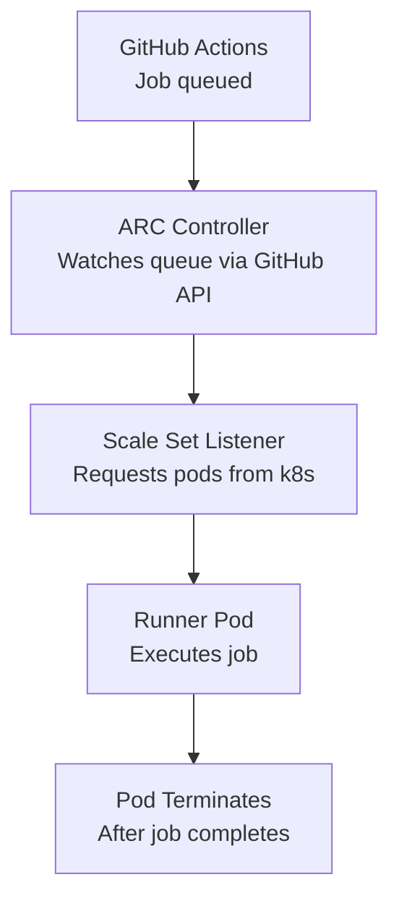

# How to Deploy GitHub Actions Runners on Kubernetes with OpenTofu

Author: [nawazdhandala](https://www.github.com/nawazdhandala)

Tags: OpenTofu, GitHub Actions, CI/CD, Kubernetes, Arc, Runner Scale Sets, Infrastructure as Code

Description: Learn how to deploy GitHub Actions Runner Controller (ARC) on Kubernetes with OpenTofu using runner scale sets for automatic scaling from zero, enabling cost-effective and isolated CI/CD workloads.

---

GitHub Actions Runner Controller (ARC) runs ephemeral runners as Kubernetes pods that scale from zero to handle queued jobs. OpenTofu deploys ARC via Helm and configures runner scale sets that match CI/CD demand elastically.

## Architecture



## ARC Controller Deployment

```hcl
# arc.tf

resource "kubernetes_namespace" "arc" {
  metadata {
    name = "arc-systems"
  }
}

resource "kubernetes_namespace" "arc_runners" {
  metadata {
    name = "arc-runners"
  }
}

# GitHub App credentials secret for ARC
resource "kubernetes_secret" "arc_github_app" {
  metadata {
    name      = "github-app-credentials"
    namespace = kubernetes_namespace.arc.metadata[0].name
  }

  data = {
    github_app_id              = var.github_app_id
    github_app_installation_id = var.github_app_installation_id
    github_app_private_key     = var.github_app_private_key
  }
}

# ARC controller manager
resource "helm_release" "arc" {
  name       = "arc"
  namespace  = kubernetes_namespace.arc.metadata[0].name
  repository = "oci://ghcr.io/actions/actions-runner-controller-charts"
  chart      = "gha-runner-scale-set-controller"
  version    = "0.9.3"

  values = [
    yamlencode({
      # Enable metrics for HPA
      metrics = {
        controllerManagerAddr = ":8080"
        listenerAddr          = ":8080"
        listenerEndpoint      = "/metrics"
      }
    })
  ]
}
```

## Runner Scale Set

```hcl
# runner_scale_set.tf

resource "helm_release" "runner_scale_set" {
  name       = "arc-runners"
  namespace  = kubernetes_namespace.arc_runners.metadata[0].name
  repository = "oci://ghcr.io/actions/actions-runner-controller-charts"
  chart      = "gha-runner-scale-set"
  version    = "0.9.3"

  depends_on = [helm_release.arc]

  values = [
    yamlencode({
      githubConfigUrl    = "https://github.com/${var.github_org}"
      githubConfigSecret = kubernetes_secret.arc_github_app.metadata[0].name

      runnerGroup = "k8s-runners"
      runnerScaleSetName = "k8s-runners"

      # Scale from 0 to max runners
      minRunners = 0
      maxRunners = var.max_runners  # e.g., 20

      # Runner pod template
      template = {
        spec = {
          containers = [{
            name  = "runner"
            image = "ghcr.io/actions/actions-runner:latest"

            resources = {
              requests = {
                cpu    = "500m"
                memory = "1Gi"
              }
              limits = {
                cpu    = "2000m"
                memory = "4Gi"
              }
            }

            env = [{
              name  = "DOCKER_HOST"
              value = "tcp://localhost:2376"
            }]
          },
          # DinD sidecar for Docker builds
          {
            name  = "dind"
            image = "docker:24-dind"
            securityContext = {
              privileged = true
            }
            resources = {
              requests = { cpu = "500m", memory = "512Mi" }
              limits   = { cpu = "2000m", memory = "2Gi" }
            }
          }]

          tolerations = [{
            key      = "dedicated"
            value    = "ci-runners"
            operator = "Equal"
            effect   = "NoSchedule"
          }]

          nodeSelector = {
            "node-role" = "ci-runner"
          }
        }
      }
    })
  ]
}
```

## Dedicated Node Pool for Runners

```hcl
# node_pool.tf - dedicated nodes for CI runners

# EKS node group example
resource "aws_eks_node_group" "ci_runners" {
  cluster_name    = var.cluster_name
  node_group_name = "ci-runners"
  node_role_arn   = var.node_role_arn
  subnet_ids      = var.private_subnet_ids

  instance_types = ["c6i.2xlarge", "c6a.2xlarge"]

  scaling_config {
    desired_size = 0
    min_size     = 0
    max_size     = var.max_runner_nodes
  }

  # Taint nodes so only runner pods schedule here
  taint {
    key    = "dedicated"
    value  = "ci-runners"
    effect = "NO_SCHEDULE"
  }

  labels = {
    "node-role" = "ci-runner"
  }

  # Use spot instances for cost savings
  capacity_type = "SPOT"
}
```

## Kubernetes RBAC for ARC

```hcl
# rbac.tf
resource "kubernetes_cluster_role_binding" "arc" {
  metadata {
    name = "arc-runner-controller"
  }

  role_ref {
    api_group = "rbac.authorization.k8s.io"
    kind      = "ClusterRole"
    name      = "cluster-admin"
  }

  subject {
    kind      = "ServiceAccount"
    name      = "arc"
    namespace = kubernetes_namespace.arc.metadata[0].name
  }
}
```

## Best Practices

- Use GitHub App authentication rather than a Personal Access Token for ARC - GitHub Apps have higher rate limits and more granular permissions.
- Run ARC runners on dedicated nodes with taints - this prevents CI workloads from competing with production workloads for resources.
- Use Docker-in-Docker (DinD) carefully - DinD requires privileged containers. For security, consider Kaniko or Buildah for container builds instead.
- Set `minRunners = 0` and rely on ARC's scaling - idle runner pods waste compute. ARC scales up within seconds when jobs are queued.
- Set resource requests and limits on runner pods - without limits, a runaway build can consume all node resources and affect other workloads.
