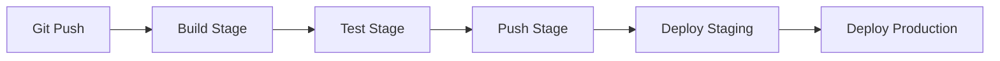

# How to Use GitLab CI to Deploy to Portainer

Author: [nawazdhandala](https://www.github.com/nawazdhandala)

Tags: Portainer, GitLab CI, CI/CD, Docker, Deployment, Automation

Description: Learn how to configure GitLab CI/CD pipelines to build Docker images and deploy them to Portainer stacks automatically.

---

GitLab CI can deploy to Portainer using the Portainer API or stack webhooks. This guide covers a complete `.gitlab-ci.yml` pipeline from build to production deployment.

## Pipeline Overview



## GitLab CI Configuration

Create `.gitlab-ci.yml` in your repository root:

```yaml
stages:
  - build
  - test
  - push
  - deploy

variables:
  IMAGE_NAME: $CI_REGISTRY_IMAGE
  IMAGE_TAG: $CI_COMMIT_SHORT_SHA

build:
  stage: build
  image: docker:24
  services:
    - docker:24-dind
  script:
    - docker login -u $CI_REGISTRY_USER -p $CI_REGISTRY_PASSWORD $CI_REGISTRY
    - docker build -t $IMAGE_NAME:$IMAGE_TAG .
    - docker push $IMAGE_NAME:$IMAGE_TAG

test:
  stage: test
  image: docker:24
  services:
    - docker:24-dind
  script:
    - docker run --rm $IMAGE_NAME:$IMAGE_TAG npm test

push-latest:
  stage: push
  image: docker:24
  services:
    - docker:24-dind
  only:
    - main
  script:
    - docker login -u $CI_REGISTRY_USER -p $CI_REGISTRY_PASSWORD $CI_REGISTRY
    - docker pull $IMAGE_NAME:$IMAGE_TAG
    - docker tag $IMAGE_NAME:$IMAGE_TAG $IMAGE_NAME:latest
    - docker push $IMAGE_NAME:latest

deploy-staging:
  stage: deploy
  image: curlimages/curl:latest
  environment:
    name: staging
    url: https://staging.example.com
  only:
    - main
  script:
    - |
      TOKEN=$(curl -s -X POST "$PORTAINER_URL/api/auth" \
        -H "Content-Type: application/json" \
        -d "{\"Username\":\"$PORTAINER_USER\",\"Password\":\"$PORTAINER_PASSWORD\"}" \
        | grep -o '"jwt":"[^"]*"' | cut -d'"' -f4)
      STACK_ID=$(curl -s -H "Authorization: Bearer $TOKEN" \
        "$PORTAINER_URL/api/stacks" | \
        grep -o '"Id":[0-9]*,"Name":"my-app-staging"' | grep -o '[0-9]*')
      curl -s -X POST \
        -H "Authorization: Bearer $TOKEN" \
        "$PORTAINER_URL/api/stacks/$STACK_ID/images/update?pullImage=true"

deploy-production:
  stage: deploy
  image: curlimages/curl:latest
  environment:
    name: production
    url: https://app.example.com
  only:
    - main
  when: manual   # Requires human approval
  script:
    - curl -X POST "$PORTAINER_PROD_WEBHOOK_URL"
```

## Setting CI/CD Variables in GitLab

Store Portainer credentials as protected CI/CD variables:

1. Go to **Settings > CI/CD > Variables**.
2. Add `PORTAINER_URL`, `PORTAINER_USER`, `PORTAINER_PASSWORD`.
3. Mark them as **Protected** (only available on protected branches) and **Masked** (hidden in logs).
4. Add `PORTAINER_PROD_WEBHOOK_URL` for production deployment.

## Using GitLab Environments for Rollback

GitLab tracks deployment history per environment. To rollback, find the previous deployment in **Deployments > Environments** and click **Rollback**. This re-runs the deploy job with the previous commit's image tag.

## Registry Cleanup

Remove old images from GitLab's container registry after deployment:

```yaml
cleanup-old-images:
  stage: deploy
  image: registry.gitlab.com/gitlab-org/cli:latest
  script:
    - |
      glab auth login --token $GITLAB_TOKEN
      # Keep last 10 tags, delete the rest
      glab api projects/$CI_PROJECT_ID/registry/repositories \
        | jq '.[].id' | while read repo_id; do
          glab api "projects/$CI_PROJECT_ID/registry/repositories/$repo_id/tags" \
            | jq -r '.[10:][].name' | while read tag; do
              glab api --method DELETE \
                "projects/$CI_PROJECT_ID/registry/repositories/$repo_id/tags/$tag"
            done
        done
```

## Notifications on Deployment Failure

Add a notification to alert the team if a deployment fails:

```yaml
.notify-failure: &notify-failure
  after_script:
    - |
      if [ "$CI_JOB_STATUS" = "failed" ]; then
        curl -X POST -H "Content-Type: application/json" \
          -d "{\"text\": \"Deployment failed: $CI_PROJECT_NAME $CI_JOB_NAME\"}" \
          $SLACK_WEBHOOK_URL
      fi

deploy-production:
  <<: *notify-failure
  # ... rest of job config
```
