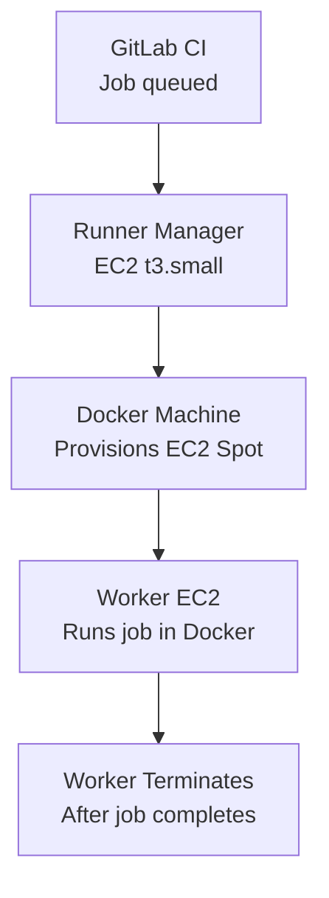

# How to Deploy GitLab Runners on AWS with OpenTofu

Author: [nawazdhandala](https://www.github.com/nawazdhandala)

Tags: OpenTofu, GitLab, CI/CD, AWS, EC2, Auto Scaling, Runners, Infrastructure as Code

Description: Learn how to deploy GitLab Runner on AWS EC2 with the Docker Machine executor and auto-scaling using OpenTofu, providing elastic CI/CD compute that scales from zero based on job demand.

---

GitLab Runner on AWS uses the Docker+Machine executor to provision ephemeral EC2 instances for each CI job. OpenTofu manages the runner manager instance, IAM permissions, and Auto Scaling configuration for cost-effective elastic scaling.

## Architecture



## IAM Role for Runner Manager

```hcl
# iam.tf
resource "aws_iam_role" "runner" {
  name = "${var.prefix}-gitlab-runner"

  assume_role_policy = jsonencode({
    Version = "2012-10-17"
    Statement = [{
      Effect    = "Allow"
      Principal = { Service = "ec2.amazonaws.com" }
      Action    = "sts:AssumeRole"
    }]
  })
}

# Permissions for Docker Machine to create EC2 instances
resource "aws_iam_policy" "runner" {
  name = "${var.prefix}-gitlab-runner"
  policy = jsonencode({
    Version = "2012-10-17"
    Statement = [
      {
        Effect = "Allow"
        Action = [
          "ec2:DescribeKeyPairs",
          "ec2:DescribeSubnets",
          "ec2:DescribeSecurityGroups",
          "ec2:DescribeInstanceTypes",
          "ec2:RunInstances",
          "ec2:TerminateInstances",
          "ec2:DescribeInstances",
          "ec2:CreateTags",
        ]
        Resource = "*"
      },
      {
        Effect   = "Allow"
        Action   = ["ecr:GetAuthorizationToken", "ecr:BatchGetImage"]
        Resource = "*"
      }
    ]
  })
}

resource "aws_iam_role_policy_attachment" "runner" {
  role       = aws_iam_role.runner.name
  policy_arn = aws_iam_policy.runner.arn
}

resource "aws_iam_role_policy_attachment" "ssm" {
  role       = aws_iam_role.runner.name
  policy_arn = "arn:aws:iam::aws:policy/AmazonSSMManagedInstanceCore"
}

resource "aws_iam_instance_profile" "runner" {
  name = "${var.prefix}-gitlab-runner"
  role = aws_iam_role.runner.name
}
```

## Runner Manager Instance

```hcl
# runner_manager.tf
data "aws_ami" "ubuntu" {
  most_recent = true
  owners      = ["099720109477"]

  filter {
    name   = "name"
    values = ["ubuntu/images/hvm-ssd/ubuntu-jammy-22.04-amd64-server-*"]
  }
}

resource "aws_instance" "runner_manager" {
  ami                  = data.aws_ami.ubuntu.id
  instance_type        = "t3.small"
  subnet_id            = var.private_subnet_id
  iam_instance_profile = aws_iam_instance_profile.runner.name

  vpc_security_group_ids = [aws_security_group.runner_manager.id]

  user_data = base64encode(templatefile("${path.module}/runner-userdata.sh", {
    gitlab_url           = var.gitlab_url
    registration_token   = var.gitlab_runner_token
    runner_name          = "${var.prefix}-runner"
    runner_tag_list      = join(",", var.runner_tags)
    max_instances        = var.max_runner_instances
    idle_count           = var.idle_runner_count
    idle_time            = var.idle_time
    aws_region           = var.aws_region
    worker_instance_type = var.worker_instance_type
    worker_subnet_id     = var.private_subnet_id
    worker_sg_id         = aws_security_group.worker.id
    s3_bucket_cache      = aws_s3_bucket.runner_cache.id
  }))

  tags = {
    Name        = "${var.prefix}-gitlab-runner-manager"
    Environment = var.environment
    ManagedBy   = "opentofu"
  }
}
```

## Runner Configuration (config.toml)

```bash
#!/bin/bash
# runner-userdata.sh
apt-get update && apt-get install -y curl

# Install GitLab Runner
curl -L https://packages.gitlab.com/install/repositories/runner/gitlab-runner/script.deb.sh | bash
apt-get install -y gitlab-runner

# Install Docker Machine
curl -L https://github.com/docker/machine/releases/download/v0.16.2/docker-machine-Linux-x86_64 \
  -o /usr/local/bin/docker-machine
chmod +x /usr/local/bin/docker-machine

# Register runner
gitlab-runner register \
  --non-interactive \
  --url "${gitlab_url}" \
  --registration-token "${registration_token}" \
  --executor "docker+machine" \
  --name "${runner_name}" \
  --tag-list "${runner_tag_list}" \
  --docker-image "alpine:latest"

# Configure auto-scaling
cat >> /etc/gitlab-runner/config.toml << 'EOF'
  [runners.machine]
    IdleCount = ${idle_count}
    IdleTime = ${idle_time}
    MaxBuilds = 10
    MachineDriver = "amazonec2"
    MachineName = "gitlab-runner-%s"
    MachineOptions = [
      "amazonec2-instance-type=${worker_instance_type}",
      "amazonec2-region=${aws_region}",
      "amazonec2-subnet-id=${worker_subnet_id}",
      "amazonec2-security-group=${worker_sg_id}",
      "amazonec2-use-private-address=true",
      "amazonec2-request-spot-instance=true",
      "amazonec2-spot-price=0.05",
    ]
    [[runners.machine.autoscaling]]
      Periods = ["* * 9-17 * * mon-fri *"]  # Scale up during business hours
      IdleCount = 2
      IdleTime = 1800
    [[runners.machine.autoscaling]]
      Periods = ["* * * * * sat,sun *"]  # Minimal on weekends
      IdleCount = 0
      IdleTime = 300

  [runners.cache]
    Type = "s3"
    Shared = true
    [runners.cache.s3]
      ServerAddress = "s3.amazonaws.com"
      BucketName = "${s3_bucket_cache}"
      BucketLocation = "${aws_region}"
      Insecure = false
EOF
```

## Cache Bucket

```hcl
# cache.tf
resource "aws_s3_bucket" "runner_cache" {
  bucket = "${var.prefix}-gitlab-runner-cache"
}

resource "aws_s3_bucket_lifecycle_configuration" "runner_cache" {
  bucket = aws_s3_bucket.runner_cache.id

  rule {
    id     = "expire-cache"
    status = "Enabled"

    expiration {
      days = 7
    }

    filter {
      prefix = "runner/"
    }
  }
}
```

## Best Practices

- Use Spot instances for worker instances with multiple fallback instance types — CI jobs tolerate interruption when runners are configured to retry.
- Configure the shared S3 cache — without it, every job re-downloads dependencies, adding minutes to build times. The cache bucket pays for itself in compute savings.
- Set `MaxBuilds = 10` on machine runners — after 10 builds, Docker Machine terminates and recreates the worker, preventing disk accumulation from Docker layers.
- Use time-based auto-scaling periods to maintain a few idle runners during business hours and scale to zero overnight and weekends.
- Place the runner manager in a private subnet with SSM access — no SSH inbound access needed, and the manager never needs to be publicly accessible.
