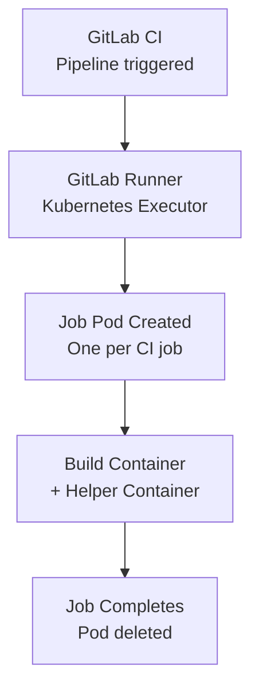

# How to Deploy GitLab Runners on Kubernetes with OpenTofu

Author: [nawazdhandala](https://www.github.com/nawazdhandala)

Tags: OpenTofu, GitLab, CI/CD, Kubernetes, Runners, Helm, Auto Scaling, Infrastructure as Code

Description: Learn how to deploy GitLab Runner on Kubernetes using the Helm chart with OpenTofu, enabling elastic CI/CD scaling with Kubernetes executor for isolated, ephemeral job pods.

---

GitLab Runner with the Kubernetes executor creates a new pod for each CI job and deletes it when complete. OpenTofu deploys the runner via Helm and configures pod templates, resource limits, and auto-scaling for efficient CI/CD on Kubernetes.

## Architecture



## GitLab Runner Helm Deployment

```hcl
# gitlab_runner.tf
resource "kubernetes_namespace" "gitlab_runner" {
  metadata {
    name = "gitlab-runner"
    labels = {
      "app.kubernetes.io/managed-by" = "opentofu"
    }
  }
}

# Store registration token as Kubernetes secret
resource "kubernetes_secret" "runner_token" {
  metadata {
    name      = "gitlab-runner-secret"
    namespace = kubernetes_namespace.gitlab_runner.metadata[0].name
  }

  data = {
    runner-registration-token = var.gitlab_runner_registration_token
    runner-token              = ""
  }
}

resource "helm_release" "gitlab_runner" {
  name       = "gitlab-runner"
  namespace  = kubernetes_namespace.gitlab_runner.metadata[0].name
  repository = "https://charts.gitlab.io"
  chart      = "gitlab-runner"
  version    = "0.62.0"

  values = [
    yamlencode({
      gitlabUrl = var.gitlab_url

      # Reference the pre-created secret
      runnerToken = ""
      existingSecret = kubernetes_secret.runner_token.metadata[0].name

      concurrent = var.concurrent_jobs  # Max parallel jobs

      # Runner configuration
      runners = {
        name = "${var.cluster_name}-runner"

        tags = join(",", var.runner_tags)

        # Kubernetes executor settings
        executor = "kubernetes"

        kubernetes = {
          namespace = kubernetes_namespace.gitlab_runner.metadata[0].name

          # CPU and memory for the build containers
          cpu_request    = "500m"
          cpu_limit      = "2000m"
          memory_request = "512Mi"
          memory_limit   = "2Gi"

          # Service account for runners (for IRSA/Workload Identity)
          service_account = kubernetes_service_account.runner.metadata[0].name

          # Run jobs on dedicated CI nodes
          node_selector = jsonencode({
            "node-role" = "ci-runner"
          })

          tolerations = jsonencode([{
            key      = "dedicated"
            value    = "ci-runners"
            operator = "Equal"
            effect   = "NoSchedule"
          }])

          # Poll interval
          poll_interval = 5
          poll_timeout  = 180
        }

        # S3 cache configuration
        cache = {
          Type = "s3"
          s3 = {
            ServerAddress  = "s3.amazonaws.com"
            BucketName     = var.cache_bucket_name
            BucketLocation = var.aws_region
          }
          Shared = true
        }
      }

      resources = {
        requests = { cpu = "100m", memory = "128Mi" }
        limits   = { cpu = "500m", memory = "512Mi" }
      }

      # Metrics for Prometheus
      metrics = {
        enabled = true
      }
    })
  ]
}
```

## Service Account with IRSA

```hcl
# service_account.tf
resource "kubernetes_service_account" "runner" {
  metadata {
    name      = "gitlab-runner"
    namespace = kubernetes_namespace.gitlab_runner.metadata[0].name

    annotations = {
      # IRSA annotation for AWS — runner pods can access AWS services
      "eks.amazonaws.com/role-arn" = aws_iam_role.runner.arn
    }
  }
}

resource "kubernetes_cluster_role_binding" "runner" {
  metadata {
    name = "gitlab-runner"
  }

  role_ref {
    api_group = "rbac.authorization.k8s.io"
    kind      = "ClusterRole"
    name      = "cluster-admin"
  }

  subject {
    kind      = "ServiceAccount"
    name      = kubernetes_service_account.runner.metadata[0].name
    namespace = kubernetes_namespace.gitlab_runner.metadata[0].name
  }
}
```

## Custom Pod Templates

```hcl
# Custom pod template for Docker builds using Kaniko
locals {
  runner_config = <<-EOT
    [[runners]]
      name = "${var.cluster_name}-runner"
      url = "${var.gitlab_url}"
      executor = "kubernetes"

      [runners.kubernetes]
        namespace = "gitlab-runner"
        image = "ubuntu:22.04"

        [[runners.kubernetes.volumes.empty_dir]]
          name = "kaniko-workspace"
          mount_path = "/kaniko"

        [[runners.kubernetes.pod_annotations]]
          "cluster-autoscaler.kubernetes.io/safe-to-evict" = "false"
  EOT
}
```

## Horizontal Pod Autoscaler for Runner Manager

```hcl
resource "kubernetes_horizontal_pod_autoscaler_v2" "runner" {
  metadata {
    name      = "gitlab-runner"
    namespace = kubernetes_namespace.gitlab_runner.metadata[0].name
  }

  spec {
    scale_target_ref {
      api_version = "apps/v1"
      kind        = "Deployment"
      name        = "gitlab-runner"
    }

    min_replicas = 1
    max_replicas = 5

    metric {
      type = "External"
      external {
        metric {
          name = "gitlab_runner_jobs"
        }
        target {
          type               = "AverageValue"
          average_value      = "10"
        }
      }
    }
  }
}
```

## Best Practices

- Use the Kubernetes executor instead of Docker+Machine on Kubernetes — it creates native pods with proper resource limits and scheduling constraints.
- Configure node selectors and tolerations for dedicated CI nodes — runner jobs consume bursty resources and shouldn't compete with production workloads.
- Use IRSA (on EKS) or Workload Identity (on GKE) to give runner pods AWS/GCP access without static credentials.
- Enable S3 cache sharing — shared caches dramatically reduce build times by sharing dependency caches across all runner pods.
- Set `concurrent` to match the maximum number of jobs your cluster can handle — without this limit, GitLab Runner will accept more jobs than the cluster can schedule.
