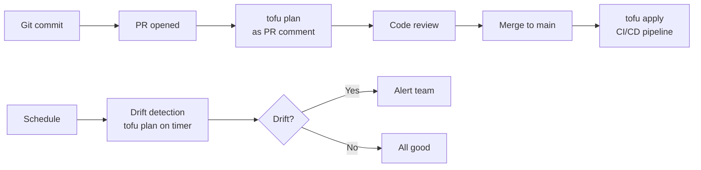

# How to Set Up GitOps for Infrastructure with OpenTofu

Author: [nawazdhandala](https://www.github.com/nawazdhandala)

Tags: OpenTofu, GitOps, GitHub Action, Drift Detection, Infrastructure as Code, CI/CD

Description: Learn how to implement GitOps for infrastructure management with OpenTofu, where Git is the single source of truth and all changes flow through pull requests with automated plan, apply, and drift...

---

GitOps for infrastructure means Git is the source of truth - the infrastructure state is always the result of merging pull requests, never ad-hoc CLI commands. OpenTofu combined with GitHub Actions implements this: plans run on PRs, applies run on merge, and drift is detected on schedule.

## GitOps Principles Applied to OpenTofu



## Plan on Pull Request

```yaml
# .github/workflows/plan.yml

name: Plan
on:
  pull_request:
    paths: ['environments/**', 'modules/**']

jobs:
  plan:
    runs-on: ubuntu-latest
    permissions:
      contents: read
      pull-requests: write
      id-token: write

    strategy:
      matrix:
        environment: [dev, staging, production]

    steps:
      - uses: actions/checkout@v4
      - uses: aws-actions/configure-aws-credentials@v4
        with:
          role-to-assume: ${{ secrets.AWS_PLAN_ROLE_ARN }}
          aws-region: us-east-1
      - uses: opentofu/setup-opentofu@v1
      - run: tofu init
        working-directory: environments/${{ matrix.environment }}
      - name: Plan
        id: plan
        run: tofu plan -no-color 2>&1 | tee plan.txt
        working-directory: environments/${{ matrix.environment }}
        continue-on-error: true
      - uses: actions/github-script@v7
        with:
          script: |
            const plan = require('fs').readFileSync('environments/${{ matrix.environment }}/plan.txt', 'utf8');
            github.rest.issues.createComment({
              issue_number: context.issue.number,
              owner: context.repo.owner,
              repo: context.repo.repo,
              body: `## Plan: ${{ matrix.environment }}\n```\n${plan.substring(0, 60000)}\n````
            });
```

## Apply on Merge

```yaml
# .github/workflows/apply.yml
name: Apply
on:
  push:
    branches: [main]
    paths: ['environments/**', 'modules/**']

jobs:
  apply:
    runs-on: ubuntu-latest
    environment: production
    permissions:
      id-token: write
      contents: read

    steps:
      - uses: actions/checkout@v4
      - uses: aws-actions/configure-aws-credentials@v4
        with:
          role-to-assume: ${{ secrets.AWS_APPLY_ROLE_ARN }}
          aws-region: us-east-1
      - uses: opentofu/setup-opentofu@v1
      - run: tofu init
        working-directory: environments/production
      - run: tofu apply -auto-approve
        working-directory: environments/production
```

## Drift Detection

```yaml
# .github/workflows/drift.yml
name: Drift Detection
on:
  schedule:
    - cron: '0 */6 * * *'  # Every 6 hours

jobs:
  detect-drift:
    runs-on: ubuntu-latest
    permissions:
      id-token: write
      issues: write

    steps:
      - uses: actions/checkout@v4
      - uses: aws-actions/configure-aws-credentials@v4
        with:
          role-to-assume: ${{ secrets.AWS_PLAN_ROLE_ARN }}
          aws-region: us-east-1
      - uses: opentofu/setup-opentofu@v1
      - run: tofu init
        working-directory: environments/production
      - name: Detect drift
        id: drift
        run: |
          tofu plan -detailed-exitcode -no-color 2>&1 | tee drift.txt
          echo "exitcode=${PIPESTATUS[0]}" >> $GITHUB_OUTPUT
        working-directory: environments/production
        continue-on-error: true
      - name: Create issue if drift detected
        if: steps.drift.outputs.exitcode == '2'
        uses: actions/github-script@v7
        with:
          script: |
            github.rest.issues.create({
              owner: context.repo.owner,
              repo: context.repo.repo,
              title: '⚠️ Infrastructure drift detected in production',
              body: 'Run `tofu plan` locally or apply from main to resolve.',
              labels: ['infrastructure', 'drift']
            });
```

## Best Practices

- Never apply infrastructure outside of the GitOps pipeline - revoke human apply permissions and only allow CI/CD roles.
- Use `-detailed-exitcode` in drift detection plans: exit code 0 = no changes, 1 = error, 2 = changes detected.
- Run drift detection on a schedule (every 6 hours) and create GitHub issues automatically when drift is found.
- Require `environment: production` in GitHub Actions apply jobs to enforce manual approval via GitHub Environments.
- Keep plan and apply in separate workflows with separate IAM roles - plan roles are read-only, apply roles have write access.
