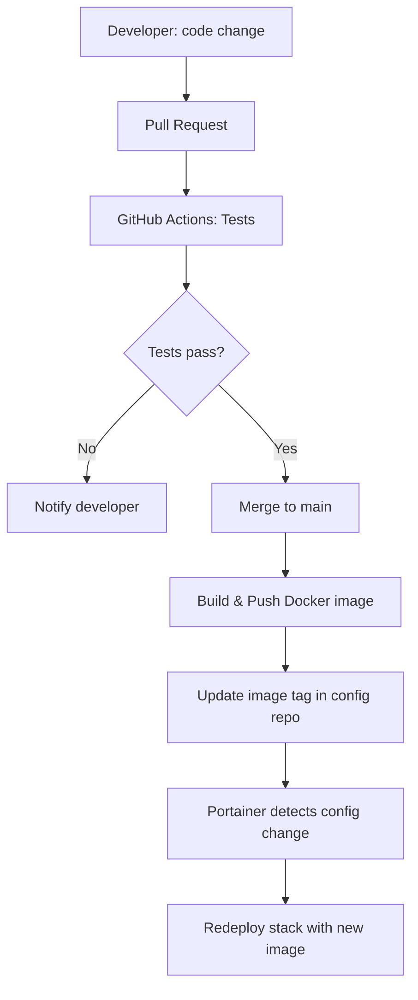

# How to Set Up a Complete GitOps Pipeline with Portainer and GitHub

Author: [nawazdhandala](https://www.github.com/nawazdhandala)

Tags: Portainer, GitHub, GitOps, CI/CD, Pipeline

Description: Learn how to build an end-to-end GitOps pipeline where GitHub stores configuration, GitHub Actions builds images, and Portainer handles deployment.

## The Complete GitOps Architecture



## Repository Structure

Use a separate "config" repository pattern:

```
app-repo/           # Application code
├── src/
├── Dockerfile
└── .github/
    └── workflows/
        └── ci.yml

infra-repo/         # Infrastructure/deployment config (GitOps source)
├── stacks/
│   ├── production/
│   │   └── docker-compose.yml
│   └── staging/
│       └── docker-compose.yml
└── README.md
```

## Step 1: The Application Repository CI Pipeline

```yaml
# app-repo/.github/workflows/ci.yml
name: CI - Build and Update Config

on:
  push:
    branches: [main]

jobs:
  build:
    runs-on: ubuntu-latest
    outputs:
      image-tag: ${{ steps.meta.outputs.version }}
    steps:
      - uses: actions/checkout@v4

      - name: Log in to GHCR
        uses: docker/login-action@v3
        with:
          registry: ghcr.io
          username: ${{ github.actor }}
          password: ${{ secrets.GITHUB_TOKEN }}

      - name: Extract Docker metadata
        id: meta
        uses: docker/metadata-action@v5
        with:
          images: ghcr.io/${{ github.repository }}
          tags: type=sha,format=short

      - name: Build and push
        uses: docker/build-push-action@v5
        with:
          push: true
          tags: ${{ steps.meta.outputs.tags }}

  update-config:
    needs: build
    runs-on: ubuntu-latest
    steps:
      - name: Checkout infra repo
        uses: actions/checkout@v4
        with:
          repository: myorg/infra-repo
          token: ${{ secrets.INFRA_REPO_PAT }}

      - name: Update image tag in docker-compose.yml
        run: |
          # Update the image tag in the staging compose file
          sed -i "s|image: ghcr.io/myorg/myapp:.*|image: ghcr.io/myorg/myapp:${{ needs.build.outputs.image-tag }}|" \
            stacks/staging/docker-compose.yml

      - name: Commit and push
        run: |
          git config user.name "github-actions[bot]"
          git config user.email "github-actions[bot]@users.noreply.github.com"
          git add stacks/staging/docker-compose.yml
          git commit -m "chore: update myapp to ${{ needs.build.outputs.image-tag }}"
          git push
```

## Step 2: The Infra Repository (GitOps Source)

```yaml
# infra-repo/stacks/staging/docker-compose.yml
version: "3.8"

services:
  app:
    # This line is automatically updated by CI
    image: ghcr.io/myorg/myapp:abc1234
    deploy:
      replicas: 2
    environment:
      - APP_ENV=staging
    ports:
      - "8080:8080"

  db:
    image: postgres:15-alpine
    environment:
      - POSTGRES_DB=myapp_staging
      - POSTGRES_PASSWORD_FILE=/run/secrets/db_password
```

## Step 3: Portainer GitOps Configuration

1. Create a stack in Portainer backed by `infra-repo`.
2. Compose file path: `stacks/staging/docker-compose.yml`.
3. Enable **Webhook** auto-updates.

## Step 4: GitHub Webhook on Infra Repo

Configure the infra repo to notify Portainer when the compose file changes:

1. In `infra-repo` settings, add a webhook:
   - **Payload URL**: Portainer stack webhook URL.
   - **Event**: Push.
2. Portainer immediately redeployments when the compose file is updated.

## Promotion to Production

To promote staging to production:

```bash
# Create a production update via pull request
git checkout -b promote-to-prod
sed -i "s|myapp:abc1234|myapp:abc1234|" stacks/production/docker-compose.yml
git commit -am "promote: myapp abc1234 to production"
git push origin promote-to-prod
# Open a PR - required review before merging
```

## Conclusion

This complete GitOps pipeline provides full auditability — every production change goes through a PR review, every deployment is tied to a Git commit, and Portainer's webhook integration ensures near-instant delivery. The separation of app and infra repos keeps deployment concerns cleanly separated.
