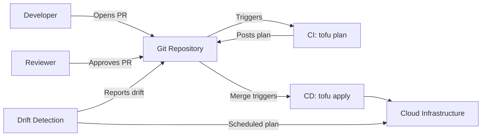

# How to Implement GitOps Workflows with OpenTofu

Author: [nawazdhandala](https://www.github.com/nawazdhandala)

Tags: OpenTofu, GitOps, CI/CD, Infrastructure as Code, GitHub Action, Pull Requests, Automation

Description: Learn how to implement a complete GitOps workflow for OpenTofu where all infrastructure changes go through pull requests with automated plan, apply, and drift detection.

---

GitOps means the Git repository is the single source of truth for infrastructure state. All changes happen through pull requests - never through direct console or CLI access. OpenTofu, combined with CI/CD automation, makes this workflow practical and auditable.

## GitOps Principles Applied to Infrastructure



## GitHub Actions: Pull Request Plan

```yaml
# .github/workflows/plan.yml

name: Infrastructure Plan
on:
  pull_request:
    paths:
      - 'infrastructure/**'
      - '**.tf'
      - '**.tfvars'

permissions:
  contents: read
  pull-requests: write
  id-token: write

jobs:
  plan:
    name: Plan Infrastructure Changes
    runs-on: ubuntu-latest

    steps:
      - uses: actions/checkout@v4

      - name: Configure AWS credentials via OIDC
        uses: aws-actions/configure-aws-credentials@v4
        with:
          role-to-assume: ${{ secrets.AWS_PLAN_ROLE_ARN }}
          aws-region: us-east-1

      - name: Setup OpenTofu
        uses: opentofu/setup-opentofu@v1
        with:
          tofu_version: "1.7.0"

      - name: Initialize OpenTofu
        run: tofu init
        working-directory: infrastructure

      - name: Run Plan
        id: plan
        run: |
          tofu plan -no-color -out=tfplan 2>&1 | tee plan_output.txt
          echo "exit_code=${PIPESTATUS[0]}" >> $GITHUB_OUTPUT
        working-directory: infrastructure

      - name: Post Plan to PR
        uses: actions/github-script@v7
        with:
          script: |
            const fs = require('fs');
            const planOutput = fs.readFileSync('infrastructure/plan_output.txt', 'utf8');
            const maxLength = 65000;
            const truncated = planOutput.length > maxLength
              ? planOutput.substring(0, maxLength) + '\n\n... (truncated)'
              : planOutput;

            github.rest.issues.createComment({
              issue_number: context.issue.number,
              owner: context.repo.owner,
              repo: context.repo.repo,
              body: `## OpenTofu Plan\n```\n${truncated}\n````
            });
```

## GitHub Actions: Apply on Merge

```yaml
# .github/workflows/apply.yml
name: Infrastructure Apply
on:
  push:
    branches: [main]
    paths:
      - 'infrastructure/**'
      - '**.tf'

permissions:
  contents: read
  id-token: write

jobs:
  apply:
    name: Apply Infrastructure Changes
    runs-on: ubuntu-latest
    environment: production  # Requires environment approval

    steps:
      - uses: actions/checkout@v4

      - name: Configure AWS credentials via OIDC
        uses: aws-actions/configure-aws-credentials@v4
        with:
          role-to-assume: ${{ secrets.AWS_APPLY_ROLE_ARN }}
          aws-region: us-east-1

      - name: Setup OpenTofu
        uses: opentofu/setup-opentofu@v1

      - name: Initialize OpenTofu
        run: tofu init
        working-directory: infrastructure

      - name: Apply
        run: tofu apply -auto-approve
        working-directory: infrastructure
```

## Scheduled Drift Detection

```yaml
# .github/workflows/drift-detection.yml
name: Drift Detection
on:
  schedule:
    - cron: '0 */6 * * *'  # Every 6 hours

jobs:
  detect-drift:
    runs-on: ubuntu-latest

    steps:
      - uses: actions/checkout@v4

      - name: Configure AWS credentials
        uses: aws-actions/configure-aws-credentials@v4
        with:
          role-to-assume: ${{ secrets.AWS_PLAN_ROLE_ARN }}
          aws-region: us-east-1

      - name: Setup OpenTofu
        uses: opentofu/setup-opentofu@v1

      - name: Initialize
        run: tofu init
        working-directory: infrastructure

      - name: Detect Drift
        id: drift
        run: |
          tofu plan -detailed-exitcode -no-color 2>&1 | tee drift_output.txt
          echo "exit_code=${PIPESTATUS[0]}" >> $GITHUB_OUTPUT
        working-directory: infrastructure

      - name: Alert on Drift
        if: steps.drift.outputs.exit_code == '2'
        uses: actions/github-script@v7
        with:
          script: |
            // Create a GitHub issue for detected drift
            github.rest.issues.create({
              owner: context.repo.owner,
              repo: context.repo.repo,
              title: '⚠️ Infrastructure Drift Detected',
              body: 'Infrastructure state has drifted from the OpenTofu configuration. Run `tofu plan` to see changes.',
              labels: ['infrastructure', 'drift']
            });
```

## Best Practices

- Separate plan and apply roles with different IAM permissions - the plan role only needs read access.
- Require at least one approval on infrastructure PRs before merge triggers apply.
- Use GitHub Environments with protection rules for the apply workflow to add a human approval gate.
- Run drift detection on a schedule (not just on push) to catch out-of-band changes made via console or CLI.
- Store `tofu plan` output as an artifact or GitHub check so reviewers can see exactly what will change.
