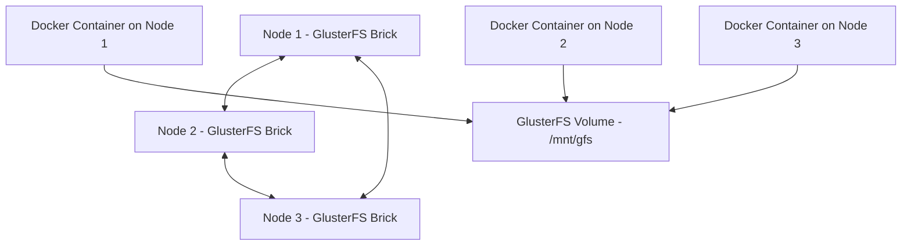

# How to Set Up GlusterFS Volumes with Portainer

Author: [nawazdhandala](https://www.github.com/nawazdhandala)

Tags: Portainer, GlusterFS, Storage, Docker, Swarm, Distributed Storage, DevOps

Description: Learn how to configure GlusterFS distributed storage and use it as persistent volume storage for containers managed by Portainer.

---

GlusterFS is a distributed file system that aggregates storage across multiple servers. When used with Portainer-managed Docker Swarm clusters, it provides shared storage that's accessible from any node - essential for stateful services that need to run on different nodes without losing their data.

---

## Architecture Overview



---

## Step 1: Install GlusterFS on All Nodes

Run these commands on each server in your cluster.

```bash
# Install GlusterFS server (Ubuntu/Debian)

sudo apt update && sudo apt install -y glusterfs-server

# Start and enable the GlusterFS service
sudo systemctl enable --now glusterd

# Verify it's running
sudo systemctl status glusterd
```

---

## Step 2: Create and Start the GlusterFS Volume

Run these commands from **one node only** (the initiating node).

```bash
# Add peer nodes to the cluster (replace with your actual IPs)
sudo gluster peer probe 192.168.1.101
sudo gluster peer probe 192.168.1.102

# Confirm peers are connected
sudo gluster peer status

# Create the brick directory on each node
# Run this on ALL nodes:
sudo mkdir -p /data/glusterfs/portainer-vol/brick1

# Create a replicated volume (from Node 1 only)
sudo gluster volume create portainer-vol replica 3 \
  192.168.1.100:/data/glusterfs/portainer-vol/brick1 \
  192.168.1.101:/data/glusterfs/portainer-vol/brick1 \
  192.168.1.102:/data/glusterfs/portainer-vol/brick1

# Start the volume
sudo gluster volume start portainer-vol

# Verify the volume
sudo gluster volume info portainer-vol
```

---

## Step 3: Mount GlusterFS on All Docker Nodes

Each Docker node needs the GlusterFS volume mounted as a local directory.

```bash
# Install GlusterFS client on all Docker nodes
sudo apt install -y glusterfs-client

# Create the mount point
sudo mkdir -p /mnt/portainer-vol

# Mount the GlusterFS volume (replace localhost with any GlusterFS node IP)
sudo mount -t glusterfs localhost:/portainer-vol /mnt/portainer-vol

# Make the mount permanent by adding to /etc/fstab
echo "localhost:/portainer-vol /mnt/portainer-vol glusterfs defaults,_netdev 0 0" | sudo tee -a /etc/fstab
```

---

## Step 4: Use GlusterFS in Portainer Stacks

With GlusterFS mounted on all nodes, you can use bind mounts in your Docker Compose stacks.

```yaml
# app-stack.yml - using GlusterFS mount for shared storage
version: "3.8"

services:
  webapp:
    image: myapp:latest
    restart: unless-stopped
    volumes:
      # Bind mount to the GlusterFS mount point
      - /mnt/portainer-vol/webapp/data:/app/data
      - /mnt/portainer-vol/webapp/uploads:/app/uploads
    deploy:
      replicas: 3
      placement:
        constraints:
          - "node.role == worker"
```

---

## Step 5: Use a Docker Volume Driver (Alternative)

For a more Docker-native approach, use the `glusterfs` volume driver so Portainer can manage volumes directly.

```bash
# Install the convoy volume driver (supports GlusterFS)
# Or use the docker-volume-glusterfs plugin
docker plugin install mikesplain/glusterfs-volume-plugin --alias glusterfs

# Create a Docker volume backed by GlusterFS
docker volume create \
  --driver glusterfs \
  --name myapp-data \
  --opt voluri="localhost:/portainer-vol"

# In Portainer UI: Volumes > Add Volume > Driver: glusterfs
```

---

## Summary

GlusterFS provides replicated, distributed storage for Portainer-managed clusters. After creating a replicated GlusterFS volume and mounting it on all nodes, containers can use bind mounts to that path and their data will be available regardless of which node the container runs on. This is particularly valuable for Docker Swarm deployments where services can reschedule across nodes.
