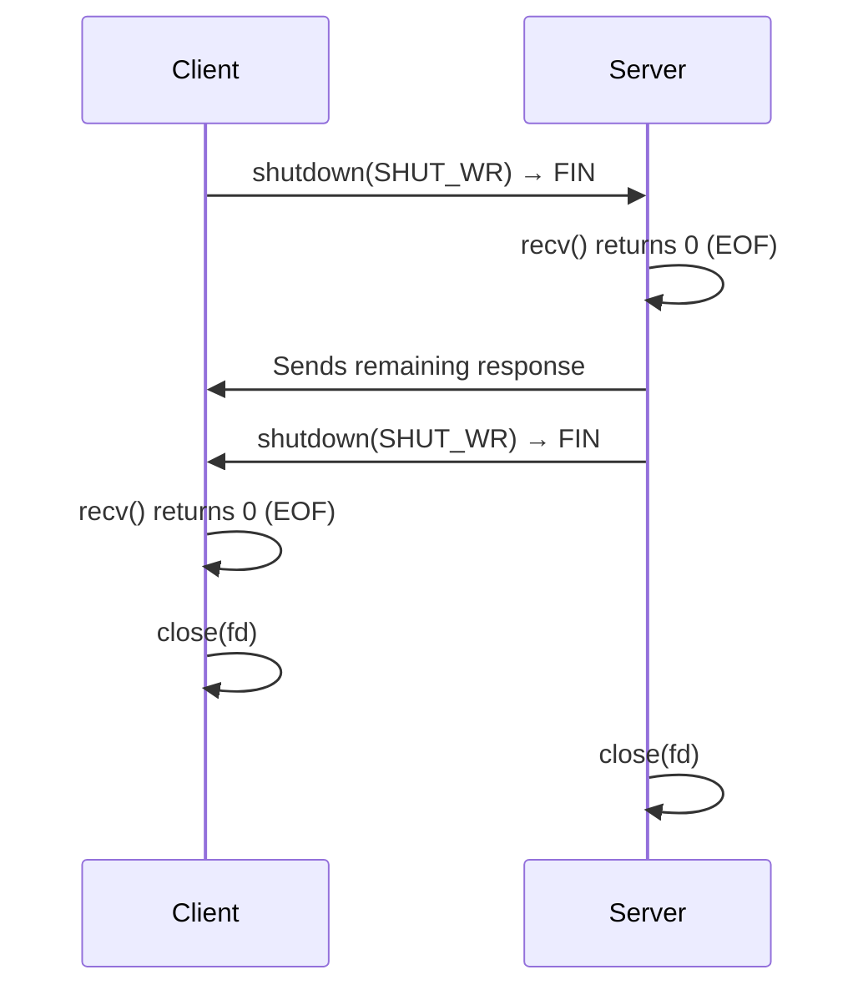

# How to Handle Graceful Socket Shutdown and Close in C

Author: [nawazdhandala](https://www.github.com/nawazdhandala)

Tags: C, IPv4, TCP, Sockets, Shutdown, POSIX, Networking

Description: Learn how to gracefully shut down IPv4 TCP sockets in C using shutdown() and close(), control half-close, drain in-flight data, and handle SO_LINGER for controlled closure.

## shutdown() vs close()

| Function | Effect |
|----------|--------|
| `close(fd)` | Decrements ref count; socket destroyed only when count reaches 0 |
| `shutdown(fd, SHUT_WR)` | Sends FIN to peer (half-close write side); peer sees EOF |
| `shutdown(fd, SHUT_RD)` | Discard incoming data; recv returns 0 |
| `shutdown(fd, SHUT_RDWR)` | Both directions; equivalent to graceful close |

```c
#include <sys/socket.h>
#include <unistd.h>

/* Graceful half-close: signal end of writes, wait for peer to finish */
void half_close(int fd) {
    /* Stop sending - peer's recv() will return 0 */
    shutdown(fd, SHUT_WR);

    /* Drain any remaining data the peer may still send */
    char drain[4096];
    while (recv(fd, drain, sizeof(drain), 0) > 0)
        ;   /* discard */

    /* Now safe to fully close */
    close(fd);
}
```

## Graceful Client Shutdown

```c
#include <stdio.h>
#include <string.h>
#include <unistd.h>
#include <sys/socket.h>
#include <arpa/inet.h>

void graceful_client(void) {
    int fd = socket(AF_INET, SOCK_STREAM, 0);

    struct sockaddr_in addr = {0};
    addr.sin_family = AF_INET;
    addr.sin_port   = htons(9000);
    inet_pton(AF_INET, "127.0.0.1", &addr.sin_addr);
    connect(fd, (struct sockaddr *)&addr, sizeof(addr));

    const char *req = "GET / HTTP/1.0\r\nHost: localhost\r\n\r\n";
    send(fd, req, strlen(req), 0);

    /* Signal that we are done writing; server sees EOF on its recv */
    shutdown(fd, SHUT_WR);

    /* Read the server response until it also closes */
    char buf[4096];
    ssize_t n;
    while ((n = recv(fd, buf, sizeof(buf), 0)) > 0) {
        fwrite(buf, 1, (size_t)n, stdout);
    }

    close(fd);
}
```

## Graceful Server Handler

```c
#include <string.h>
#include <unistd.h>
#include <sys/socket.h>

void handle_client(int client_fd) {
    char buf[4096];
    ssize_t n;

    /* Echo loop: recv until client signals EOF (n == 0) */
    while ((n = recv(client_fd, buf, sizeof(buf), 0)) > 0) {
        send(client_fd, buf, (size_t)n, 0);
    }

    /* Client sent SHUT_WR or called close() - now shut down our write side */
    shutdown(client_fd, SHUT_WR);

    /* Let the OS flush any buffered data before close */
    close(client_fd);
}
```

## SO_LINGER - Wait for Data to Flush on close()

```c
#include <sys/socket.h>

/* By default, close() returns immediately and the OS sends remaining data in the background.
   SO_LINGER makes close() block until data is flushed or the timeout expires. */
void set_linger(int fd, int timeout_sec) {
    struct linger sl;
    sl.l_onoff  = 1;           /* enable linger */
    sl.l_linger = timeout_sec; /* wait up to timeout_sec for data to flush */
    setsockopt(fd, SOL_SOCKET, SO_LINGER, &sl, sizeof(sl));
}

/* l_linger = 0 causes close() to send RST immediately (hard close) */
void hard_close(int fd) {
    struct linger sl = { .l_onoff = 1, .l_linger = 0 };
    setsockopt(fd, SOL_SOCKET, SO_LINGER, &sl, sizeof(sl));
    close(fd);   /* sends RST, skips TIME_WAIT */
}
```

## Signal-Based Server Shutdown

```c
#include <signal.h>
#include <stdio.h>
#include <stdlib.h>

static volatile int g_running = 1;
static int          g_server_fd;

/* Signal handler sets flag and wakes accept() with EINTR */
void handle_signal(int sig) {
    (void)sig;
    g_running = 0;
    shutdown(g_server_fd, SHUT_RDWR);
}

int main(void) {
    signal(SIGTERM, handle_signal);
    signal(SIGINT,  handle_signal);

    /* ... socket(), bind(), listen() ... */

    while (g_running) {
        int client_fd = accept(g_server_fd, NULL, NULL);
        if (client_fd < 0) break;   /* EINTR on signal */
        handle_client(client_fd);
    }

    printf("Server shutting down...\n");
    close(g_server_fd);
    return 0;
}
```

## Shutdown Flow Diagram



## Conclusion

Use `shutdown(fd, SHUT_WR)` to send a TCP FIN and signal to the peer that you are done writing - the peer's `recv()` returns 0 (EOF). After `shutdown(SHUT_WR)`, continue reading until the peer closes its write side, then call `close()`. Call `close()` alone only when you want the OS to handle the FIN asynchronously. Set `SO_LINGER` with `l_linger > 0` when you need `close()` to block until the send buffer is drained. Set `SO_LINGER` with `l_linger = 0` to immediately send a TCP RST and skip TIME_WAIT - useful for servers that need to reclaim ports quickly, but causes data loss if the send buffer is not empty.
