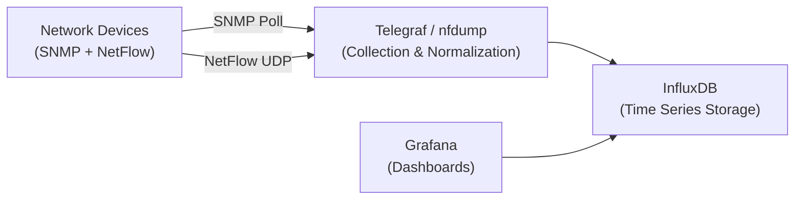

# How to Use Grafana to Visualize SNMP and NetFlow Data

Author: [nawazdhandala](https://www.github.com/nawazdhandala)

Tags: Grafana, SNMP, NetFlow, Visualization, InfluxDB, Dashboards

Description: Learn how to build Grafana dashboards to visualize SNMP-polled metrics and NetFlow traffic data using InfluxDB as the time series database.

## Architecture



## Step 1: Install InfluxDB and Grafana

```bash
# Install InfluxDB 2.x
wget https://dl.influxdata.com/influxdb/releases/influxdb2_2.7.1_amd64.deb
sudo dpkg -i influxdb2_2.7.1_amd64.deb
sudo systemctl enable influxdb && sudo systemctl start influxdb

# Set up InfluxDB (one-time)
influx setup \
  --username admin \
  --password Admin@Passw0rd! \
  --org myorg \
  --bucket network \
  --force

# Install Grafana
sudo apt-get install -y adduser libfontconfig1
wget https://dl.grafana.com/oss/release/grafana_10.4.0_amd64.deb
sudo dpkg -i grafana_10.4.0_amd64.deb
sudo systemctl enable grafana-server && sudo systemctl start grafana-server
```

## Step 2: Configure Telegraf for SNMP Polling

Telegraf is the data collection agent that polls SNMP and sends to InfluxDB:

```bash
sudo apt-get install -y telegraf
```

Create Telegraf SNMP configuration:

```toml
# /etc/telegraf/telegraf.d/snmp.conf

[[inputs.snmp]]
  agents = ["192.168.1.1:161", "192.168.1.2:161"]
  version = 2
  community = "public"
  interval = "60s"

  # Hostname/sysName
  [[inputs.snmp.field]]
    name = "hostname"
    oid = "RFC1213-MIB::sysName.0"

  # CPU utilization
  [[inputs.snmp.field]]
    name = "cpu_5min"
    oid = "CISCO-PROCESS-MIB::cpmCPUTotal5minRev.7"

  # Interface table - polled for each interface
  [[inputs.snmp.table]]
    name = "interface"
    inherit_tags = ["hostname"]
    oid = "IF-MIB::ifXTable"

    [[inputs.snmp.table.field]]
      name = "name"
      oid = "IF-MIB::ifDescr"
      is_tag = true

    [[inputs.snmp.table.field]]
      name = "in_bytes"
      oid = "IF-MIB::ifHCInOctets"

    [[inputs.snmp.table.field]]
      name = "out_bytes"
      oid = "IF-MIB::ifHCOutOctets"

    [[inputs.snmp.table.field]]
      name = "oper_status"
      oid = "IF-MIB::ifOperStatus"

# Output to InfluxDB
[[outputs.influxdb_v2]]
  urls = ["http://localhost:8086"]
  token = "your-influxdb-token"
  organization = "myorg"
  bucket = "network"
```

```bash
sudo systemctl restart telegraf
```

## Step 3: Configure Telegraf for NetFlow

Add a NetFlow input to Telegraf:

```toml
# /etc/telegraf/telegraf.d/netflow.conf

[[inputs.netflow]]
  service_address = "udp://:2055"
  # Or for IPFIX:
  # service_address = "udp://:4739"

[[outputs.influxdb_v2]]
  urls = ["http://localhost:8086"]
  token = "your-influxdb-token"
  organization = "myorg"
  bucket = "netflow"
```

## Step 4: Add InfluxDB Data Source in Grafana

1. Open Grafana at `http://server-ip:3000` (admin/admin)
2. Go to **Configuration > Data Sources > Add data source**
3. Select **InfluxDB**
4. Configure:
   - Query language: **Flux**
   - URL: `http://localhost:8086`
   - Organization: `myorg`
   - Token: Your InfluxDB token
   - Default bucket: `network`

## Step 5: Create Interface Bandwidth Dashboard

In Grafana, create a new dashboard with a Time series panel. Use this Flux query:

```flux
// Interface bandwidth in Mbps (calculate delta for counter)
from(bucket: "network")
  |> range(start: v.timeRangeStart, stop: v.timeRangeStop)
  |> filter(fn: (r) => r["_measurement"] == "interface")
  |> filter(fn: (r) => r["_field"] == "in_bytes" or r["_field"] == "out_bytes")
  |> filter(fn: (r) => r["name"] == "GigabitEthernet0/0")
  |> derivative(unit: 1s, nonNegative: true)
  |> map(fn: (r) => ({ r with _value: r._value * 8.0 / 1000000.0 }))
  |> yield(name: "bandwidth_mbps")
```

## Step 6: Create a Top Talkers Panel from NetFlow

```flux
// Top 10 source IPs by bytes in last hour
from(bucket: "netflow")
  |> range(start: -1h)
  |> filter(fn: (r) => r["_measurement"] == "netflow" and r["_field"] == "in_bytes")
  |> group(columns: ["src"])
  |> sum()
  |> sort(columns: ["_value"], desc: true)
  |> limit(n: 10)
```

## Conclusion

Grafana combined with Telegraf and InfluxDB provides a powerful, open-source network monitoring stack. Use Telegraf's SNMP input to poll interface counters and create bandwidth graphs, and its NetFlow input to capture flow data for top talker analysis. Pre-built Grafana dashboards for network monitoring are available on grafana.com/grafana/dashboards for common use cases.
