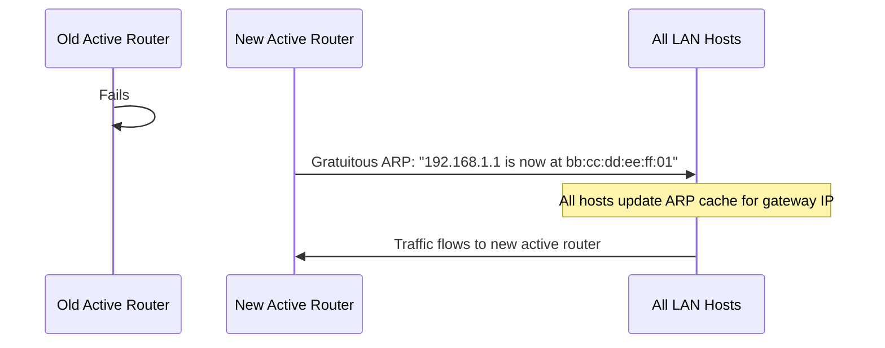

# How to Understand Gratuitous ARP and Its Uses

Author: [nawazdhandala](https://www.github.com/nawazdhandala)

Tags: Networking, ARP, IPv4, High Availability

Description: Learn what gratuitous ARP is, when it is used, and how it helps with failover, IP conflict detection, and cache updates.

## What Is Gratuitous ARP?

A Gratuitous ARP is an ARP request or reply where a host announces its own IP-to-MAC mapping without being asked. The key characteristic:

- **Sender IP = Target IP** (the host is asking/announcing about itself)
- Sent to the broadcast address

## Why Send a Gratuitous ARP?

1. **IP conflict detection**: If another host replies, there is a duplicate IP address.
2. **ARP cache update**: Forces all neighbors to update their ARP caches when a MAC address changes.
3. **Failover/HA notification**: In HA setups (VRRP, HSRP), the new active gateway announces its IP-MAC mapping.
4. **NIC initialization**: Hosts often send gratuitous ARP when a network interface comes up.

## Gratuitous ARP Format

```
Gratuitous ARP Request:
  Sender MAC:  aa:bb:cc:dd:ee:01  (new or announcing host)
  Sender IP:   192.168.1.1
  Target MAC:  00:00:00:00:00:00  (broadcast)
  Target IP:   192.168.1.1        (same as sender IP)
  Operation:   1 (Request)

Or as a Reply:
  Operation:   2 (Reply)
  Destination: ff:ff:ff:ff:ff:ff  (broadcast)
```

## Sending Gratuitous ARP on Linux

```bash
# Using arping (send 1 gratuitous ARP on eth0)
arping -A -c 1 -I eth0 192.168.1.10

# Using arping (update neighbors)
arping -U -c 1 -I eth0 192.168.1.10
# -A: ARP Reply mode (gratuitous reply)
# -U: Unsolicited ARP Request mode (gratuitous request)
```

## Sending Gratuitous ARP with Scapy

```python
from scapy.all import ARP, Ether, sendp

def send_gratuitous_arp(ip, iface='eth0'):
    """Send a gratuitous ARP request announcing our own IP."""
    pkt = Ether(dst='ff:ff:ff:ff:ff:ff') / ARP(
        op=1,         # ARP Request
        psrc=ip,      # Sender IP = our IP
        pdst=ip,      # Target IP = same (gratuitous)
        hwdst='ff:ff:ff:ff:ff:ff'
    )
    sendp(pkt, iface=iface, verbose=True)

send_gratuitous_arp('192.168.1.10')
```

## Gratuitous ARP in VRRP/HSRP Failover

When a VRRP/HSRP standby router takes over as the active gateway:



## Detecting Gratuitous ARP with tcpdump

```bash
# Capture gratuitous ARPs (Sender IP = Target IP in ARP request)
tcpdump -n -e 'arp and arp[6:2] = 1'
```

In Wireshark, filter with:

```
arp.isgratuitous == true
```

## Detecting Duplicate IPs via Gratuitous ARP

```python
from scapy.all import ARP, Ether, srp

def check_ip_conflict(ip, iface='eth0'):
    """Send gratuitous ARP and check for replies (indicates IP conflict)."""
    pkt = Ether(dst='ff:ff:ff:ff:ff:ff') / ARP(op=1, psrc=ip, pdst=ip)
    result, _ = srp(pkt, timeout=2, iface=iface, verbose=False)
    if result:
        for _, rcv in result:
            print(f"WARNING: IP conflict! {ip} is already used by {rcv[ARP].hwsrc}")
    else:
        print(f"No conflict detected for {ip}")

check_ip_conflict('192.168.1.50')
```

## Key Takeaways

- Gratuitous ARP has the same Sender IP and Target IP.
- It is used for IP conflict detection, ARP cache updates, and HA failover.
- `arping -U` sends gratuitous ARP requests; `arping -A` sends gratuitous ARP replies.
- VRRP and HSRP both use gratuitous ARP when a new active router takes over.

**Related Reading:**

- [How to Understand ARP Request and Reply Messages](https://oneuptime.com/blog/post/2026-03-20-arp-request-reply-messages/view)
- [How to Configure Proxy ARP on a Router](https://oneuptime.com/blog/post/2026-03-20-configure-proxy-arp-linux-ipv4/view)
- [How to Detect Duplicate IP Addresses Using ARP](https://oneuptime.com/blog/post/2026-03-20-detect-duplicate-ip-arp/view)
