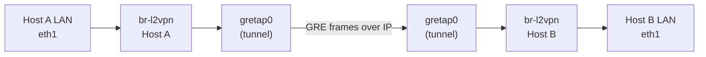

# How to Configure a GRE Tap (GRETAP) Tunnel for Layer 2 Bridging

Author: [nawazdhandala](https://www.github.com/nawazdhandala)

Tags: Linux, GRETAP, GRE, Layer 2, Bridge, Networking, L2VPN, Tunnel

Description: Create a GRETAP (GRE TAP) tunnel to extend a Layer 2 network segment between two remote Linux hosts, enabling transparent Ethernet frame tunneling.

## Introduction

GRETAP is a variant of GRE that tunnels Ethernet frames (Layer 2) rather than just IP packets (Layer 3). This enables you to create a virtual Ethernet cable between two remote sites, making remote hosts appear to be on the same local LAN. GRETAP interfaces are typically added to Linux bridges to connect remote networks at Layer 2.

## GRETAP vs GRE

| Feature | GRE (gre) | GRETAP (gretap) |
|---|---|---|
| Layer | Layer 3 (IP) | Layer 2 (Ethernet) |
| Frame type | IP packets | Ethernet frames |
| Use with bridge | No | Yes |
| MAC address | None | Has its own MAC |
| Use case | IP routing | L2 extension / L2VPN |

## Create a GRETAP Tunnel

### On Host A (10.0.0.1)

```bash
# Create GRETAP tunnel interface

ip link add gretap0 type gretap \
    local 10.0.0.1 \
    remote 10.0.0.2

# Bring up the GRETAP interface
ip link set gretap0 up
```

### On Host B (10.0.0.2)

```bash
ip link add gretap0 type gretap \
    local 10.0.0.2 \
    remote 10.0.0.1

ip link set gretap0 up
```

## Add GRETAP to a Bridge for L2 Extension

The real power of GRETAP is connecting it to a bridge so remote hosts share a L2 domain:

### Host A

```bash
# Create a bridge
ip link add br-l2vpn type bridge
ip link set br-l2vpn up

# Add local LAN interface and GRETAP to the bridge
ip link set eth1 master br-l2vpn     # Local LAN interface
ip link set gretap0 master br-l2vpn  # Remote tunnel endpoint

# Assign IP to bridge (for host management)
ip addr add 192.168.100.1/24 dev br-l2vpn
```

### Host B

```bash
ip link add br-l2vpn type bridge
ip link set br-l2vpn up

ip link set eth1 master br-l2vpn
ip link set gretap0 master br-l2vpn

ip addr add 192.168.100.2/24 dev br-l2vpn
```

## Architecture



## Verify L2 Extension

```bash
# A host on Host A's LAN should be able to ping a host on Host B's LAN
# Both LANs are on the same L2 segment (same broadcast domain)

# Check bridge FDB shows remote MACs learned through GRETAP
bridge fdb show br br-l2vpn | grep gretap0
```

## Capture GRETAP Traffic

```bash
# GRETAP uses IP protocol 47 (GRE) - capture on physical interface
tcpdump -i eth0 proto gre -n

# To see the inner Ethernet frames in detail
tcpdump -i gretap0 -e -n
```

## Conclusion

GRETAP extends Layer 2 networks over Layer 3 infrastructure, creating a virtual Ethernet cable between remote sites. Add the GRETAP interface to a bridge alongside a local LAN interface to transparently bridge the two sites at the MAC/Ethernet level. This is useful for L2VPN scenarios, VM live migration across sites, and extending VLANs between data centers.
