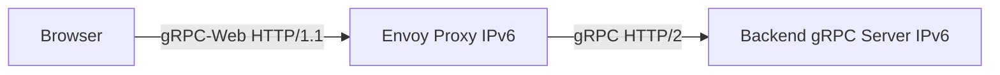

# How to Configure gRPC-Web with IPv6

Author: [nawazdhandala](https://www.github.com/nawazdhandala)

Tags: gRPC, gRPC-Web, IPv6, JavaScript, Browser

Description: Configure gRPC-Web proxy and browser clients to communicate with gRPC backends over IPv6 addresses.

## What is gRPC-Web?

gRPC-Web bridges browser clients (which can't use raw HTTP/2 gRPC) to gRPC backends via a proxy. The browser uses gRPC-Web protocol over HTTP/1.1 or HTTP/2, and the proxy translates to standard gRPC.

## Architecture



## Step 1: Configure Envoy as gRPC-Web Proxy on IPv6

```yaml
# envoy-grpcweb.yaml
static_resources:
  listeners:
    - address:
        socket_address:
          address: "::"  # All IPv6 interfaces
          port_value: 8080
      filter_chains:
        - filters:
            - name: envoy.filters.network.http_connection_manager
              typed_config:
                "@type": type.googleapis.com/envoy.extensions.filters.network.http_connection_manager.v3.HttpConnectionManager
                codec_type: AUTO
                stat_prefix: grpc_web
                route_config:
                  virtual_hosts:
                    - name: grpc_backend
                      domains: ["*"]
                      cors:
                        allow_origin_string_match:
                          - prefix: "*"
                        allow_methods: GET, PUT, DELETE, POST, OPTIONS
                        allow_headers: keep-alive,user-agent,cache-control,content-type,content-transfer-encoding,x-accept-content-transfer-encoding,x-accept-response-streaming,x-user-agent,x-grpc-web,grpc-timeout
                        expose_headers: grpc-status,grpc-message
                        max_age: "1728000"
                      routes:
                        - match:
                            prefix: "/"
                          route:
                            cluster: grpc_backend
                            timeout: 0s
                            max_stream_duration:
                              grpc_timeout_header_max: 0s
                http_filters:
                  - name: envoy.filters.http.grpc_web
                    typed_config:
                      "@type": type.googleapis.com/envoy.extensions.filters.http.grpc_web.v3.GrpcWeb
                  - name: envoy.filters.http.cors
                    typed_config:
                      "@type": type.googleapis.com/envoy.extensions.filters.http.cors.v3.CorsPolicy
                  - name: envoy.filters.http.router
                    typed_config:
                      "@type": type.googleapis.com/envoy.extensions.filters.http.router.v3.Router

  clusters:
    - name: grpc_backend
      connect_timeout: 5s
      type: STATIC
      http2_protocol_options: {}
      load_assignment:
        cluster_name: grpc_backend
        endpoints:
          - lb_endpoints:
              - endpoint:
                  address:
                    socket_address:
                      address: "2001:db8:backend::1"  # IPv6 gRPC backend
                      port_value: 50051
```

## Step 2: Browser gRPC-Web Client

```javascript
// browser-client.js
const { HelloRequest, HelloReply } = require('./hello_pb.js');
const { GreeterClient } = require('./hello_grpc_web_pb.js');

// Connect to gRPC-Web proxy over IPv6
// Browsers use the URL format — IPv6 in square brackets
const client = new GreeterClient(
    'http://[2001:db8::1]:8080',
    null,  // credentials
    null   // options
);

const request = new HelloRequest();
request.setName('World');

// Unary call
client.sayHello(request, {}, (err, response) => {
    if (err) {
        console.error('Error:', err.code, err.message);
        return;
    }
    console.log('Response:', response.getMessage());
});
```

## Step 3: TypeScript gRPC-Web Client

```typescript
// grpc-client.ts
import { GreeterClient } from './generated/HelloServiceClientPb';
import { HelloRequest } from './generated/hello_pb';

// The proxy URL with IPv6 address (browser-side)
const PROXY_URL = 'https://[2001:db8::1]:8080';

const client = new GreeterClient(PROXY_URL);

async function sayHello(name: string): Promise<string> {
    const request = new HelloRequest();
    request.setName(name);

    return new Promise((resolve, reject) => {
        client.sayHello(request, {}, (error, response) => {
            if (error) reject(error);
            else resolve(response.getMessage());
        });
    });
}

sayHello('IPv6 World').then(console.log);
```

## Step 4: Nginx as gRPC-Web Proxy

Alternatively, use Nginx with `grpc_pass`:

```nginx
server {
    listen [::]:8080;

    location / {
        # Forward gRPC-Web to backend over IPv6
        grpc_pass grpc://[2001:db8:backend::1]:50051;

        # CORS headers for browser access
        add_header 'Access-Control-Allow-Origin' '*' always;
        add_header 'Access-Control-Allow-Headers' 'grpc-timeout,content-type,x-grpc-web' always;
        add_header 'Access-Control-Expose-Headers' 'grpc-status,grpc-message' always;
    }
}
```

## Testing

```bash
# Test gRPC-Web proxy from command line (simulates browser behavior)
curl -6 \
  -H "Content-Type: application/grpc-web+proto" \
  -H "x-grpc-web: 1" \
  http://[2001:db8::1]:8080/helloworld.Greeter/SayHello \
  --data-binary @request.bin

# Test with grpcurl against the backend directly
grpcurl -plaintext '[2001:db8:backend::1]:50051' helloworld.Greeter/SayHello
```

## Monitoring with OneUptime

Use [OneUptime](https://oneuptime.com) to monitor your gRPC-Web proxy endpoint over IPv6. Configure HTTP monitors for the proxy's IPv6 address and verify it responds to gRPC-Web requests correctly.

## Conclusion

gRPC-Web over IPv6 requires an Envoy or Nginx proxy to translate browser HTTP requests to gRPC HTTP/2. Configure the proxy to listen on IPv6 (`[::]:8080`), forward to IPv6 backends, and add CORS headers. Browser clients connect using the standard `http://[ipv6addr]:port` URL format.
